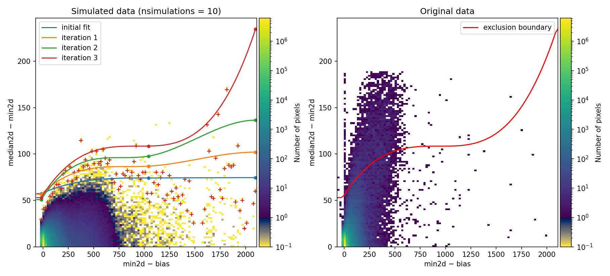
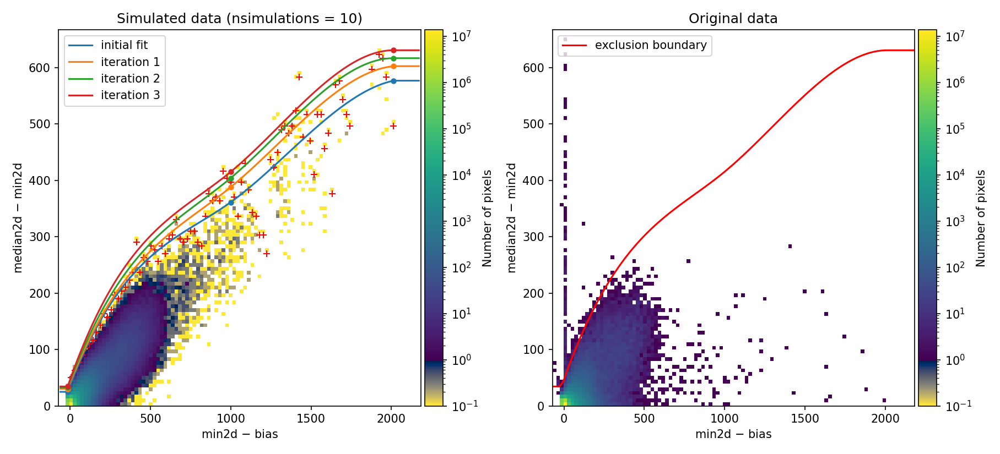
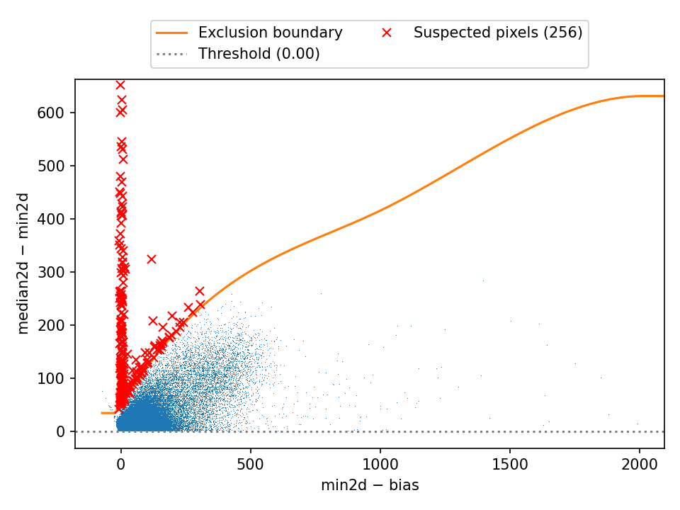
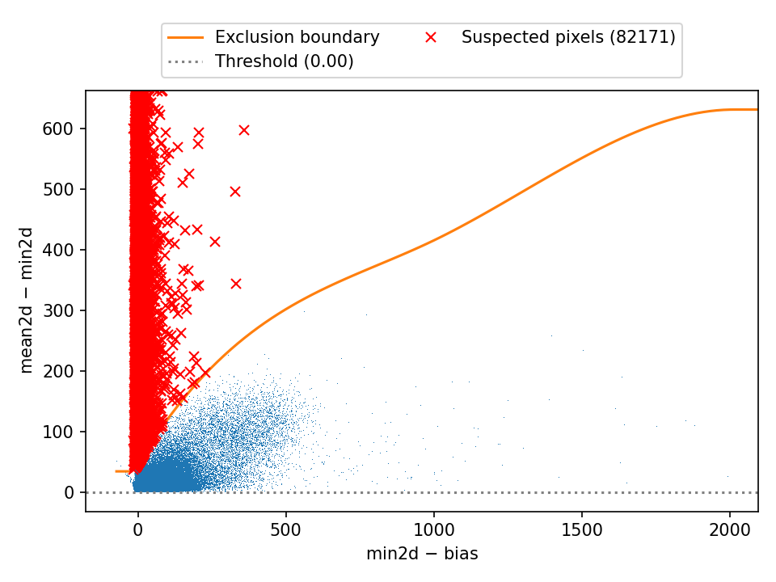
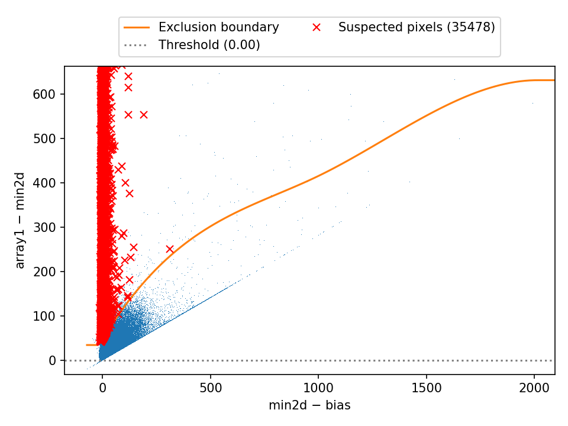
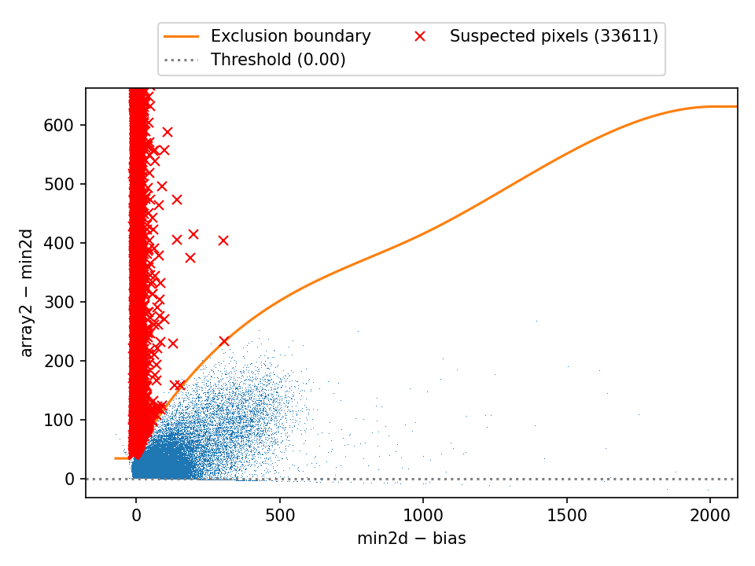
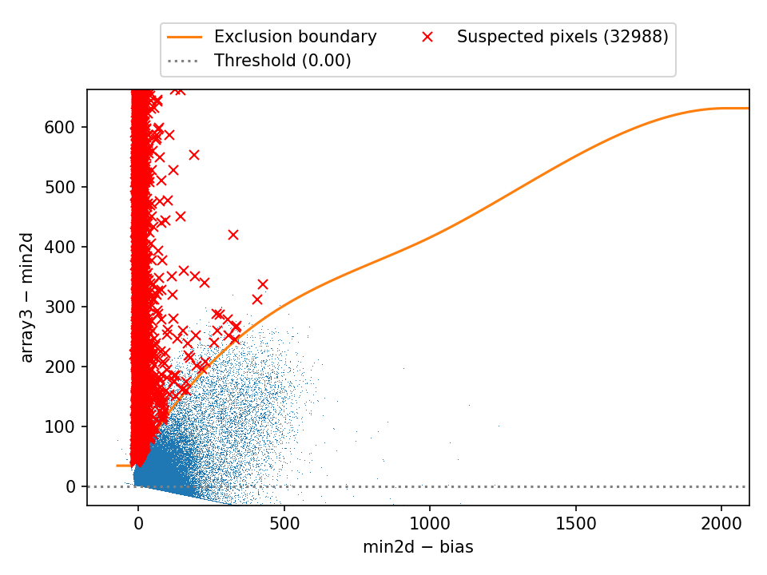

.. _Fixing_CR_median:

*********************************
CR not removed by median stacking
*********************************

.. warning::

  This functionality is still in the development phase and is not yet fully 
  consolidated. Some future modifications may be introduced as more testing 
  is conducted with new images.

By default, the various recipes in MEGARA DRP use a median combination of three
or more images to produce an average exposure and eliminate cosmic rays.
However, when exposure times are long, it’s not uncommon for the same pixel to
be hit by a cosmic ray in consecutive exposures.

The most straightforward solution is to visually inspect the resulting image
(e.g., the ``final_rss.fits`` file) and manually interpolate the affected pixels
using data from neighboring pixels. However, it can be more efficient to use an
automated procedure that detects and corrects pixels impacted by cosmic rays
across multiple exposures, eliminating the need for manual intervention.

Such an automatic method is available in the numina package, and it can be
easily activated by modifying the default image combination method used by
MEGARA DRP.

.. note::

   It’s important to note that the *ad hoc* method described here is prone to
   detecting false positives and should be tested and compared against the
   default method (simple median combination).

   **This method has only been tested on a limited subset of images and is not
   guaranteed to perform optimally in all cases. Users should be aware of this
   limitation and apply the method at their own discretion.**

   By carefully adjusting the detection parameters, typically through trial and
   error, it’s possible to reduce the number of false detections. When a pixel
   is incorrectly flagged as affected by multiple cosmic rays, its signal is
   replaced either by the minimum value across exposures or by the median,
   depending on the selected combination method. As a result, the impact on the
   final combined image is generally minimal. In many cases, the benefit of
   automatically removing pixels affected by multiple cosmic rays across
   exposures outweighs this drawback.

   This method is likely to be useful primarily when reducing science images
   with long exposure times. In general, it is not recommended for the
   reduction of calibration images.

Overall description
===================

This method can only be applied when three or more equivalent exposures are
available. It works by identifying pixels that deviate unexpectedly in a
diagnostic diagram constructed using the median and minimum signal values of
each pixel across the different exposures.

For the method to function correctly, it’s essential that the exposures are
truly equivalent, that is, each pixel should exhibit the same signal level
across exposures, aside from expected random noise. While small variations in
signal levels are tolerable, significant differences can result in a high
number of false positives.

Although the method is designed to be used within the MEGARA DRP, it can also
be executed directly from the command line using the ``numina-crmasks`` script,
which is described later in this document.

The main workflow for applying the method is as follows:

1. **Prepare the observation result file**: Create the YAML file that lists the
   individual exposures and specifies additional requirements for the reduction
   recipe associated with the reduction recipe **MegarCrDetection**.
2. **Run the MEGARA DRP to generate the CR masks**: The execution of the MEGARA
   DRP with this YAML file is interactive (see below), and the result is a FITS
   file named ``crmasks.fits``, which contains several masks that can later be
   used to remove the cosmic rays using different strategies. This
   file must be copied to the `data/` subdirectory.
3. **Run the MEGARA DRP to generate the reduced scientific result**: Once the
   file ``crmasks.fits`` is placed in the `data/` subdirectory, the MEGARA DRP
   can be run again to generate the reduced scientific result, using for that
   purpose the corresponding YAML file. During this step, the user must one of
   the available strategies for combining exposures and removing cosmic rays.
   Instead of using the default ``median`` combination, specify one of the
   following methods in the requirements section:
   ``mediancr``, ``meancrt`` or ``meancr``.

.. note::

   The three available combination methods, ``mediancr``, ``meancrt`` and 
   ``meancr``, produce different results:

   - ``mediancr``: performs a median combination, replacing pixels 
     suspected of being affected by cosmic rays in more than one exposure by
     the minimum value at each pixel across the available exposures.
   - ``meancrt``: generates the mean combination using of a single mask that
     stores all the cosmic rays detected in all the individual exposures,
     replacing each masked pixels by the value obtained when using the
     ``mediancr`` method.
   - ``meancr``: also performs a median combination, but uses the individual
     cosmic ray masks specifically computed for each available exposure.

   Since the mean has a lower standard deviation than the median, the 
   ``meancrt`` and ``meancr`` methods are generally preferable. Among these
   two, tests suggest that ``meancr`` tends to yield better
   results. However, it is recommended to try all three methods and compare the
   outputs to determine which works best for your specific dataset.

Preparing the observation result file
=====================================

Let's assume that we have three initially equivalent exposures. The process
begins with the creation of a YAML file, e.g.  ``8_generate_crmasks.yaml``,
which lists the individual exposures to be used in the cosmic ray detection
step.

.. literalinclude:: files/8_generate_crmasks_1.yaml
   :language: yaml
   :linenos:
   :lineno-start: 1
   :emphasize-lines: 2

This initial file is quite simple: one only has to take care of specifying
``mode: MegarCrDetection``, so the MEGARA DRP will know that the
``8_generate_crmasks.yaml`` file is intended for generating the CR masks.  It’s
also essential to ensure that the list of exposures includes three or more
equivalent exposures, as the method relies on comparing pixel values across
multiple images.

Computing the CR masks
======================

Initial execution
-----------------

The recipe is run by doing:

.. code-block:: console

   (megara) $ numina run 8_generate_crmasks.yaml -r control.yaml

After a short processing time (typically around one minute, required to perform
the necessary numerical simulations), the program generates a diagnostic plot
used to detect double cosmic ray hits in the median combination. This plot is
saved in the *work/* subdirectory under the name
``diagnostic_histogram2d.png``. The figure is also displayed interactively,
allowing the user to examine it in real time and, if necessary, stop the
program execution.

Once the exposures are preprocessed, the program stacks the three (or more)
individual exposures into a 3D data cube. From this cube, it generates 2D
images, each with the same dimensions as the original exposures, that represent
the minimum ``min2d``, maximum ``max2d``, and median ``median2d`` signal values
at each pixel across the exposures.

In the previously mentioned diagnostic plot, the vertical axis shows the
difference between ``median2d`` and ``min2d`` for each pixel, while the
horizontal axis shows ``min2d - bias``.

The diagnostic diagram is actually a 2D histogram, and it is displayed in two
panels:

**Left Panel:**
This shows the result of a predefined number of simulations (10 by default, but
this can be adjusted). These simulations use the ``median2d`` image to generate
synthetic exposures, based on assumed values for gain, readout noise, and bias.
For MEGARA data, exposures are preprocessed before this step (including
overscan subtraction, trimming, and gain correction), so the code assumes:

- gain = 1.0 (the data is transform from ADU to electrons)

- readout noise = 3.4 electrons (see RDNOISE1 and RDNOISE2 in the FITS headers)

- bias = 0 electrons

**Right Panel:**
This shows the same diagnostic diagram, but using the actual data from the individual exposures.

Returning to the left panel, for each bin along the horizontal axis, the
corresponding 1D histogram is converted into a cumulative distribution function
(CDF). The red crosses mark the values of ``median2d - min2d`` where the
probability of finding a pixel above that value is low enough that only one
such pixel is expected. A blue spline curve is fitted through these red
crosses.

To define a more conservative detection boundary, the blue curve is extended
upward using orange, green, and red lines, which apply increasing weights to
the vertical distance above the original fit. This final curve serves as the
threshold: pixels above this line are flagged as likely affected by cosmic rays
in more than one exposure.

This detection boundary is also plotted in the right panel. If a large number
of pixels lie above the boundary, as in the example shown, it indicates that
the exposures are not equivalent, and the method will likely produce many false
positives. In such cases, it is advisable to:

- Stop the execution.

- Modify the YAML file to include the option to rescale the images.

- Rerun the program with the updated configuration.

Checking the flux level of the individual exposures
---------------------------------------------------

To address the issue of non-equivalent exposures, you can enable automatic
rescaling by adding the requirement ``flux_factor`` to the YAML file:

.. literalinclude:: files/8_generate_crmasks_2.yaml
   :language: yaml
   :linenos:
   :lineno-start: 1
   :emphasize-lines: 8-9

By default, this parameter is set to ``none``, which means the program assumes
all exposures are equivalent. Internally, this is interpreted as a scaling
factor of 1.0 for each exposure. Setting it to ``auto`` allows the program to
estimate and apply appropriate scaling factors to bring the exposures to a
common flux level, helping reduce false positives in the cosmic ray detection
process.

.. code-block:: console

   (megara) $ numina run 8_generate_crmasks.yaml -r control.yaml

In this example, the program generates new 2D histograms to evaluate the
equivalence of the exposures. It does so by computing the number of pixels for
various reasonable combinations of the flux ratio between each individual
exposure and the median of the three exposures.

Ideally, this ratio should be close to 1.0, indicating that the exposures are
well matched. However, the program explores a broader range, from 0.5 to 1.5,
in order to account for potential variations and identify the best scaling
factors for each exposure.

.. image:: _static/crmasks/flux_factor1.png
   :width: 100%
   :alt: computation of the flux factor for the first exposure

.. image:: _static/crmasks/flux_factor2.png
   :width: 100%
   :alt: computation of the flux factor for the second exposure

.. image:: _static/crmasks/flux_factor3.png
   :width: 100%
   :alt: computation of the flux factor for the third exposure

The 2D histograms used to estimate flux scaling factors are displayed in two
panels (note that these plots are also saved in the *work/* subdirectory, as
``flux_factor1.png``, ``flux_factor2.png`` and ``flux_factor3.png``):

**Left Panel:**
This shows the raw 2D histogram, representing the distribution of pixel ratios
between each individual exposure and the median of the three exposures.
Ideally, these ratios should cluster around 1.0, but the program evaluates a
range from 0.5 to 1.5 to account for possible variations.

**Right Panel:**
This shows the cleaned version of the histogram, where isolated pixels have
been removed to reduce noise and improve the reliability of the analysis.

To estimate the scaling factors, the program performs the following steps:

1. Spline fits (shown as blue and orange solid lines) are computed on both sides
   of the horizontal bin corresponding to the 1.0 ratio. These fits ignore the
   bin encompassing the 1.0 ratio.

2. The mode (most frequent value) is determined on each side, above and below
   1.0, focusing on pixels with higher signal levels.

3. These modes are used to estimate the approximate scaling factors for each
   exposure.

In the example provided:

- The first exposure has a lower flux, with a scaling factor of approximately
  0.78.

- The second exposure is nearly equivalent to the median, with a factor of
  1.01.

- The third exposure shows a slightly higher flux, with a factor of 1.11.

These scaling factors are then applied when generating the simulated diagnostic
diagram, which, in this case, more closely resembles the one generated from the
actual data, indicating improved consistency between exposures.

If needed, the flux scaling factors can be manually specified in the YAML file
using the flux_factor requirement. For example: ``flux_factor: [0.78, 1.01,
1.11]``. Each value corresponds to one of the individual exposures. This manual
approach can be useful when automatic estimation is not reliable or when known
scaling factors are available.

Additionally, in the final diagnostic diagram, the detection boundary is
extended below zero and above the maximum value of the ``min2d - bias`` axis.
This is done by continuing the fitted boundary using the constant value it
attains at the edges of the fitted range. This extension ensures that the
boundary fully encompasses the entire range of actual pixel values, improving
the robustness of the method in identifying outliers potentially affected by
multiple cosmic ray hits.

Detecting suspected double cosmic rays in the median combination
----------------------------------------------------------------

Once the comparison between the simulated and actual diagnostic diagrams is
satisfactory, the program proceeds using the computed detection boundary.

At this stage, the diagnostic diagram is displayed again, this time as a
scatter plot rather than a 2D histogram. In this plot, red crosses mark the
pixels suspected of being affected by a cosmic ray in more than one exposure.
The total number of flagged pixels is shown in the legend for reference.

This plot is saved in the *work/* subdirectory under the name
``diagnostic_mediancr.png``, and provides a clear visual summary of the
detection results.

In this example, 256 pixels have been flagged as suspected of being affected by
a cosmic ray in more than one exposure. To account for nearby pixels that may
be slightly affected by the same event, these flagged pixels are surrounded by
a 1-pixel-wide border. This process is known as dilation, and the extent of
dilation can be controlled using the ``dilation`` requirement in the YAML file.

With a dilation factor of 1, the initial 256 pixels expand to 1592 pixels.
After dilation, the program groups connected pixels into clusters, each
representing an individual cosmic ray hit affecting contiguous pixels.
These clusters are then sorted based on their distance above the detection
boundary, allowing the most likely double cosmic ray hits to be reviewed first.

For each identified case, the program generates an independent page in the file
``mediancr_identified_cr.pdf``, which is saved in the *work/* subdirectory.
The corresponding plots are not displayed interactively, so users should open
this file manually after the program finishes execution.

By default, only the first 10 suspected double cosmic ray hits are displayed.
This limit can be adjusted using the ``maxplots`` requirement in the YAML file.

In this example, a total of 138 suspected double cosmic ray hits have been
identified, as indicated in the following plot title.

.. image:: _static/crmasks/mediancr_identified_cr.png
   :width: 100%
   :alt: example of pixels affected by two cosmic rays in a group of 3 exposures

The plots are organized into two rows:

**First row:**
Displays the three individual exposures used in the analysis.

**Second row:**

- Left image: The result of a simple median combination of the exposures.

- Center image: A binary map showing the pixels detected as affected by two
  cosmic rays, highlighted with a 1-pixel-wide border (after dilation).

- Right image: The corrected median combination, where the affected pixels
  have been replaced by the minimum value from the corresponding pixels in the
  individual exposures.

This layout provides a clear visual comparison between the original data, the
detected cosmic ray hits, and the corrected result.

Detecting cosmic rays in the mean combination
---------------------------------------------

After detecting suspected double cosmic ray hits in the median combination, the
program proceeds to analyze the mean combination. It's important to note that
the resulting ``mean2d`` image includes cosmic rays from all individual
exposures, making it more sensitive to single cosmic ray events.

The program then generates a new diagnostic diagram, where red crosses indicate
pixels suspected of being affected by cosmic rays in the combined exposure.
This plot is saved in the work/ subdirectory under the name
``diagnostic_meancr.png``.

As expected, the number of pixels suspected of being affected by a cosmic ray
in the mean combination is significantly higher than in the median case. In
this example, 82171 pixels have been flagged as potential cosmic ray hits.
After applying a dilation factor of 1, this number increases to 296655 pixels,
accounting for surrounding pixels that may have been slightly affected by the
same cosmic ray event.

Detecting cosmic rays in the individual exposures
-------------------------------------------------

The program also generates diagnostic diagrams for each individual exposure.
These plots are saved in the *work/* subdirectory with the names
``diagnostic_crmask1.png``, ``diagnostic_crmask2.png``, and
``diagnostic_crmask3.png`` (one for each individual exposure). 

In these diagrams, the vertical axis shows the original ``median2d - min2d``
values, scaled by the corresponding flux factor for each exposure. This scaling
ensures consistency when comparing exposures with different flux levels.

When computing the mask for each individual exposure, the program enforces that
any pixel masked in an individual exposure must also be masked in the mean
combination mask described earlier. This constraint ensures that cosmic ray
detections are consistent across both individual and combined analyses, while
reducing the number of false positive detections.

Output file ``crmasks.fits``
----------------------------

The output file ``crmasks.fits`` is generated in the *results/* subdirectory, 
and contains several extensions:

.. code-block:: console

   (megara) $ cd obsid8_LcbImage_LR-R_crmasks_results
   (megara) $ fitsinfo crmasks.fits
   Filename: crmasks.fits
   No.    Name      Ver    Type      Cards   Dimensions   Format
     0  PRIMARY       1 PrimaryHDU     121   ()      
     1  MEDIANCR      1 ImageHDU         8   (4096, 4112)   uint8   
     2  MEANCRT       1 ImageHDU         8   (4096, 4112)   uint8   
     3  CRMASK1       1 ImageHDU         8   (4096, 4112)   uint8   
     4  CRMASK2       1 ImageHDU         8   (4096, 4112)   uint8   
     5  CRMASK3       1 ImageHDU         8   (4096, 4112)   uint8   

The primary HDU does not contain image data but includes keywords that document the parameters used to generate the masks.

The extensions store the actual masks computed by the program:

- ``MEDIANCR``: Mask for pixels suspected of being affected by
  two cosmic rays in the median combination.
- ``MEANCRT``: Mask for pixels suspected of being affected by
  a cosmic ray in the mean combination.
- ``CRMASK1``, ``CRMASK2``, ``CRMASK3``: Masks for pixels suspected
  of being affected by a cosmic ray in each of the individual exposures.

In all cases, pixels suspected of being affected by a cosmic ray
are set to 1, while the rest of the pixels are set to 0.

Do not forget to copy the file ``crmasks.fits`` to the `data/` subdirectory
before running the MEGARA DRP to generate the reduced scientific result.

.. code-block:: console

   (megara) $ cp crmasks.fits ../data/

Additional program parameters
-----------------------------

The reduction recipe that generates the cosmic ray masks uses several default
parameter values. However, these parameters can be customized by specifying
them in the requirements section of the YAML file. This allows users to
fine-tune the behavior of the detection algorithm to better suit their specific
data or scientific goals.

- ``gain``: detector gain (electron/ADU). This parameter is retained to allow
  the code to be reused with other instruments.
  As previously mentioned, since
  MEGARA exposures are preprocessed before the CR mask generation (including
  conversion from ADU to electrons), the gain is assumed to be 1.0 by default.

- ``rnoise``: readout noise (ADU). For MEGARA, the code assumes
  a value of 3.4 electrons, which corresponds to the detector's readout noise 
  (see the ``RDNOISE1`` and ``RDNOISE2`` keywords in the FITS headers). 

- ``bias`` (default value 0.0): bias value (ADU). This should be set to 0.0 for
  MEGARA, as the bias is removed during the preprocessing performed by MEGARA
  DRP.

- ``flux_factor`` (default ``none``): this parameter controls how the relative
  flux levels of individual exposures are handled. This paramewter can be set
  in several ways:

  - ``none``: Assumes all exposures are equivalent; internally, a flux factor
    of 1.0 is applied to each.

  - ``auto``: The program automatically estimates the flux factor for each
    exposure by comparing it to the median of all exposures.

  - List of values: You can manually specify a list of flux factors (e.g.,
    ``[0.78, 1.01, 1.11]``), with one value per exposure.

  - Single float: A single value (e.g., 1.0) applies the same flux factor to
    all exposures.

- ``knots_splfit`` (default 3): Specifies the total number of knots employed in
  the spline fit that define the detection boundary in the diagnostic diagram.

- ``nsimulations`` (default 10): Sets the number of simulations to perform for
  each set of exposures when generating the simulated diagnostic diagram.

- ``niter_boundary_extension`` (default 3): Determines the number of iterations
  used to extend the detection boundary above the red crosses in the simulated
  diagnostic diagram, improving the robustness of cosmic ray detection by
  reducing the number of false positives.

- ``weight_boundary_extension`` (default 10): Specifies the weight applied to
  the vertical distance between fitted points in the diagnostic diagram when
  extending the detection boundary above the red crosses. During each
  iteration, points above the previous fit are multiplied by this weight raised
  to the power of the iteration number. This forces the fit to better align
  with the upper boundary defined by the red crosses in the simulated
  diagnostic diagram, improving the accuracy of cosmic ray detection.

- ``threshold`` (default 0.0): Sets a minimum threshold for the ``median2d -
  min2d`` value in the diagnostic diagrams. This acts as an additional
  constraint beyond the detection boundary (pixels with values below this
  threshold are not considered as suspected cosmic ray hits).

- ``minimum_max2d_rnoise`` (default 5.0): Defines the minimum value of
  ``max2d``, expressed in readout noise units, required to consider a pixel as
  a double cosmic ray. This helps avoid false positives caused by large
  negative values in one of the individual exposures.

- ``interactive`` (default True): Controls whether the program generates
  interactive plots using Matplotlib. If True, the plots are displayed with
  zoom and pan functionality. If False, the program runs in non-interactive
  mode, but all plots are still saved in the *work/* subdirectory.

- ``dilation`` (default 1): Specifies the dilation factor used to expand the
  mask around detected cosmic ray pixels. A value of 0 disables dilation. A
  value of 1 is typically recommended, as it helps include the tails of cosmic
  rays, which may have lower signal levels but are still affected.

- ``seed`` (default None): Sets the random seed used when generating the
  simulated diagnostic diagram. If set to None, the seed is randomly
  generated, resulting in slightly different simulations each time.

- ``plots`` (default True): If True, the program generates a PDF file named
  ``mediancr_identified_cr.pdf`` containing visualizations of some or all of
  the identified double cosmic ray hits.

- ``semiwindow`` (default 15): Defines the semiwindow size (in pixels) used
  when plotting the double cosmic ray hits. This parameter is only used if
  ``plots`` is set to True.

- ``color_scale`` (default minmax): Specifies the color scale used in the
  images displayed in the ``mediancr_identified_cr.pdf`` file. This option is
  only relevant if ``plots`` is set to True. Valid values are ``minmax`` and
  ``zscale``.

- ``maxplots`` (default 10): Sets the maximum number of suspicious double
  cosmic rays to display. Limiting the number of plots is useful when
  experimenting with program parameters, as it helps avoid generating an
  excessive number of plots due to false positives. A negative value means all
  suspected double CRs will be displayed (note that this may significantly
  increase execution time). This option is only used if ``plots`` is True.

- ``save_preprocessed`` (default False): If set to True, the program saves the
  preprocessed individual exposures in the *work/* subdirectory. This can be
  helpful for debugging, but is not required for normal operation.

Applying the masks
==================

Once the ``crmasks.fits`` file has been generated, it can be used to remove the
suspected cosmic rays from the combined image.  Several options are available
for this step, depending on the value of ``method`` specified in the
requirements section of the YAML file used to produce the reduced scientific
result. Rather than assuming the combination method is ``median`` (the default
in MEGARA DRP), the user should explicitly specify one of the following
methods: ``mediancr``, ``meancr`` or ``meancrt``. 

Method ``mediancr``
-------------------

For example, when using the **MegaraLcbImage** recipe, the corresponding
YAML file, ``8_LcbImage.yaml`` should define the ``method`` and
``crmasks`` parameters in the requirements section, as follows:

.. literalinclude:: files/8_LcbImage_mediancr.yaml
   :language: yaml
   :linenos:
   :lineno-start: 1
   :emphasize-lines: 2, 9-10

Note that the ``crmasks`` parameter must be explicitly specified, and it should
point to the ``crmasks.fits`` file generated in the previous step. This
requirement also gives users the flexibility to rename the file and test
different versions of it (each potentially created with varying detection
thresholds) to evaluate the impact of using different masks.

.. code-block:: console

   (megara) $ numina run 8_LcbImage.yaml -r control.yaml

When using ``method: mediancr``, the MEGARA DRP reads the mask stored in the
``MEDIANCR`` extension of the ``crmasks.fits`` file. The masked pixels (those
suspected of being affected by a cosmic ray in more than one exposure) are
replaced with the corresponding ``min2d`` value at each pixel. As a result, the
final image is identical to ``median2d``, except for the corrected pixels.

Method ``meancrt``
------------------

.. literalinclude:: files/8_LcbImage_meancrt.yaml
   :language: yaml
   :linenos:
   :lineno-start: 1
   :emphasize-lines: 2, 9-10

When using ``method: meancrt``, the MEGARA DRP reads the mask stored in 
the ``MEANCRT`` extension of the file ``crmasks.fits``. The masked pixels,
which are suspected of being affected by a cosmic ray, are replaced by 
the corresponding values when using ``method: mediancr``. 

As a result, the final image is identical to ``mean2d``, except for the
corrected pixels, where the data is sourced from the image produced by the
``mediancr`` method.

Method ``meancr``
-----------------

.. literalinclude:: files/8_LcbImage_meancr.yaml
   :language: yaml
   :linenos:
   :lineno-start: 1
   :emphasize-lines: 2, 9-10

When using ``method: meancr``, the MEGARA DRP reads the masks stored in the
``CRMASK1``, ``CRMASK2`` and ``CRMASK3`` extensions of the file
``crmasks.fits``. The program uses NumPy masked arrays to construct a 3D stack
of the individual exposures, where each image is represented as a masked array
based on its corresponding mask. This allows the program to compute the mean
along the axis corresponding to the image number, excluding the masked pixels.

In cases where a pixel is masked in all individual exposures, the corresponding
pixel in the combined image is set to the ``min2d`` value at that location.

Using the command line script
=============================

It is also possible to compute the CR masks and apply them directly to
an arbitray set of images using the command-line script
``numina-crmasks``.

We will now demonstrate how to do this using the set of preprocessed images
that the MEGARA DRP uses to generate the cosmic ray masks. Since these
preprocessed images are not generated by default by the MEGARA reduction
recipes, a special requirement named ``save_preprocessed`` must be set to True
in the requirements section when using the **MegaraCrDetection** recipe. The
preprocessed images will then be saved in the *work/* subdirectory with the
filenames ``preprocessed_1.fits``, ``preprocessed_2.fits``, and
``preprocessed_3.fits``.

.. literalinclude:: files/8_generate_crmasks_3.yaml
   :language: yaml
   :linenos:
   :lineno-start: 1
   :emphasize-lines: 2,10

.. code-block:: console

   (megara) $ numina run 8_generate_crmasks.yaml -r control.yaml

After running the previous command, we can easily generate a text file
containing the names of the preprocessed files.

.. code-block:: console

   (megara) $ cd obsid8_LcbImage_LR-R_crmasks_work
   (megara) $ ls preprocessed_*.fits > list.txt
   (megara) $ cat list.txt
   preprocessed_1.fits
   preprocessed_2.fits
   preprocessed_3.fits

The script ``numina-crmasks`` must be executed twice: first to compute the
CR masks, and then again to apply them to the combination of the individual 
exposures.

Step 1: masks generation
------------------------

.. code-block:: console

   (megara) $ $ numina-crmasks compute \
   --inputlist list.txt \
   --gain 1.0 \
   --rnoise 3.4 \
   --flux_factor '[0.78, 1.01, 1.11]' \
   --interactive \
   --output_masks crmasks.fits

Note that in this case, it is important to specify the gain and readout noise.
The flux factor must also be provided: here, we supply individual values for
each exposure. These values should be given as a quoted string. The output file
is named ``crmasks.fits``, but any other name can be used.

The full list of available parameters can be obtained by executing:

.. code-block:: console

   (megara) $ numina-crmasks compute --help
   usage: numina-crmasks compute [-h] --inputlist INPUTLIST [--gain GAIN]
                                 [--rnoise RNOISE] [--bias BIAS]
                                 [--flux_factor FLUX_FACTOR]
                                 [--knots_splfit KNOTS_SPLFIT]
                                 [--nsimulations NSIMULATIONS]
                                 [--niter_boundary_extension NITER_BOUNDARY_EXTENSION]
                                 [--weight_boundary_extension WEIGHT_BOUNDARY_EXTENSION]
                                 [--threshold THRESHOLD]
                                 [--minimum_max2d_rnoise MINIMUM_MAX2D_RNOISE]
                                 [--interactive] [--dilation DILATION]
                                 [--output_masks OUTPUT_MASKS] [--plots]
                                 [--semiwindow SEMIWINDOW]
                                 [--color_scale {minmax,zscale}]
                                 [--maxplots MAXPLOTS] [--extname EXTNAME]

   options:
     -h, --help            show this help message and exit
     --inputlist INPUTLIST
                           Input text file with list of 2D arrays.
     --gain GAIN           Detector gain (ADU)
     --rnoise RNOISE       Readout noise (ADU)
     --bias BIAS           Detector bias (ADU, default: 0.0)
     --flux_factor FLUX_FACTOR
                           Flux factor to be applied to each image
     --knots_splfit KNOTS_SPLFIT
                           Total number of knots for the spline fit to the
                           detection boundary (default: 3)
     --nsimulations NSIMULATIONS
                           Number of simulations to compute the detection
                           boundary (default: 10)
     --niter_boundary_extension NITER_BOUNDARY_EXTENSION
                           Number of iterations for the extension of the
                          detection boundary (default: 3)
     --weight_boundary_extension WEIGHT_BOUNDARY_EXTENSION
                           Weight for the detection boundary extension (default:
                           10)
     --threshold THRESHOLD
                           Minimum threshold for median2d - min2d to flag a pixel
                           (default: None)
     --minimum_max2d_rnoise MINIMUM_MAX2D_RNOISE
                           Minimum value for max2d in rnoise units to flag a
                           pixel (default: 5.0)
     --interactive         Interactive mode for diagnostic plot (program will
                           stop after the plot)
     --dilation DILATION   Dilation factor for cosmic ray mask
     --output_masks OUTPUT_MASKS
                           Output FITS file for the cosmic ray masks
     --plots               Generate plots with detected double cosmic rays
     --semiwindow SEMIWINDOW
                           Semiwindow size for plotting double cosmic rays
     --color_scale {minmax,zscale}
                           Color scale for the plots (default: 'minmax')
     --maxplots MAXPLOTS   Maximum number of double cosmic rays to plot (-1 for
                           all)
     --extname EXTNAME     Extension name in the input arrays (default:
                           'PRIMARY')

Step 2: masks application
-------------------------

The second step is to apply the generated masks using the desired
combination method: ``mediancr``, ``meancrt`` or ``meancr``. For example, to
apply the mask corresponding to the ``mediancr`` method, one can execute:

.. code-block:: console

   (megara) $ numina-crmasks apply \
   --inputlist list.txt \
   --input_mask crmasks.fits \
   --output_combined result.fits \
   --combination mediancr

In this example, the combined image is saved to the file ``result.fits``. You
can choose any filename for the output, depending on your workflow or naming
conventions.

Full details of the available parameters can be obtained by executing:

.. code-block:: console

   (megara) $ numina-crmasks apply --help
   usage: numina-crmasks apply [-h] --inputlist INPUTLIST
                               --input_mask INPUT_MASK
                               --output_combined OUTPUT_COMBINED
                               [--combination {mediancr,meancrt,meancr}]
                               [--extname EXTNAME]

   options:
     -h, --help            show this help message and exit
     --inputlist INPUTLIST
                           Input text file with list of 2D arrays.
     --input_mask INPUT_MASK
                           Input FITS file with the cosmic ray masks
     --output_combined OUTPUT_COMBINED
                           Output FITS file with the combined image
     --combination {mediancr,meancr,meancrt}
                           Combination method to apply the masks (default:
                           mediancr)
     --extname EXTNAME     Extension name in the input arrays (default:
                           'PRIMARY')
