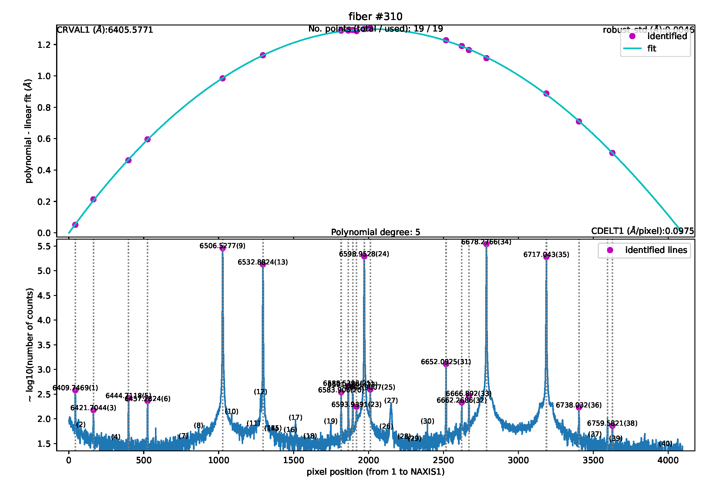
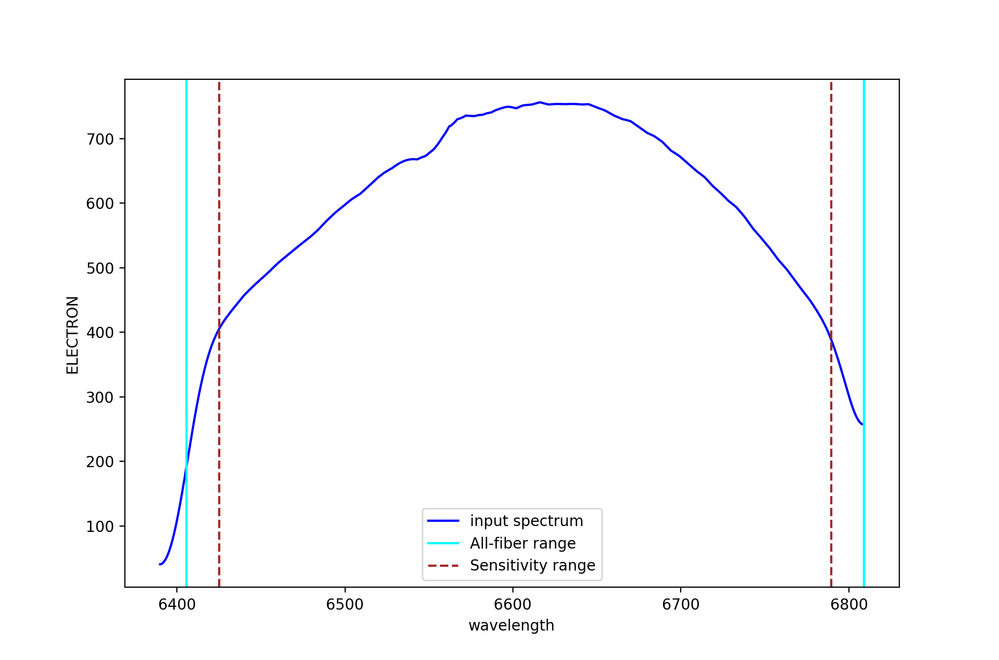
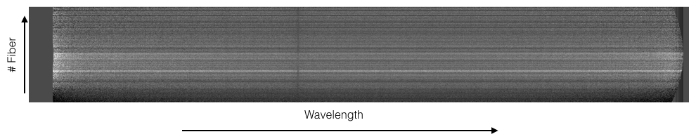
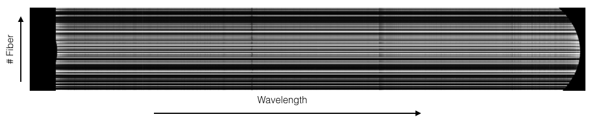

**************
Data reduction
**************

Getting Started
===============

The first step to start the data reduction is to activate your
environment (see details in Section 3.1 and 3.2):

Data organization
=================

MEGARA DRP uses its own data organization to work. We need a directory
named MEGARA, in our example this directory is under data_reduction/:

.. code-block:: console

    (megara) bash-3.2$ pwd
    /Users/acm/Desktop/data_reduction/MEGARA

Under the MEGARA/ directory we need to have the calibration tree with
the specific name ca3558e3-e50d-4bbc-86bd-da50a0998a48/, which is the
string that uniquely identifies the instrument configuration (a
different name was, for example, used during laboratory integration at
LICA-UCM). Under the MEGARA/ directory we can also have the requirements
file named *control.yaml* needed to run the pipeline (see section 5.3;
note that the *tree* command shown below might not be available in
certain unix distributions; use “ls” instead).

.. code-block:: console
    
    (megara) bash-3.2$ tree -L 2
    .
    └── MEGARA
    ├── M15
    ├── M71
    ├── ca3558e3-e50d-4bbc-86bd-da50a0998a48
    └── control.yaml

The requirements file *control.yaml* contains the path for your MEGARA/
directory:

rootdir: /Users/acm/Desktop/data_reduction

and useful information for performing the wavelength calibration of each
VPH, including the number of emission lines, wavelength ranges and
degree of polynomial fit to be used by the wavelength calibration
recipe. In this file you can also specify the name for the extinction
curve file used for the flux calibration recipe. This is simply an ASCII
file with two space-separated columns, one with the wavelength in
Angstroms and another with the magnitudes of extinction per unit airmass
at the corresponding wavelength, i.e. the same format used for
extinction curves within IRAF. We strongly recommend to use the standard
extinction curve of the Roque de los Muchachos Observatory.

.. code-block:: yaml

    version: 1
    rootdir: /Users/acm/Desktop/REDUCTION_MEGARA/reduction_GTC_com
    products:
        MEGARA:
        - {id: 2, type: 'ReferenceExtinctionTable', tags: {}, content: 'extinction_LP.txt'}
    requirements:
        MEGARA:
            default:
                MegaraArcCalibration:
                    - {name: nlines, tags: {vph: LR-U, speclamp: ThAr, insmode: LCB}, content: [25,25]}
                    - {name: nlines, tags: {vph: LR-U, speclamp: ThAr, insmode: MOS}, content: [25,25]}
                    - {name: nlines, tags: {vph: LR-B, speclamp: ThAr, insmode: LCB}, content: [10,10,15,5]}
                    - {name: nlines, tags: {vph: LR-B, speclamp: ThAr, insmode: MOS}, content: [10,10,15,5]}
                    - {name: nlines, tags: {vph: LR-V, speclamp: ThAr, insmode: LCB}, content: [15,5,10,7]}
                    - {name: nlines, tags: {vph: LR-V, speclamp: ThAr, insmode: MOS}, content: [15,5,10,7]}
                    - {name: nlines, tags: {vph: LR-R, speclamp: ThAr, insmode: LCB}, content: [14,7]}
                    - {name: nlines, tags: {vph: LR-R, speclamp: ThAr, insmode: MOS}, content: [14,7]}
                    - {name: nlines, tags: {vph: LR-I, speclamp: ThAr, insmode: LCB}, content: [14]}
                    - {name: nlines, tags: {vph: LR-I, speclamp: ThAr, insmode: MOS}, content: [14]}
                    - {name: nlines, tags: {vph: LR-Z, speclamp: ThNe, insmode: LCB}, content: [14,9]}
                    - {name: nlines, tags: {vph: LR-Z, speclamp: ThNe, insmode: MOS}, content: [14,9]}
                    - {name: nlines, tags: {vph: MR-U, speclamp: ThAr, insmode: LCB}, content: [8,10]}
                    - {name: nlines, tags: {vph: MR-U, speclamp: ThAr, insmode: MOS}, content: [8,10]}
                    - {name: nlines, tags: {vph: MR-UB, speclamp: ThAr, insmode: LCB}, content: [20]}
                    - {name: nlines, tags: {vph: MR-UB, speclamp: ThAr, insmode: MOS}, content: [20]}
                    - {name: nlines, tags: {vph: MR-B, speclamp: ThAr, insmode: LCB}, content: [11]}
                    - {name: nlines, tags: {vph: MR-B, speclamp: ThAr, insmode: MOS}, content: [11]}
                    - {name: nlines, tags: {vph: MR-G, speclamp: ThAr, insmode: LCB}, content: [10,10,8]}
                    - {name: nlines, tags: {vph: MR-G, speclamp: ThAr, insmode: MOS}, content: [10,10,8]}
                    - {name: nlines, tags: {vph: MR-V, speclamp: ThAr, insmode: LCB}, content: [13,8]}
                    - {name: nlines, tags: {vph: MR-V, speclamp: ThAr, insmode: MOS}, content: [13,8]}
                    - {name: nlines, tags: {vph: MR-VR, speclamp: ThNe, insmode: LCB}, content: [14]}
                    - {name: nlines, tags: {vph: MR-VR, speclamp: ThNe, insmode: MOS}, content: [14]}
                    - {name: nlines, tags: {vph: MR-R, speclamp: ThNe, insmode: LCB}, content: [9]}
                    - {name: nlines, tags: {vph: MR-R, speclamp: ThNe, insmode: MOS}, content: [9]}
                    - {name: nlines, tags: {vph: MR-RI, speclamp: ThNe, insmode: LCB}, content: [7]}
                    - {name: nlines, tags: {vph: MR-RI, speclamp: ThNe, insmode: MOS}, content: [7]}
                    - {name: nlines, tags: {vph: MR-I, speclamp: ThNe, insmode: LCB}, content: [5,5,5]}
                    - {name: nlines, tags: {vph: MR-I, speclamp: ThNe, insmode: MOS}, content: [5,5,5]}
                    - {name: nlines, tags: {vph: MR-Z, speclamp: ThNe, insmode: LCB}, content: [4,5,3]}
                    - {name: nlines, tags: {vph: MR-Z, speclamp: ThNe, insmode: MOS}, content: [4,5,3]}
                    - {name: nlines, tags: {vph: HR-R, speclamp: ThNe, insmode: LCB}, content: [5]}
                    - {name: nlines, tags: {vph: HR-R, speclamp: ThNe, insmode: MOS}, content: [5]}
                    - {name: nlines, tags: {vph: HR-I, speclamp: ThNe, insmode: LCB}, content: [10]}
                    - {name: nlines, tags: {vph: HR-I, speclamp: ThNe, insmode: MOS}, content: [10]}
                    - {name: polynomial_degree, tags: {vph: LR-U, speclamp: ThAr}, content: [3,5]}
                    - {name: polynomial_degree, tags: {vph: LR-B, speclamp: ThAr}, content: [5,5]}
                    - {name: polynomial_degree, tags: {vph: LR-V, speclamp: ThAr}, content: [5,5]}
                    - {name: polynomial_degree, tags: {vph: LR-R, speclamp: ThAr}, content: [3,5]}
                    - {name: polynomial_degree, tags: {vph: LR-I, speclamp: ThAr}, content: [3,5]}
                    - {name: polynomial_degree, tags: {vph: LR-Z, speclamp: ThNe}, content: [3,5]}
                    - {name: polynomial_degree, tags: {vph: MR-U, speclamp: ThAr}, content: [3,5]}
                    - {name: polynomial_degree, tags: {vph: MR-UB, speclamp: ThAr}, content: [3,5]}
                    - {name: polynomial_degree, tags: {vph: MR-B, speclamp: ThAr}, content: [3,5]}
                    - {name: polynomial_degree, tags: {vph: MR-G, speclamp: ThAr}, content: [3,5]}
                    - {name: polynomial_degree, tags: {vph: MR-V, speclamp: ThAr}, content: [3,5]}
                    - {name: polynomial_degree, tags: {vph: MR-VR, speclamp: ThNe}, content: [3,5]}
                    - {name: polynomial_degree, tags: {vph: MR-R, speclamp: ThNe}, content: [3,3]}
                    - {name: polynomial_degree, tags: {vph: MR-RI, speclamp: ThNe}, content: [3,3]}
                    - {name: polynomial_degree, tags: {vph: MR-I, speclamp: ThNe}, content: [3,5]}
                    - {name: polynomial_degree, tags: {vph: MR-Z, speclamp: ThNe}, content: [3,3]}
                    - {name: polynomial_degree, tags: {vph: HR-R, speclamp: ThNe}, content: [3,5]}
                    - {name: polynomial_degree, tags: {vph: HR-I, speclamp: ThNe}, content: [3,5]}

Another fundamental function of the calibration tree
(ca3558e3-e50d-4bbc-86bd-da50a0998a48/) is to host the calibration
products that will be used by the corresponding recipes, such as the
MasterBias, MasterFiberFlat, MasterSensitivity, etc. Thus, once the
files for these calibrations are generated, they should be copied under
this calibration tree according structure below. Since the DRP would
read the first file in alphabetical order inside the corresponding
folder, we recommend to place only one file in each folder.

(megara) bash-3.2$ tree ca3558e3-e50d-4bbc-86bd-da50a0998a48/ -L 2

ca3558e3-e50d-4bbc-86bd-da50a0998a48/

├── LinesCatalog

│   ├── ThAr

│   └── ThNe

├── MasterBPM

│   └── master_bpm.fits

├── MasterBias

│   └── master_bias.fits

├── MasterFiberFlat

│   ├── LCB

│   └── MOS

├── MasterSensitivity

│   ├── LCB

│   └── MOS

├── MasterSlitFlat

│  

├── MasterTwilightFlat

│   ├── LCB

│  

├── ModelMap

│   ├── LCB

│   └── MOS

├── TraceMap

│   ├── LCB

│   └── MOS

└── WavelengthCalibration

├── LCB

└── MOS

The content for the LinesCatalog/ is specific for each VPH (line lists
for all VPHs can be found at
https://zenodo.org/record/2270518#.XRx9HKZS9E4). In the following
example the calibration files for the HR-R (LCB observing mode) and LR-R
(MOS observing mode) VPHs are shown. When other VPHs are used, the user
just needs to create the corresponding folders. It is recommended to
have only one file in each calibration directory. For example, for the
same VPH you can have several *master_traces.json* files with the
information to trace the fibers light through the detector at the same
day but at different ambient temperatures.

Different files can be stored at the same directory, but the DRP is
going to use the first file it encounters in alphabetical order. The
user can name the desired file with prefix *“00\_”* (e.g.
*00_master_traces.json*) to be sure this is the file to be used by the
DRP. Note that the sorting of files named *“00\_”* and *“000\_”* might
be different for the operative system and for the MEGARA DRP, so avoid
making abusive use of these prefixes.

(megara) bash-3.2$ tree ca3558e3-e50d-4bbc-86bd-da50a0998a48/ -L 4

ca3558e3-e50d-4bbc-86bd-da50a0998a48/

├── LinesCatalog

│   ├── ThAr

│   │   ├── LR-R

│   │   │   └── LR-R_ThAr.lis

│   │   .

│   │   .

│ │ .

│   └── ThNe

│      ├── HR-R

│      │   └── HR-R_ThNe.lis

│     .

│   .

│   .

├── MasterBPM

│   └── master_bpm.fits

├── MasterBias

│   └── master_bias.fits

├── MasterFiberFlat

│   ├── LCB

│   │   └── HR-R

│   │   └── master_fiberflat.fits

│   └── MOS

│   └── LR-R

│   └── master_fiberflat.fits

├── MasterSensitivity

│   ├── LCB

│   │   └── HR-R

│   │   └── master_sensitivity.fits

│   └── MOS

│   └── LR-R

│   └── master_sensitivity.fits

├── MasterSlitFlat

│  

├── MasterTwilightFlat

│   └── LCB

│   └── HR-R

│   └── master_twilightflat.fits

├── ModelMap

│   ├── LCB

│   │   └── HR-R

│   │   └── master_model.json

│   └── MOS

│   └── LR-R

│   └── master_model.json

├── TraceMap

│   ├── LCB

│   │   └── HR-R

│   │   └── master_traces.json

│   └── MOS

│   └── LR-R

│   └── master_traces.json

└── WavelengthCalibration

├── LCB

│   └── HR-R

│   └── master_wlcalib.json

└── MOS

└── LR-R

└── master_wlcalib.json

Furthermore, the user’s MEGARA/ directory can contain data for your
targets under different directories (in this example our targets are the
M15 and M71 globular clusters). **Your raw data should always be
included in a subdirectory named test/** within each working target
directory (M15, M71, etc.). Images could be stored gzipped but then the
observation-result files should list the images with the .gz extension.
The different observation-result files (*\*.yaml*) used during the data
reduction process should be also located within each target directory as
they will be different for each target. In this example, the
observation-result files in YAML format are named with a first number
related in which they are run.

(megara) bash-3.2$ tree M15 M71 -L 2

M15

├── 0_bias.yaml

├── 1_tracemap.yaml

├── 2_modelmap.yaml

├── 3_wavecalib.yaml

├── 4_fiberflat.yaml

├── 5_twilight.yaml

├── 6_Lcbadquisition.yaml

├── 7_Standardstar.yaml

├── 8_reduce_LCB.yaml

└── data

├── 0001251794-20170626-MEGARA-MegaraLCBImage.fits

├── 0001251795-20170626-MEGARA-MegaraLCBImage.fits

├── 0001251796-20170626-MEGARA-MegaraLCBImage.fits

├── 0001286973-20170724-MEGARA-MegaraLcbImage.fits

├── 0001286974-20170724-MEGARA-MegaraLcbImage.fits

├── 0001286975-20170724-MEGARA-MegaraLcbImage.fits

├── ……

M71

├── 0_bias.yaml

├── 1_tracemap.yaml

├── 2_modelmap.yaml

├── 3_wavecalib.yaml

├── 4_fiberflat.yaml

├── 5_twilight.yaml

├── 6_Lcbadquisition.yaml

├── 7_Standardstar.yaml

├── 8_reduce_MOS.yaml

└── data

├── 0001287845-20170730-MEGARA-MegaraLcbImage.fits

├── 0001287846-20170730-MEGARA-MegaraLcbImage.fits

├── 0001287847-20170730-MEGARA-MegaraLcbImage.fits

├── 0001288184-20170731-MEGARA-MegaraMosImage.fits

├── 0001288185-20170731-MEGARA-MegaraMosImage.fits

├── ……

Running a recipe
================

The MEGARA DRP is run through a command line interface provided by
**numina**.

The run mode of numina requires:

-  An observation-result file in YAML format.

-  A requirements file in YAML format (*control.yaml*).

-  The raw images obtained as part of the user’s observing block.

-  The calibrations required by the recipe.

The observation-result file and the requirements file are created by the
user. This is an example of the observation result file to compute the
fibers traces `1_tracemap.yaml`

.. code-block:: yaml

    id: 1_HR-R
    mode: MegaraTraceMap
    instrument: MEGARA
    frames:
        - 0001312246-20170831-MEGARA-MegaraSuccess.fits
        - 0001312247-20170831-MEGARA-MegaraSuccess.fits
        - 0001312248-20170831-MEGARA-MegaraSuccess.fits

The “\ *id:”* is an identifier of the observing block. The DRP will
create two directories with the products of the recipe (/obsid_work and
/obsid_results) using the “\ *id”* identifier as a prefix to identify
the corresponding processing block. The “\ *mode:”* is the name of the
instrument observing mode as returned by numina show-modes. In
“\ *frames:”* a list of the names of the images obtained as part of the
observation should be included. Using the same YAML file the user can
process sequentially different sets of files with the same recipe, the
“\ *enabled:”* parameter can be set to *True* (or *False)* to process
(or not) a specific block of files (last block should end with *enabled:
True*, not with block separator “----“). Note that the user can add
comments to these YAML files by adding lines preceded with a hash sign
(#).

(megara) bash-3.2$ more 1_tracemap.yaml

id: 1_HR-R

mode: MegaraTraceMap

instrument: MEGARA

frames:

- 0001312246-20170831-MEGARA-MegaraSuccess.fits

- 0001312247-20170831-MEGARA-MegaraSuccess.fits

- 0001312248-20170831-MEGARA-MegaraSuccess.fits

enabled: True

---

id: 1_HR-R_d29jun

mode: MegaraTraceMap

instrument: MEGARA

frames:

- 0001252371-20170629-MEGARA-MegaraFiberFlatImage.fits

- 0001252372-20170629-MEGARA-MegaraFiberFlatImage.fits

- 0001252373-20170629-MEGARA-MegaraFiberFlatImage.fits

enabled: True

In the directory of our target M15 for example,

(megara) bash-3.2$ pwd

/Users/acm/Desktop/data_reduction/MEGARA/M15

(megara) bash-3.2$ ls

0_bias.yaml 2_modelmap.yaml 4_fiberflat.yaml 6_Lcbadquisition.yaml
8_reduce_LCB.yaml

1_tracemap.yaml 3_wavecalib.yaml 5_twilight.yaml 7_Standardstar.yaml
**data**

we run the recipe MegaraTraceMap using the observing-result file
*1_tracemap.yaml* and the requirements file *control.yaml* in the
following way:

(megara) bash-3.2$ numina run 1_tracemap.yaml -r ../control.yaml

Other useful numina commands include:

(megara) bash-3.2$ numina show-modes

(megara) bash-3.2$ numina show-recipes

(megara) bash-3.2$ numina show-recipes -m <obs mode>

(megara) numina run -h

(megara) numina run 1_tracemap.yaml -r ../control.yaml –enable
<block_id>

Data reduction process
======================

In the following sections the different steps to produce the target
wavelength and flux calibrated row-stacked spectra (RSS) are detailed.

Bias image
~~~~~~~~~~

Before the Analog-to-Digital conversion is performed a pedestal
(electronic) level is added to all images obtained with the MEGARA CCD.
This is a standard procedure in CCD imaging and spectroscopy
applications for Astronomy and is intended to minimize the ADC errors
produced when very low analog values are converted to DUs. To calibrate
this pedestal level of the detectors, bias images are taking with null
integration time. We note the user that in the case of the MEGARA CCD (a
4k x 4k pixels CCD231-84 E2V chip), since the detector is always read
using two diagonally-opposed amplifiers (to speed up the reading process
while minimizing electronic cross-talk), the bias is slightly different
in the upper and bottom halves of the image. Note that the Readout Noise
(RoN) should be around 2 e\ :sup:`–` in all cases.

This recipe processes a set of bias images obtained in Bias Image
instrument mode. Images are corrected from overscan and trimmed to the
physical size of the detector. Then, they are corrected from Bad-pixels
Mask, if the BPM is available and finally, images are stacked using the
_staticn.

This is an example for the *0_bias.yaml*:

.. code-block:: yaml

    id: 0_bias
    mode: MegaraBiasImage
    instrument: MEGARA
    frames:
    - 0001310880-20170827-MEGARA-MegaraBiasImage.fits
    - 0001310881-20170827-MEGARA-MegaraBiasImage.fits
    - 0001310882-20170827-MEGARA-MegaraBiasImage.fits
    - 0001310883-20170827-MEGARA-MegaraBiasImage.fits
    - 0001310884-20170827-MEGARA-MegaraBiasImage.fits
    - 0001310885-20170827-MEGARA-MegaraBiasImage.fits
    - 0001310886-20170827-MEGARA-MegaraBiasImage.fits
    - 0001310887-20170827-MEGARA-MegaraBiasImage.fits
    - 0001310888-20170827-MEGARA-MegaraBiasImage.fits

The recipe is run as follows,

(megara) bash-3.2$ numina run 0_bias.yaml -r ../control.yaml

and the products are stored in the directory obsid0_bias_results/,
including the *master_bias.fits* file (see **Figure 4**). The user needs
to copy this file to the calibration tree at
`ca3558e3-e50d-4bbc-86bd-da50a0998a48/MasterBias/`.

(megara) bash-3.2$ tree obsid0_bias_work/ obsid0_bias_results/

obsid0_bias_work/

├── 0001310880-20170827-MEGARA-MegaraBiasImage.fits

├── 0001310881-20170827-MEGARA-MegaraBiasImage.fits

├── 0001310882-20170827-MEGARA-MegaraBiasImage.fits

├── 0001310883-20170827-MEGARA-MegaraBiasImage.fits

├── 0001310884-20170827-MEGARA-MegaraBiasImage.fits

├── 0001310885-20170827-MEGARA-MegaraBiasImage.fits

├── 0001310886-20170827-MEGARA-MegaraBiasImage.fits

├── 0001310887-20170827-MEGARA-MegaraBiasImage.fits

├── 0001310888-20170827-MEGARA-MegaraBiasImage.fits

├── index.pkl

└── master_bpm.fits

obsid0_bias_results/

├── master_bias.fits

├── processing.log

├── result.yaml

└── task.yaml

.. image:: _static/image11.png
   :alt: A close up of a logo Description automatically generated
   :width: 3.64097in
   :height: 3.53681in

Figure 4: Example of a MEGARA master bias as created by the
MegaraBiasImage recipe. Note that this image was obtained with the
MEGARA DRP ver. 0.9. Later versions fit a spline to the overscan regions
of both amplifiers (instead of adopting a constant value) so the
resulting MegaraBias image is typically flatter than the example shown
here.

Dark image
~~~~~~~~~~

The potential wells in CCD detectors spontaneously generate electron-ion
pairs at a rate that is a function of temperature. For very long
exposures this translates into a current that is associated with no
light source and that is commonly referred to as dark current. Different
tests during AIV activities have shown MEGARA detector´s dark current
has very low values < 2 e\ :sup:`-`/h/pixel, therefore in our data
reduction dark images are neither needed nor used.

Bad-pixels Mask
~~~~~~~~~~~~~~~

Although science-grade CCD detectors show very few bad pixels / bad
columns there will be a number of pixels (among the ~17 Million pixels
in the MEGARA CCD) whose response could not be corrected by means of
using calibration images such as dark frames or flat-field images. These
pixels, commonly called either dead or hot pixels, should be identified
and masked so their expected signal could be derived using dithered
images or, alternatively, locally interpolated. The user is provided
with a Bad-Pixels Mask (BPM) named *master_bpm.fits* and located at
ca3558e3-e50d-4bbc-86bd-da50a0998a48/MasterBPM/ that was generated as
part of the AIV activities by processing a set of defocused continuum
flat images. This image can be also found at
https://zenodo.org/record/2270518#.XRx9HKZS9E4. Currently, MEGARA
presents only one (partial) bad column of 120 pixels in length.

Slit Flat correction
~~~~~~~~~~~~~~~~~~~~

In the case of fiber-fed spectrographs the correction for the detector
pixel-to-pixel variation of the sensibility is usually carried out using
data from laboratory, where the change in efficiency of the detector at
different wavelengths is computed and then used to correct for this
effect for each specific instrument configuration (VPH setup in the case
of MEGARA).

The quality of present-day CCDs leads to a rather small impact of these
pixel-to-pixel variations in sensitivity on either the flux calibration
and the cosmetics of the scientific images, especially considering that
not one but a number of pixels along the spatial direction are extracted
for each fiber and at each wavelength. In the case of MEGARA, the
pseudo-slit has been offset from its optical focus position to ensure
that the gaps between fibers are also illuminated when a continuum
(halogen) lamp at the ICM is used. The results of the analysis of the
pixel-to-pixel variations in sensitivity show that this correction is
actually not needed although this recipe is implemented in the MEGARA
DRP.

Tracing fibers
~~~~~~~~~~~~~~

Trace map
^^^^^^^^^

The next processing step combine a series of fiber-flats to generate a
master “trace map”. The fiber-flats are obtained by illuminating the
instrument focal plane with a continuum (halogen) lamp that is part of
the GTC Instrument Calibration Module (ICM).

This step produces the tracing information required to extract the flux
of the fibers. The result is stored in a file named
*master_traces.json*.

An example of the observation result file *1_tracemap.yaml* to trace the
fibers is the following:

(megara) bash-3.2$ more 1_tracemap.yaml

id: 1_HR-R

mode: MegaraTraceMap

instrument: MEGARA

frames:

- 0001312246-20170831-MEGARA-MegaraSuccess.fits

- 0001312247-20170831-MEGARA-MegaraSuccess.fits

- 0001312248-20170831-MEGARA-MegaraSuccess.fits

Then the recipe is run by doing:

(megara) bash-3.2$ numina run 1_tracemap.yaml -r ../control.yaml

Images listed in the observation-result file are trimmed and corrected
from overscan, bad-pixel mask (if *master_bpm* is present), bias and
dark current (if *master_dark* is present). Images thus corrected are
then _staticn stacked. The result of the combination is saved as an
inter_staticte result that is named ‘\ *reduced_image.fits’*. This
combined image is also returned in the field *reduced_image* of the
recipe result and will be used for doing some quality control on the
tracing of the fibers.

The fibers are then grouped in packs of different numbers of fibers. To
match the traces in the image with the corresponding fibers, the DRP
uses the information provided by the instrument configuration to know
how fibers are packed and where the different groups of fibers appear in
the detector. Using the column reference 2000, peaks are detected (using
an average of 7 columns) and matched to the layout of fibers. Fibers
without a matching peak are counted and their ids stored in the final
*master_traces.json* file. Once the peaks in the reference column are
found, each one is traced until the border of the image is reached. The
trace may be lost before reaching the border. In all cases, the
beginning and the end of the trace are stored.

The Y position of the trace is fitted to a polynomial of degree
polynomial_degree set to 5 by default. The coefficients of the
polynomial are stored in the final *master_traces.json* file.

(megara) bash-3.2$ tree obsid1_HR-R_work/ obsid1_HR-R_results/ -L 2

obsid1_HR-R_work/

├── 0001312246-20170831-MEGARA-MegaraSuccess.fits

├── 0001312247-20170831-MEGARA-MegaraSuccess.fits

├── 0001312248-20170831-MEGARA-MegaraSuccess.fits

├── ds9.reg

├── ds9_raw.reg

├── index.pkl

├── master_bias.fits

├── master_bpm.fits

└── reduced_image.fits

obsid1_HR-R_results/

├── master_traces.json

├── processing.log

├── reduced_image.fits

├── reduced_rss.fits

├── result.yaml

└── task.yaml

The position of the fibers traces at the detector are shifted depending
on the ambient temperature. It is recommended to have continuum halogen
exposures near in time to the observation of the scientific target. If
this is not the case, the traces can be shifted easily when processing
the target (see section 5.4.5.2).

The traces generated by this task can be visualized both on the raw or
the processed images and can be also shifted to consider possible
offsets between these traces and the position in the fibers in other
images (twilight flats, standard star or scientific target observations,
etc.). The visualization of the traces and an underlying reduced image
can be done by executing:

(megara)bash-3.2$ megaradrp-overplot_traces reduced_image.fits
master_traces.json

or

(megara)bash-3.2$ megaradrp-overplot_traces –-rawimage
0001312246-20170831-MEGARA-MegaraSuccess.fits master_traces.json

respectively for the reduced and raw images. Another way to check the
tracing is by overplotting the ds9 region files created by the DRP for
the traces on top of this *reduced_image* by doing (syntax might vary):

(megara) bash-3.2$ ds9 obsid1_HR-R_results/reduced_image.fits -regions
load obsid1_HR-R_work/ds9.reg

The same syntax can be used to check the offset between these traces and
the position of the fibers in other images (arc-lamp, twilight, standard
star and object images).

Finally, the user needs to copy this *master_traces.json* to the
corresponding place at the calibration tree.

(megara)bash-3.2$ cd obsid1_HR-R_results/

(megara)bash-3.2$ cp master_traces.json
../../ca3558e3-e50d-4bbc-86bd-da50a0998a48/TraceMap/LCB/HR-R

Model map
^^^^^^^^^

This recipe processes a set of continuum flat images obtained in *Trace
Map* or *Fiber Flat* modes and returns the fiber profile information
required to perform **advanced** fiber extraction in other recipes.

The set of files listed in the observation-result file *2_modelmap.yaml*
is the same one used for the Trace Map.

(megara) bash-3.2$ more 2_modelmap.yaml

id: 2_HR-R

mode: MegaraModelMap

instrument: MEGARA

frames:

- 0001312246-20170831-MEGARA-MegaraSuccess.fits

- 0001312247-20170831-MEGARA-MegaraSuccess.fits

- 0001312248-20170831-MEGARA-MegaraSuccess.fits

Then the recipe is run by doing:

(megara) bash-3.2$ numina run 2_modelmap.yaml -r ../control.yaml

This processing step might take several minutes (from 10-40 min.)
depending on the hardware used. When a model map is used the running
times of the subsequent processing steps also increase by 2-5 minutes.

The images are processed as in the Trace Map recipe. In this case, the
approximate central position of the fibers is obtained from the
previously computed *master_traces.json*. Then, for every 100 columns of
the reduced image, a vertical cut in the image is fitted to a sum of
fiber profiles, being the profile a gaussian convolved with a square.
After the columns are fitted, the profiles (central position and sigma)
are interpolated to all columns using splines (see **Figure 5**). The
coefficients of the resulting splines are stored in the final
*master_model.json* file.

The recipe also returns the RSS obtained by applying this advanced
extraction to *reduced_image*. As an inter_staticte result, the recipe
produces DS9 region files with the position of the center of the
profiles, that can be used with raw and reduced images (see **Figure
6**).

(megara) bash-3.2$ tree obsid2_HR-R_work/ obsid2_HR-R_results/ -L 2

obsid2_HR-R_work/

├── 0001312246-20170831-MEGARA-MegaraSuccess.fits

├── 0001312247-20170831-MEGARA-MegaraSuccess.fits

├── 0001312248-20170831-MEGARA-MegaraSuccess.fits

├── ds9.reg

├── ds9_raw.reg

├── fib_100_mean.png

├── fib_100_std.png

├── fib_101_mean.png

├── fib_101_std.png

├── fib_102_mean.png

├── fib_102_std.png

├── …

├── index.pkl

├── master_bias.fits

├── master_bpm.fits

└── reduced_image.fits

obsid2_HR-R_results/

├── master_model.json

├── processing.log

├── reduced_image.fits

├── reduced_rss.fits

├── result.yaml

└── task.yaml

The user needs to copy this *master_model.json* to the corresponding
place at the calibration tree.

(megara)bash-3.2$ cd obsid2_HR-R_results/

|image8|\ |image9|\ (megara)bash-3.2$ cp master_model.json
../../ca3558e3-e50d-4bbc-86bd-da50a0998a48/ModelMap/LCB/HR-R

Figure 5: Mean position (left) and sigma (right) in pixels for fiber
#310 along the spectral axis shown as blue points. The red line shows
the spline fit. Plots for all the fibers are stored in the obsid_work/
directory.

.. image:: _static/image14.png
   :width: 6.7375in
   :height: 2.30278in

Figure 6: MEGARA LCB HR-R continuum halogen exposure (left) and a region
of the raw image (right) with the ds9_raw.reg tracing the fibers’ path
shown on top.

Wavelength Calibration
~~~~~~~~~~~~~~~~~~~~~~

In this processing step the wavelength solution for each fiber is
created using recipe *MegaraArcCalibration*. To create the dispersion
solution the recipe needs raw arc-lamp [10]_ frames as input (see
**Figure 7**).

The user needs to check if the traces already computed in the previous
step are appropriate to do the extraction in the arc-lamp exposures. If
the continuum halogen used to generate the traces and the arc-lamp
images were obtained near in time there no offset should be applied to
the traces [11]_. The user can check this and evaluate the actual offset
by plotting the *ds9_raw.reg* regions file on top of the arc-lamp raw
image using DS9. If the traces (regions in *ds9_raw.reg*) are above the
fiber as seen in the raw image, then the offset is a negative number and
it is measured in pixels, while if the traces are below then the offset
is a positive number. This offset is given in the *“requirements”*
section in the observation-result file using the *“extraction_offset”*
parameter.

In this case, the observation-result file is called *3_wavecalib.yaml*.
In the example below, three frames for arc lamp exposures are included
and the offset for the extraction is set to 0 pixels:

(megara) bash-3.2$ more 3_wavecalib.yaml

id: 3_HR-R

mode: MegaraArcCalibration

instrument: MEGARA

frames:

- 0001312249-20170831-MEGARA-MegaraSuccess.fits

- 0001312250-20170831-MEGARA-MegaraSuccess.fits

- 0001312251-20170831-MEGARA-MegaraSuccess.fits

requirements:

extraction_offset: [0.0]

store_pdf_with_refined_fits: 1

Then the recipe is run by doing:

(megara) bash-3.2$ numina run 3_wavecalib.yaml -r ../control.yaml

.. image:: _static/image15.png
   :width: 2.48819in
   :height: 2.50069in

**Figure 7:** *MEGARA LCB ThNe arc-lamp exposure obtained with the HR-R
VPH.*

Images provided in *3_wavecalib.yaml* are trimmed and corrected from
overscan, bad-pixel mask (if *master_bpm* is present), bias and dark
current (if *master_dark* is present). The corrected images are then
stacked using a _staticn. The result of the combination of these images is
saved as an inter_staticte result, named *‘reduced_image.fits’*. The
apertures in the 2D image are extracted, using the information in
*master_traces.json* (or in the *model_map.json* if this file is present
at the calibration tree) and the *“extraction_offset”* parameter set in
the *3_wavecalib.yaml*. The result of the extraction is saved as an
inter_staticte result named *‘reduced_rss.fits’*. The requirement file
*control.yaml* has useful information for the wavelength calibration.
For each fiber in the reduced RSS, the peaks are detected and sorted by
peak intensity. Then, a total of *nlines* as listed in the
*control.yaml* file are used to select the brightest peaks. If it is a
list, then the peaks are divided, by their position, in as many groups
as elements in the list and *nlines[0]* peaks are selected in the first
group, *nlines[1]* peaks in the second, etc. The selected peaks are then
matched against the catalog of lines located in the calibration tree at
ca3558e3-e50d-4bbc-86bd-da50a0998a48/LinesCatalog/. The wavelengths of
the matched features are fitted to a polynomial of degree equal to
*polynomial_degree*. The matched lines, the quality of the match and
other relevant information such as the coefficients of the polynomial
are stored in the final *master_wlcalib.json* for each fiber.

Finally, the recipe returns different products. At the obsid_work/
directory the files *wavecal_iter1.pdf* (for the initial wavelength
calibration) and *wavecal_iter2.pdf* (for the final iteration) contain a
graphical representation for the wavelength calibration for each fiber.
For example, in *wavecal_iter2.pdf* the total number of lines used for
the refined wavelength calibration and the root mean square for each fit
is plotted depending on the fiber number. In the same PDF file, the
linear approximation for CRVAL1 and CDELT1 is plotted and also a graph
for each coefficient (typically of 5\ :sup:`th` degree) of the
polynomial fit used for the refined wavelength calibration is shown (see
**Figure 8**).

Should the user set the *store_pdf_with_refined_fits* parameter to
*“store_pdf_with_refined_fits: 1”* at the *3_wavecalib.yaml*, the recipe
will create the subdirectory obsid3_HR-R_work/refined_wavecal/ where a
collection of PDF files (one for each fiber) is created with graphical
information about the refined wavelength calibration (see **Figure 9**).

(megara) bash-3.2$ tree obsid3_HR-R_work/ obsid3_HR-R_results/ -L 2

obsid3_HR-R_work/

├── 0001312249-20170831-MEGARA-MegaraSuccess.fits

├── 0001312250-20170831-MEGARA-MegaraSuccess.fits

├── 0001312251-20170831-MEGARA-MegaraSuccess.fits

├── index.pkl

├── initial_master_wlcalib.json

├── master_bias.fits

├── master_bpm.fits

├── reduced_image.fits

├── reduced_rss.fits

├── refined_wavecal

│   ├── 001.pdf

│   ├── 002.pdf

│   ├── 003.pdf

│   ├── 004.pdf

│   ├── 005.pdf

│ …

├── wavecal_iter1.pdf

└── wavecal_iter2.pdf

obsid3_HR-R_results/

├── fwhm_image.fits

├── master_wlcalib.json

├── processing.log

├── reduced_image.fits

├── reduced_rss.fits

├── result.yaml

└── task.yaml

.. image:: _static/image16.png
   :width: 5.91667in
   :height: 4.14792in

**Figure 8:** *Some of the plots included in wavecalib_iter2.pdf file
generated with the MegaraArcCalibration recipe.*

**Figure 9:** *Example of the refined wavelength calibration result for
fiber #310. This kind of file (310.pdf at refined_wavecalib/ in this
case) is generated when the parameter “store_pdf_with_refined_fits”* *is
set to 1. This requirement should be set to 0 for a faster execution of
this recipe.*

The user needs to copy the *master_wlcalib.json* at the obsid_result/
directory to the corresponding place at the calibration tree:

(megara)bash-3.2$ cd obsid3_HR-R_results/

(megara)bash-3.2$ cp master_wlcalib.json
../../ca3558e3-e50d-4bbc-86bd-da50a0998a48/WavelengthCalibration/LCB/HR-R

Flat-field correction
~~~~~~~~~~~~~~~~~~~~~

Each optical fiber in MEGARA behaves like a different optical system,
and therefore, its optical transmission is different and individual,
with different wavelength dependence.

The recipe *MegaraFiberFlatImage* computes the *master_fiberflat.fits*
to correct for the global variations in transmission in between fibers
and as a function of wavelength in MEGARA. A fiber-flat image should be
used to perform this correction. These images are obtained by means of
illuminating the instrument focal plane with a flat spectral source
(typically a halogen lamp) that is installed as part of the GTC
Instrument Calibration Module (ICM).

In this case, we called the observation result file *4_fiberflat.yaml*,
where a total of three continuum halogen exposures are included. If the
inputs frames are the same used to trace the fiber spectra on the
detector for the same specific spectral setup, the *“extraction_offset”*
parameter should be set to 0 pixels. If that is note the case the offset
should be evaluated and computed as detailed in Section 5.4.6.

(megara) bash-3.2$ more 4_fiberflat.yaml

id: 4_HR-R

mode: MegaraFiberFlatImage

instrument: MEGARA

frames:

- 0001312246-20170831-MEGARA-MegaraSuccess.fits

- 0001312247-20170831-MEGARA-MegaraSuccess.fits

- 0001312248-20170831-MEGARA-MegaraSuccess.fits

requirements:

extraction_offset: [0.0]

Then the recipe is run by doing:

(megara) bash-3.2$ numina run 4_fiberflat.yaml -r ../control.yaml

All images listed in the observation-result file are trimmed and
corrected from overscan, bad pixel mask (if *master_bpm* is present),
bias and dark current (if *master_dark* is present) and corrected from
pixel-to-pixel flat if *master_slitflat* is provided. The corrected
images are then stacked using a _staticn. The result of the combination is
saved as an inter_staticte result, named *‘reduced_image.fits’*.

The apertures in the 2D image are extracted, using the information in
*master_traces.json* (or in the *model_map.json* if this file is present
at the calibration tree) and the *“extraction_offset”* parameter set in
the *4_fiberflat.yaml,* and then it is resampled according to the
wavelength calibration in *master_wlcalib.json*. The resulting RSS is
saved as an inter_staticte result named *‘reduced_rss.fits’*. To normalize
the *master_fiberflat*, each fiber is divided by the best-fitting spline
to the average of all valid fibers (see **Figure 10**). The RSS image
*master_fiberflat.fits* is returned as a recipe result (see **Figure
11**).

(megara) bash-3.2$ tree obsid4_HR-R_work/ obsid4_HR-R_results/ -L 2

obsid4_HR-R_work/

├── 0001312246-20170831-MEGARA-MegaraSuccess.fits

├── 0001312247-20170831-MEGARA-MegaraSuccess.fits

├── 0001312248-20170831-MEGARA-MegaraSuccess.fits

├── collapse.txt

├── collapsed_smooth.png

├── index.pkl

├── mask_noinfo.txt

├── master_bias.fits

├── master_bpm.fits

├── reduced_image.fits

└── reduced_rss.fits

obsid4_HR-R_results/

├── master_fiberflat.fits

├── processing.log

├── reduced_image.fits

├── reduced_rss.fits

├── result.yaml

└── task.yaml

The user needs to copy the *master_fiberflat.json* at the obsid_result/
directory to the corresponding place at the calibration tree:

(megara)bash-3.2$ cd obsid4_HR-R_results/

(megara)bash-3.2$ cp master_fiberflat.json
../../ca3558e3-e50d-4bbc-86bd-da50a0998a48/MasterFiberFlat/LCB/HR-R

.. image:: _static/image18.png
   :width: 3.41597in
   :height: 2.56042in

**Figure 10:** *Example of the collapsed_smooth.png file generated as
part of the MegaraFiberFlat recipe, which is located at the* obsid_work/
*directory. The green line is a spline fit to the average of all valid
fibers, which is then used to normalize the extracted spectral in order
to generate the normalized master_fiberflat image.*

|image10|\ **Figure 11:** *Example of the master_fiberflat.fits file
generated for MEGARA LCB HR-R mode.*

Illumination correction
~~~~~~~~~~~~~~~~~~~~~~~

Blank twilight-sky exposures are to be used to calibrate the global
change in response introduced by the fiber flat. This is called the
illumination correction and it is due to the fact that the GTC ICM does
not produce a perfectly uniform illumination of the field and that the
fraction and shape of the pupil that is seen by the MEGARA fibers during
the observation of a specific target does not coincide with that seen
during the acquisition of the fiber-flat images with the ICM.

The twilight sky exposure can safely assume to homogeneously illuminate
the entire MEGARA field of view (3.5 arcmin x 3.5 arcmin for MOS mode
and 12.5 x 11.3 sq. arcsec for LCB mode). However, since the telescope
pupil is not circular and the alignment of the image of the pupil on top
fibers by the microlenses is not identical for all fibers, in order to
do this correction properly, the Rotator Angle of the FC-F rotator
(ROTANG keyword in the raw image) and the Elevation of the telescope
(ELEVAT keyword), and ideally also the temperature, should have the same
values as the ones for the scientific observation. Furthermore, in case
of MOS observing mode, the twilight sky exposures should be done with
the robotic positioners placed at the same positions as for the targets’
configuration.

The recipe *MegaraTwilightFlatImage* process a set of continuum blank
twilight sky images and returns the master twilight flat product. In
this case, we named observation result file as *5_twilight.yaml*, where
three frames for continuum blank twilight sky exposures being listed in
the file. The *“extraction_offset”* parameter can be computed as
detailed in section 5.4.6 (see **Figure 12**).

.. image:: _static/image20.png
   :width: 5.10903in
   :height: 2.375in

**Figure 12:** *Example of a region in the raw blank twilight sky image
(LCB, HR-R) with the computed traces (ds9_raw.reg file) on top. In this
case a “extraction \_offset” of +2.5 pixels was needed.*

(megara) bash-3.2$ more 5_twilight.yaml

id: 5_HR-R

mode: MegaraTwilightFlatImage

instrument: MEGARA

frames:

- 0001251794-20170626-MEGARA-MegaraLCBImage.fits

- 0001251795-20170626-MEGARA-MegaraLCBImage.fits

- 0001251796-20170626-MEGARA-MegaraLCBImage.fits

requirements:

extraction_offset: [+2.5]

normalize_region: [1550,1700]

continuum_region: [1750,1900]

Then the recipe is run by doing:

(megara) bash-3.2$ numina run 5_twilight.yaml -r ../control.yaml

Images provided in the observation-result file are trimmed and corrected
from overscan, bad pixel mask (if *master_bpm* is present), bias and
dark current (if *master_dark* is present) and corrected from
pixel-to-pixel flat if *master_slitflat* is provided. The corrected
images are then stacked using a _staticn. The result of the combination is
saved as an inter_staticte result, named *‘reduced_image.fits’*.

The apertures in the 2D image are extracted, using the information in
*master_traces.json* (or in the *model_map.json* if this file is present
at the calibration tree) and the *“extraction_offset”* parameter set in
the *5_twilight.yaml,* and then it is resampled according to the
wavelength calibration in *master_wlcalib.json*. Then, the result is
divided by the *master_fiberflat*. The resulting RSS is saved as an
inter_staticte result named *‘reduced_rss.fits’*. To normalize the
*master_twilightflat* (see **Figure 13**\ *)*, each fiber is divided by
the average of the column range given in “\ *normalize_region”*
parameter in *5_twilight.yaml.* In those cases where the observation of
an object includes a bright sky line, this “\ *normalize_region”*
parameter can be used to obtain a twilight flat image from these science
observations, especially if twilight frames of the same ROTANG, ELEVAT
and temperature values are not available. In that case, the user can
also make use of the parameter “\ *continuum_region*\ ” to previously
subtract the sky continuum under the bright sky line of interest. Note
that the pixels used in the “\ *normalize_region”* and the
“\ *continuum_region*\ ” requirements correspond to those of the x-axis
of the *“reduced_rss.fits”* image.

(megara) bash-3.2$ tree obsid5_HR-R_work/ obsid5_HR-R_results/ -L 2

obsid5_HR-R_work/

├── 0001251794-20170626-MEGARA-MegaraLCBImage.fits

├── 0001251795-20170626-MEGARA-MegaraLCBImage.fits

├── 0001251796-20170626-MEGARA-MegaraLCBImage.fits

├── index.pkl

├── master_bias.fits

├── master_bpm.fits

├── master_fiberflat.fits

├── reduced_image.fits

└── reduced_rss.fits

obsid5_HR-R_results/

├── master_twilightflat.fits

├── processing.log

├── reduced_image.fits

├── reduced_rss.fits

├── result.yaml

└── task.yaml

|image11|\ **Figure 13:** *Example of the master_twilightflat.fits file
generated for MEGARA LCB HR-R mode.*

The user needs to copy the *master_twilightflat.fits* at the
obsid_result/ directory to the corresponding place at the calibration
tree:

(megara)bash-3.2$ cd obsid5_HR-R_results/

(megara)bash-3.2$ cp master_twilightflat.fits
../../ca3558e3-e50d-4bbc-86bd-da50a0998a48/MasterTwilight/LCB/HR-R

Flux calibration
~~~~~~~~~~~~~~~~

The flux calibration is performed by observing one or several
spectrophotometric stars with the same instrument configuration that for
the scientific observations. Depending on the number of standard stars
observed and on the weather conditions (mainly transparency) two
different types of calibration could be achieved:

-  Absolute-flux calibration: The weather conditions during the night
   should be photometric and a number of spectrophotometric standard
   stars at different airmasses should be observed. This allows to fully
   correct from DUs per CCD pixel to energy surface density (typically
   in AB magnitudes, Jankys or erg s\ :sup:`-1` cm\ :sup:`-2`
   Å\ :sup:`-1`) incident at the top of the atmosphere. If only one
   single standard star is observed (ideally at the airmass of the
   science object) this correction allows deriving the energy surface
   density hitting the telescope primary mirror exclusively, unless an
   atmospheric extinction curve for the observatory and that particular
   night is assumed (in which case the airmass could be different). In
   order to properly flux-calibrate scientific observations at all
   airmasses several stars should be observed during the night.

-  Relative-flux calibration: If the weather conditions are not
   photometric this correction only allows normalizing the DUs per CCD
   pixel along the spectral direction so the conversion to incident
   energy at the top of the atmosphere is the same at all wavelengths.
   In order for this calibration to be valid one must assume that the
   effect of the atmosphere (including atmospheric cirrus and possibly
   thick clouds) on the wavelength dependence of this correction is that
   given by the adopted atmospheric extinction curve, even if the
   absolute flux level is not.

In the following, the different steps to do an absolute flux calibration
are described. A photometric night and one spectrophotometric standard
star observation with the same airmass as the scientific observation are
assumed.

The entire flux of the spectrophotometric standard star needs to be
recovered, so the LCB IFU bundle must be used. The recipe
*MegaraLcbAcquisition* is used to process and extract the spectra in the
standard star observation and determine the position of the centroid of
the target in the LCB field of view, around which the total flux of the
star will be later recovered.

In this case, the observation-result file for determining the star
centroid is *6_lcbadquisition.yaml*, where three frames for
spectrophotometric standard star exposures are here listed. The
*“extraction_offset”* parameter can be computed as detailed in section
5.4.6.

(megara) bash-3.2$ more 6_Lcbadquisition.yaml

id: 6_HR-R

mode: MegaraLcbAcquisition

instrument: MEGARA

frames:

- 0001286973-20170724-MEGARA-MegaraLcbImage.fits

- 0001286974-20170724-MEGARA-MegaraLcbImage.fits

- 0001286975-20170724-MEGARA-MegaraLcbImage.fits

requirements:

extraction_offset: [+4.5]

Then the recipe is run by doing:

(megara) bash-3.2$ numina run 6_lcbadquisition.yaml -r ../control.yaml

Images provided in observation-result file are trimmed and corrected
from overscan, bad pixel mask (if *master_bpm* is present), bias and
dark current (if *master_dark* is present) and corrected from
pixel-to-pixel flat if *master_slitflat* is provided. The corrected
images are then stacked using a _staticn. The result of the combination is
saved as an inter_staticte result, named *‘reduced_image.fits’*.

The apertures in the 2D image are extracted, using the information in
*master_traces.json* (or in the *model_map.json* if this file is present
at the calibration tree) and the *“extraction_offset”* parameter set in
the *6_lcbadquisition.yaml,* and then it is resampled according to the
wavelength calibration in *master_wlcalib.json*. Then it is divided by
the *master_fiberflat*. The resulting RSS is saved as an inter_staticte
result named *‘reduced_rss.fits’*.

The sky is subtracted by combining the 56 fibers dedicated for this
purpose in the LCB mode. The RSS with sky subtracted is saved in a file
named *‘final_rss.fits’* as a result of the recipe. Then, the centroids
around both the center of the field and the brighest spaxel are computed
using up the signal from the 3 rings of fibers (37 fibers in total)
around these two spaxels. The offsets needed to center the object
(considered to be either the centroid around the central spaxel or, more
likely, around the brightest spaxel) in the center of the LCB field are
then returned both in mm and arcsec. This information is saved in the
*“processing.log”* file at the obsid_result/ directory.

(megara) bash-3.2$ tree obsid6_HR-R_work/ obsid6_HR-R_results/ -L 2

obsid6_HR-R_work/

├── 0001286973-20170724-MEGARA-MegaraLcbImage.fits

├── 0001286974-20170724-MEGARA-MegaraLcbImage.fits

├── 0001286975-20170724-MEGARA-MegaraLcbImage.fits

├── index.pkl

├── master_bias.fits

├── master_bpm.fits

├── master_fiberflat.fits

├── master_twilightflat.fits

├── reduced_image.fits

└── reduced_rss.fits

obsid6_HR-R_results/

├── final_rss.fits

├── processing.log

├── reduced_image.fits

├── reduced_rss.fits

├── result.yaml

└── task.yaml

(megara) bash-3.2$ cd obsid6_HR-R_results/

(megara) bash-3.2$ more processing.log

2018-08-14 10:19:36,656 - numina.recipes.megara - INFO - end sky
subtraction

2018-08-14 10:19:36,837 - numina.recipes.megara - DEBUG - LCB
configuration is b7dcd9d1-0b60-4b43-b26e-d2c9868d5e20

2018-08-14 10:19:36,837 - numina.recipes.megara - DEBUG - unit is arcsec

2018-08-14 10:19:36,838 - numina.recipes.megara - INFO - maximum flux in
spaxel 311 -- unknown

2018-08-14 10:19:36,842 - numina.recipes.megara - INFO - Using 37
nearest fibers

2018-08-14 10:19:36,842 - numina.recipes.megara - INFO - For point [0,
0] arcsec

2018-08-14 10:19:36,842 - numina.recipes.megara - INFO - For point
**[0.0, 0.0]** mm

2018-08-14 10:19:36,843 - numina.recipes.megara - DEBUG - nearest fibers

2018-08-14 10:19:36,843 - numina.recipes.megara - DEBUG - [310, 313,
311, 312, 308, 309, 314, 315, 307, 316, 288, 289, 333, 334, 305, 306,
317, 318, 292, 293, 329, 330, 304, 319, 335, 336, 290, 291, 331, 332,
296, 297, 325, 326, 302, 303, 321]

2018-08-14 10:19:36,843 - numina.recipes.megara - INFO - centroid:
[0.2920111992228447, 0.05845381069681873] arcsec

2018-08-14 10:19:36,844 - numina.recipes.megara - INFO - centroid:
**[0.260724285020397, 0.052190902407873864]** mm

2018-08-14 10:19:36,845 - numina.recipes.megara - INFO - 2nd order
moments, x2=0.345658, y2=0.357311, xy=-0.006625 arcsec^2

2018-08-14 10:19:36,845 - numina.recipes.megara - INFO - FWHM ,
x=1.384461, y=1.407606 arcsec

2018-08-14 10:19:36,845 - numina.recipes.megara - INFO - For point
[0.465000003576279, 0.0] arcsec

2018-08-14 10:19:36,845 - numina.recipes.megara - INFO - For point
**[0.4151785746216777, 0.0]** mm

2018-08-14 10:19:36,845 - numina.recipes.megara - DEBUG - nearest fibers

2018-08-14 10:19:36,845 - numina.recipes.megara - DEBUG - [311, 289,
333, 310, 313, 308, 314, 293, 329, 307, 316, 335, 312, 291, 331, 309,
315, 305, 317, 297, 325, 304, 319, 222, 400, 288, 334, 295, 327, 306,
318, 218, 404, 292, 330, 302, 320]

2018-08-14 10:19:36,846 - numina.recipes.megara - INFO - centroid:
[0.35982695996081826, 0.05175193243532355] arcsec

2018-08-14 10:19:36,846 - numina.recipes.megara - INFO - centroid:
**[0.3212740713935877, 0.04620708253153888]** mm

2018-08-14 10:19:36,846 - numina.recipes.megara - INFO - 2nd order
moments, x2=0.356009, y2=0.356539, xy=-0.006142 arcsec^2

2018-08-14 10:19:36,846 - numina.recipes.megara - INFO - FWHM ,
x=1.405038, y=1.406084 arcsec

In this example, the brighest spaxel is located at [0.4151785746216777,
0.0] mm relative to the center of the field, which is, by definition
located at [0.0, 0.0] mm. The positions of the centroids obtained from
the 37 fibers around these spaxels are [0.3212740713935877,
0.04620708253153888] mm and [0.260724285020397, 0.052190902407873864]
mm, respectively.

These centroid offsets (in mm), one or the other (to be decided by the
user depending on the brightness of the target and on the presence of
other bright targets in the field), are needed to derive recover all the
flux from the standard star and to derive the instrument sensitivity
curve for a particular setup using the *MegaraLcbStdStar* recipe.

In this case, the observation-result file was named
*7_Standardstar.yaml* and includes spectrophotometric standard star
individual exposures. The *“extraction_offset”* parameter can be
computed as detailed in section 5.4.6 (this parameter is the same as in
*6_lcbadquisition.yaml* for the same spectrophotometric standard
star)\ *.* The parameter *“reference_spectrum”* includes a text file
where the flux-calibrated spectrum in AB magnitudes is provided [12]_.
This parameter can be also specify in the *control.yaml*. The
*“reference_extinction”* parameter points to the text file with the
information to apply the atmospheric extinction correction [13]_. By
default, the DRP searches for these data files in the test/ directory.
The *“position”* parameter is the position of the reference object, i.e.
the offset in mm at the CCD detector computed with the recipe
*MegaraLcbAcquisition*, written in the same format and units. Finally,
the *“sigma_resolution”* parameter is the sigma of the Gaussian filter
that would be used to degrade the resolution of the MEGARA input star
spectrum. Given the high spectral resolution and low reciprocal
dispersion of the MEGARA spectra this parameter is critical to remove
artifacts associated to bright absorption lines present in the standard
star spectrum, especially when the tabulated spectra have reciprocal
dispersions that can be as high as 50 Å/pixel. The parameter
*“ignored_sky_bundles”* contains the fiber bundle ids to be ignored when
the sky spectrum is computed (see more details in section 5.4.10 below).

(megara) bash-3.2$ more 7_Standardstar.yaml

id: 7_HR-R

mode: MegaraLcbStdStar

instrument: MEGARA

frames:

- 0001286973-20170724-MEGARA-MegaraLcbImage.fits

- 0001286974-20170724-MEGARA-MegaraLcbImage.fits

- 0001286975-20170724-MEGARA-MegaraLcbImage.fits

requirements:

extraction_offset: [+4.5]

reference_spectrum: mbd284211_stis.dat

reference_extinction: extinction_LP.txt

ignored_sky_bundels: []

position: [0.3212740713935877, 0.04620708253153888]

sigma_resolution: 50

Then the recipe is run by doing:

(megara) bash-3.2$ numina run 7_Standardstar.yaml -r ../control.yaml

Images provided in the observation-result file are trimmed and corrected
from overscan, bad pixel mask (if *master_bpm* is present), bias and
dark current (if *master_dark* is present) and corrected from
pixel-to-pixel flat if *master_slitflat* is provided. The corrected
images are then stacked using a _staticn. The result of the combination is
saved as an inter_staticte result, named *‘reduced_image.fits’*.

The apertures in the 2D image are extracted, using the information in
*master_traces.json* (or in the *model_map.json* if this file is present
at the calibration tree) and the *“extraction_offset”* parameter set in
the *7_Standardstar.yaml*, and then it is resampled according to the
wavelength calibration in *master_wlcalib.json*. Then, the result is
divided by the *master_fiberflat*. The resulting RSS is saved as an
inter_staticte result named *‘reduced_rss.fits’*.

The sky is subtracted by combining the 56 fibers dedicated for this
purpose in the LCB mode. The RSS with the sky already subtracted is
saved in a file named *‘final_rss.fits’* as a result of the recipe. The
flux of the star is computed by summing the signal in 37 fibers around
the spaxel closest to the offset given in the *“position”* parameter so,
finally, the *“star_spectrum”* is returned. This star spectrum is
degraded with a Gaussian filter, corrected by atmospheric extinction and
compared with the reference spectrum to return the
*“master_sensitivity”*, which is finally stored at the obsid_result/
directory.

(megara) bash-3.2$ tree obsid7_HR-R_work/ obsid7_HR-R_results/ -L 2

obsid7_HR-R_work/

├── 0001286973-20170724-MEGARA-MegaraLcbImage.fits

├── 0001286974-20170724-MEGARA-MegaraLcbImage.fits

├── 0001286975-20170724-MEGARA-MegaraLcbImage.fits

├── index.pkl

├── master_bias.fits

├── master_bpm.fits

├── master_fiberflat.fits

├── master_twilightflat.fits

├── reduced_image.fits

└── reduced_rss.fits

obsid7_HR-R_results/

├── fiber_ids.txt

├── final_rss.fits

├── master_sensitivity.fits

├── processing.log

├── reduced_image.fits

├── reduced_rss.fits

├── result.yaml

├── sky_rss.fits

├── star_spectrum.fits

└── task.yaml

The user can visualize the *master_sensitivity* curve running the python
script *plot_spectrum.py* that can be found in the DRP distribution
located at https://github.com/guaix-ucm/ (see **Figure 14**).

(megara) bash-3.2$ cd obsid7_HR-R_results/

(megara) bash-3.2$
path_to_your_DRP_installation/megaradrp/tools/plot_spectrum.py -s
master_sensitivity.fits

The user needs to copy the file *master_sensitivity.fits* to the
calibration tree at
ca3558e3-e50d-4bbc-86bd-da50a0998a48/MasterSensitivity/.

**Figure 14:** *Example of sensitivity curve for MEGARA HR-R VPH. The
spectral ranges defined by keywords WAVLIMM1-2 and WAVELIMF1-2 are shown
as cyan and dashed brown lines, respectively (see text for details).*

It is worth noting that the *master_sensitivity.fits* file includes on
its header the information on the spectral ranges that are valid in
terms of spectral coverage both in pixels and wavelength for all, ranges
covered in at least one fiber (PIXLIMR1-2 and WAVLIMR1-2), all fibers
(PIXLIMM1-2 and WAVLIMM1-2) and with a proper flux calibration
(PIXLIMF1-2 and WAVLIMF1-2) (see **Table 2**). The latter range is
limited by the degree of smoothing applied to the sensitivity curve. The
WAVLIMM1-2 and WAVELIMF1-2 ranges are shown in **Figure 14** using cyan
and dashed brown lines, respectively.

+-----------------+-----------------+-----------------+-----------------+
| **Keyword**     | **Meaning**     | **Keyword**     | **Meaning**     |
+=================+=================+=================+=================+
| (keywords in    |                 | (keywords in    |                 |
| pixels)         |                 | Ångstroms)      |                 |
+-----------------+-----------------+-----------------+-----------------+
| PIXLIMR1        | Start of region | WAVLIMR1        | Start of region |
|                 | with at least   |                 | with at least   |
|                 | one fiber       |                 | one fiber       |
+-----------------+-----------------+-----------------+-----------------+
| PIXLIMR2        | End of region   | WAVLIMR2        | End of region   |
|                 | with at least   |                 | with at least   |
|                 | one fiber       |                 | one fiber       |
+-----------------+-----------------+-----------------+-----------------+
| PIXLIMM1        | Start of region | WAVLIMM1        | Start of region |
|                 | with all fibers |                 | with all fibers |
+-----------------+-----------------+-----------------+-----------------+
| PIXLIMM2        | End of region   | WAVLIMM2        | End of region   |
|                 | with all fibers |                 | with all fibers |
+-----------------+-----------------+-----------------+-----------------+
| PIXLIMF1        | Start of valid  | WAVLIMF1        | Start of valid  |
|                 | flux            |                 | flux            |
|                 | calibration     |                 | calibration     |
+-----------------+-----------------+-----------------+-----------------+
| PIXLIMF2        | End of valid    | WAVLIMF2        | End of valid    |
|                 | flux            |                 | flux            |
|                 | calibration     |                 | calibration     |
+-----------------+-----------------+-----------------+-----------------+

**Table 2:** Keywords included in the *master_sensitivity.fits* file
regarding the wavelength coverage of at least one fiber (PIXLIMR1-2 and
WAVLIMR1-2), all fibers (PIXLIMM1-2 and WAVLIMM1-2) and with proper flux
calibration in all fibers (PIXLIMF1-2 and WAVLIMF1-2).

LCB IFU/MOS scientific observation
~~~~~~~~~~~~~~~~~~~~~~~~~~~~~~~~~~

Once all the calibrations files are derived and copied at the
corresponding calibration directories, the user can reduce the
corresponding scientific observations with recipes *MegaraLcbImage* or
*MegarMosImage* depending on the observing mode (the LCB IFU or the
MOS).

In this case, the observation-result files are named *8_reduce_LCB.yaml*
for the LCB and *8_reduce_MOS.yaml* for the MOS mode, and include a list
of all the frames obtained for the target. The *“extraction_offset”*
parameter can be computed as detailed in section 5.4.6. The
*“reference_extinction”* parameter can be provided here if it is not at
the *control.yaml* file. The parameter *“ignored_sky_bundles”* contains
the sky bundle ids to be ignored when the sky spectrum is computed (see
sample .yaml file below). In the case of LCB observing mode, the
dedicated sky-bundles have, by default, all ids in the range 93-100.
These bundles (sorted in blocks of seven consecutive fibers) correspond
to the individual fiber ids and position on the sky (for instrument PA
set to zero, i.e. NE) listed in Table below.

+----------+---------------------------+-------------+---------------+
| Sk       | Sky-fibers ids in each    | On-sky      | Distance to   |
| y-bundle | bundle                    | orientation | the LCB       |
| id       |                           | for IPA=0º  | center        |
+==========+===========================+=============+===============+
| 93       | 22, 23, 24, 25, 26, 27,   | NE          | 2.5 arcmin    |
|          | 28                        |             |               |
+----------+---------------------------+-------------+---------------+
| 94       | 57, 58, 59, 60, 61, 62,   | E           | 1.75 arcmin   |
|          | 63                        |             |               |
+----------+---------------------------+-------------+---------------+
| 95       | 134, 135, 136, 137, 138,  | N           | 1.75 arcmin   |
|          | 139, 140                  |             |               |
+----------+---------------------------+-------------+---------------+
| 96       | 267, 268, 269, 270, 271,  | SE          | 2.5 arcmin    |
|          | 272, 273                  |             |               |
+----------+---------------------------+-------------+---------------+
| 97       | 351, 352, 353, 354, 355,  | NW          | 2.5 arcmin    |
|          | 356, 357                  |             |               |
+----------+---------------------------+-------------+---------------+
| 98       | 484, 485, 486, 487, 488,  | S           | 1.75 arcmin   |
|          | 489, 490                  |             |               |
+----------+---------------------------+-------------+---------------+
| 99       | 561, 562, 563, 564, 565,  | W           | 1.75 arcmin   |
|          | 566                       |             |               |
+----------+---------------------------+-------------+---------------+
| 100      | 567, 596, 597, 598, 599,  | SW          | 2.5 arcmin    |
|          | 600, 601, 602             |             |               |
+----------+---------------------------+-------------+---------------+

**Table 3:** Sky bundles: The first column identifies the sky-bundle id,
while the second column indicates which fibers (listed by fiber id) are
included in each sky bundle. The orientation (for an instrument Position
Angle of 0º; i.e. NE) and distance to the LCB center of each bundle is
included in the third and fourth columns, respectively.

In case MOS observing mode, sky-bundles should have been previously
selected by the user for that purpose when preparing the observation
with FMAT tool. If no sky-bundles are identified the DRP will not
perform any sky subtraction to the target data.

The content of the *8_reduce_LCB.yaml* file would be the following:

(megara) bash-3.2$ more 8_reduce_LCB.yaml

id: 8_HR-R_M15

mode: MegaraLcbImage

instrument: MEGARA

frames:

- 0001309955-20170822-MEGARA-MegaraLcbAcquisition.fits

- 0001309956-20170822-MEGARA-MegaraLcbAcquisition.fits

- 0001309957-20170822-MEGARA-MegaraLcbAcquisition.fits

requirements:

extraction_offset: [+6.5]

reference_extinction: extinction_LP.txt

ignored_sky_bundles: [93,95,98]

Then the recipe is run by doing:

(megara) bash-3.2$ numina run 8_reduce_LCB.yaml -r ../control.yaml

Images provided in the observation-result file are trimmed and corrected
from overscan, bad pixel mask (if *master_bpm* is present), bias and
dark current (if *master_dark* is present) and corrected from
pixel-to-pixel flat if *master_slitflat* is provided. The corrected
images are then stacked using a _staticn. The result of the combination is
saved as an inter_staticte result, named *‘reduced_image.fits’*.

The apertures in the 2D image are extracted, using the information in
*master_traces.json* (or in the *model_map.json* if this file is present
at the calibration tree) and the *“extraction_offset”* parameter set in
the *8_reduce_LCB.yaml*. These are then resampled according to the
wavelength calibration in *master_wlcalib.json*. Then, the result is
divided by the *master_fiberflat*. The resulting RSS is saved as an
inter_staticte result named *‘reduced_rss.fits’*.

The sky is subtracted by combining the 56 fibers (except the fibers
listed in the *“ignored_sky_bundles”* parameter) dedicated for this
purpose in the LCB mode. In case MOS observing mode, the sky is
subtracted combining the signal of the fiber bundles (SKY bundles)
selected by the user when preparing the MOS observation. The RSS with
sky subtracted is saved in a file named *‘final_rss.fits’* as a result
of the recipe.

If a *master_sensitivity* is provided (optional), RSS products will be
flux calibrated. If *reference_extinction* is provided (optional),
*final_rss* and *reduced_rss* will be extinction corrected. Notice that
*sky_rss* is not corrected for extinction.

(megara) bash-3.2$ tree obsid8_HR-R_M15_work/ obsid8_HR-R_M15_results/
-L 2

obsid8_HR-R_M15_work/

├── 0001309955-20170822-MEGARA-MegaraLcbAcquisition.fits

├── 0001309956-20170822-MEGARA-MegaraLcbAcquisition.fits

├── 0001309957-20170822-MEGARA-MegaraLcbAcquisition.fits

├── index.pkl

├── master_bias.fits

├── master_bpm.fits

├── master_fiberflat.fits

├── master_sensitivity.fits

├── master_twilightflat.fits

├── reduced_image.fits

└── reduced_rss.fits

obsid8_HR-R_M15_results/

├── final_rss.fits

├── processing.log

├── reduced_image.fits

├── reduced_rss.fits

├── result.yaml

├── sky_rss.fits

└── task.yaml

**
Figure 15:** *Example of the final_rss.fits (sky subtracted, wavelength
and flux calibrated) file for object M15 in the HR-R setup and the LCB
observing mode.*

The following is an example of the products for M71 MOS observing mode
data reduction:

(megara) bash-3.2$ tree obsid8_LR-R_M71_work/ obsid8_LR-R_M71_results/
-L 2

obsid8_LR-R_M71_work/

├── 0001288184-20170731-MEGARA-MegaraMosImage.fits

├── 0001288185-20170731-MEGARA-MegaraMosImage.fits

├── 0001288186-20170731-MEGARA-MegaraMosImage.fits

├── index.pkl

├── master_bias.fits

├── master_bpm.fits

├── master_fiberflat.fits

├── master_sensitivity.fits

├── reduced_image.fits

└── reduced_rss.fits

obsid8_LR-R_M71_results/

├── final_rss.fits

├── processing.log

├── reduced_image.fits

├── reduced_rss.fits

├── result.yaml

├── sky_rss.fits

└── task.yaml\ |Imagen que contiene edificio Descripción generada
automáticamente|

**Figure 16:** *Example of the final_rss.fits (sky subtracted,
wavelength and flux calibrated) file for object M71 with the LR-R setup
and the MOS observing mode.*

The user has also the option of running these recipes without performing
any flux calibration. In order to do that one can simply add the
following lines (shown in bold face below) in the corresponding .yaml
file:

(megara) bash-3.2$ more 8_reduce_LCB.yaml

id: 8_HR-R_M15

mode: MegaraLcbImage

instrument: MEGARA

frames:

- 0001309955-20170822-MEGARA-MegaraLcbAcquisition.fits

- 0001309956-20170822-MEGARA-MegaraLcbAcquisition.fits

- 0001309957-20170822-MEGARA-MegaraLcbAcquisition.fits

requirements:

extraction_offset: [+6.5]

**reference_extinction: null**

**master_sensitivity: null**

ignored_sky_bundles: [93,94]

.. |image1| image:: _static/image2.png
   :width: 3.65278in
   :height: 2.34722in
.. |image2| image:: _static/image3.jpeg
   :width: 2.60208in
   :height: 2.04792in
.. |image3| image:: _static/image4.png
   :width: 6.81319in
   :height: 3.43194in
.. |image4| image:: _static/image5.png
   :width: 6.81319in
   :height: 3.43194in
.. |image5| image:: _static/image6.png
   :width: 6.81319in
   :height: 3.43194in
.. |image6| image:: _static/image6.png
   :width: 6.81319in
   :height: 3.43194in
.. |image7| image:: _static/image10.png
   :width: 6.63681in
   :height: 3.09306in
.. |image8| image:: _static/image12.png
   :width: 3in
   :height: 2.25in
.. |image9| image:: _static/image13.png
   :width: 3.04167in
   :height: 2.28056in
.. |image10| image:: _static/image19.png
   :width: 6.69306in
   :height: 1.28472in
.. |image11| image:: _static/image21.png
   :width: 6.69306in
   :height: 1.27917in

.. |Captura de pantalla en blanco y negro Descripción generada automáticamente| image:: _static/image28.png
   :width: 3.35556in
   :height: 3.38542in
.. |image12| image:: _static/image30.png
   :width: 3.37205in
   :height: 3.36751in
.. |Imagen que contiene monitor, computadora, tabla Descripción generada automáticamente| image:: _static/image31.png
   :width: 3.38422in
   :height: 3.40178in
.. |Imagen que contiene mapa, texto Descripción generada automáticamente| image:: _static/image32.png
   :width: 3.34124in
   :height: 2.79245in
.. |image13| image:: _static/image33.png
   :width: 3.93424in
   :height: 2.80189in
.. |Captura de pantalla de un celular Descripción generada automáticamente| image:: _static/image34.png
   :width: 3.14708in
   :height: 2.41985in
.. |image14| image:: _static/image35.png
   :width: 3.1087in
   :height: 2.36637in
.. |image15| image:: _static/image36.png
   :width: 3.59647in
   :height: 2.66927in
.. |image16| image:: _static/image37.png
   :width: 3.5784in
   :height: 2.70836in

.. [10]
   Note that although the term used is “arc-lamps” these are ThAr and
   ThNe Hollow-Cathode Lamps (HCL).

.. [11]
   By taking the images close in time user ensures that temperature
   remains constant so no offset is present. The offsets are estimated
   to be ~1 pixel per ºC/K of change in temperature. No offset in the
   spectral direction has been reported.

.. [12]
   The format of these files is the same as for those found in the ESO
   spectrophotometric standard stars database located at
   https://www.eso.org/sci/observing/tools/standards/spectra/.

.. [13]
   For processing standard-star observations this parameter must be
   defined in either the *control.yaml* of *7_Standardstar.yaml* files
   or the recipe would fail. In the case of the *MegaraLcbImage* or
   *MegarMosImage* recipes this would only imply that the processed data
   would not be corrected for atmospheric extinction.
