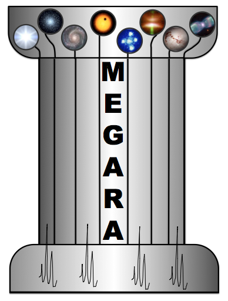

**MEGARA
DATA REDUCTION COOKBOOK**

   **Code:** N/A

   **Issue:** 1.I

   **Date:** 07/07/2020

   **Pages:** 64

+-------------+--------------------------------------------------------+
| *           | África Castillo Morales, Sergio Pascual Ramírez,       |
| *Authors:** | Armando Gil de Paz                                     |
+=============+========================================================+
| **Revised   | Armando Gil de Paz                                     |
| by:**       |                                                        |
+-------------+--------------------------------------------------------+
| **Approved  | Armando Gil de Paz                                     |
| by:**       |                                                        |
+-------------+--------------------------------------------------------+

**
Distribution List:**

+-----------------------------------------+-------------+-------------+
| **Name**                                | **Af        | **Date**    |
|                                         | filiation** |             |
+-----------------------------------------+-------------+-------------+
| MEGARA team                             | N/A         | 07/07/2020  |
+-----------------------------------------+-------------+-------------+
| GRANTECAN                               | N/A         | 07/07/2020  |
+-----------------------------------------+-------------+-------------+
|                                         |             |             |
+-----------------------------------------+-------------+-------------+
|                                         |             |             |
+-----------------------------------------+-------------+-------------+

**Acronyms:**

ADC Analog-Digital Converter / Conversion

AIV Assembly, Integration and Verification

BPM Bad-Pixels Mask

CCD Charged-Coupled Device

DRP Data Reduction Pipeline

DU Digital Unit

FC Folded-Cassegrain

FMAT Fiber-MOS Assignment Tool

FWHM Full-Width at Half-Maximum

GTC Gran Telescopio CANARIAS

ICM Instrument Calibration Module

IFU Integral Field Unit

IFS Integral Field Spectrograph / Integral Field Spectroscopy

IPA Instrument Position Angle

JSON JavaScript Object Notation

LCB Large Compact Bundle

LICA Laboratorio de Instrumentación Científica Avanzada

MEGARA Multi-Espectrógrafo en GTC de Alta Resolución para Astronomía

MOS Multi-Object Spectrograph / Multi-Object Spectroscopy

PA Position Angle

PDF Portable Document Format

RoN Readout Noise

RSS Row-Stacked Spectrum

ROTANG Folded-Cassegrain Rotator Angle

UCM Universidad Complutense de Madrid

**
Change Control**

+-------+---------+------+----+---------------------------------------+
| **Is  | *       | **S  | ** | **Change description**                |
| sue** | *Date** | ecti | Pa |                                       |
|       |         | on** | ge |                                       |
|       |         |      | ** |                                       |
+-------+---------+------+----+---------------------------------------+
| 1A    | 3       |      |    | First issue                           |
|       | /9/2018 |      |    |                                       |
+-------+---------+------+----+---------------------------------------+
| 1B    | 1/      |      |    | Second issue. Added: VPH table, info  |
|       | 10/2018 |      |    | on how to update the DRP              |
|       |         |      |    | installation, how to visualize traces |
|       |         |      |    | (overplot_traces) and FITS            |
|       |         |      |    | (numina-ximshow). The description of  |
|       |         |      |    | the *final_rss.fits* 92x4300          |
|       |         |      |    | extension has been included.          |
+-------+---------+------+----+---------------------------------------+
| 1C    | 18/     |      |    | Third issue. Minor problems when      |
|       | 06/2019 |      |    | using the MEGARA DRP in Mac OS X are  |
|       |         |      |    | reported and solutions are provided.  |
|       |         |      |    | We also describe how to process       |
|       |         |      |    | without flux calibration neither      |
|       |         |      |    | atmospheric extinction correction.    |
+-------+---------+------+----+---------------------------------------+
| 1D    | 28/     |      |    | MEGARA DRP is only compatible with    |
|       | 06/2019 |      |    | Python 3.5 or later versions.         |
|       |         |      |    | Installation is now compatible with   |
|       |         |      |    | the conda 4.4 distributions. More     |
|       |         |      |    | details on the normalize_region &     |
|       |         |      |    | continuum_region requirements for the |
|       |         |      |    | TwilightFiberFlat recipe are          |
|       |         |      |    | provided.                             |
+-------+---------+------+----+---------------------------------------+
| 1E    | 22/     |      |    | The following errors in the 1D        |
|       | 07/2019 |      |    | version are corrected: sky bundles    |
|       |         |      |    | instead of sky fibers should be used  |
|       |         |      |    | in ignored_sky_bundles requirement,   |
|       |         |      |    | normalize_region requirement in       |
|       |         |      |    | measured on the reduced_rss.fits.     |
|       |         |      |    | More details on some recipes is       |
|       |         |      |    | provided.                             |
+-------+---------+------+----+---------------------------------------+
| 1F    | 12/     |      |    | Description on visualization, cube    |
|       | 05/2020 |      |    | and *analysis* tools has been added.  |
+-------+---------+------+----+---------------------------------------+
| 1G    | 19/     | 6    |    | Corrections to the examples included  |
|       | 05/2020 |      |    | in Section 6.                         |
+-------+---------+------+----+---------------------------------------+
| 1H    | 24/     | 6    |    | megaratools-cube &                    |
|       | 05/2020 |      |    | megaratools-hypercube only run under  |
|       |         |      |    | the megaradrp development version or  |
|       |         |      |    | on as a Python package released after |
|       |         |      |    | July 1\ :sup:`st` 2020 (*numina* and  |
|       |         |      |    | *megaradrp* versions 0.21+ & 0.9+,    |
|       |         |      |    | respectively).                        |
+-------+---------+------+----+---------------------------------------+
| 1.I   | 07/     | 6    |    | New ways to install *megara-tools*    |
|       | 07/2020 |      |    | added.                                |
+-------+---------+------+----+---------------------------------------+

**Reference Documents**

+----+--------------------------------+--------------------------------+
| ** | **Document Name**              | **Code**                       |
| Nº |                                |                                |
| ** |                                |                                |
+----+--------------------------------+--------------------------------+
| R  | MEGARA, the R=6000-20000 IFU   | Proc. of the SPIE, 10702-42,   |
| .1 | and MOS of GTC                 | 20 pp. (2018)                  |
+----+--------------------------------+--------------------------------+
| R  | MEGARA, the new                | Proceedings of the SPIE,       |
| .2 | inter_staticte-resolution        | Volume 9908, id. 99081K, 20    |
|    | optical IFU and MOS for GTC:   | pp. (2016).                    |
|    | getting ready for the          |                                |
|    | telescope                      |                                |
+----+--------------------------------+--------------------------------+
| R  | First scientific observations  | Proc. of the SPIE, 10702-43,   |
| .3 | with MEGARA at GTC             | 20 pp. (2018)                  |
+----+--------------------------------+--------------------------------+

**INDEX**

1. INTRODUCTION `9 <#introduction>`__

1.1 Scope `9 <#scope>`__

1.2 MEGARA instrument `9 <#megara-instrument>`__

2. MEGARA Data Reduction Pipeline
`12 <#megara-data-reduction-pipeline>`__

3. DRP INSTALLATION `13 <#drp-installation>`__

3.1 Install in virtualenv `13 <#install-in-virtualenv>`__

3.1.1 Create a virtual environment using either virtualenv or venv.
`13 <#create-a-virtual-environment-using-either-virtualenv-or-venv.>`__

3.1.2 Activate the environment. `13 <#activate-the-environment.>`__

3.1.3 Install megaradrp with pip `14 <#install-megaradrp-with-pip>`__

3.1.4 Test the installation. `14 <#test-the-installation.>`__

3.1.5 Update within the environment
`15 <#update-within-the-environment>`__

3.1.6 Deactivate the environment. `15 <#deactivate-the-environment.>`__

3.2 Install in conda `15 <#install-in-conda>`__

3.2.1 Create a conda environment `16 <#create-a-conda-environment>`__

3.2.2 Install megaradrp with conda
`16 <#install-megaradrp-with-conda>`__

3.2.3 Activate the environment `17 <#activate-the-environment>`__

3.2.4 Test the installation `17 <#test-the-installation>`__

3.2.5 Update within the environment
`17 <#update-within-the-environment-1>`__

3.2.6 Deactivate the environment `17 <#deactivate-the-environment>`__

3.2.7 Update outside the environment
`17 <#update-outside-the-environment>`__

3.3 Development version `17 <#development-version>`__

4. DATA DESCRIPTION `18 <#data-description>`__

4.1 Raw Data `18 <#raw-data>`__

4.2 Pipeline Products `18 <#pipeline-products>`__

5. DATA REDUCTION COOKBOOK `19 <#data-reduction-cookbook>`__

5.1 Getting Started `19 <#getting-started>`__

5.2 Data organization `19 <#data-organization>`__

5.3 Running a recipe `23 <#_Toc41035254>`__

5.4 Data reduction process `25 <#data-reduction-process>`__

5.4.1 Bias image `25 <#bias-image>`__

5.4.2 Dark image `26 <#dark-image>`__

5.4.3 Bad-pixels Mask `26 <#bad-pixels-mask>`__

5.4.4 Slit Flat correction `27 <#slit-flat-correction>`__

5.4.5 Tracing fibers `27 <#tracing-fibers>`__

5.4.5.1 Trace map `27 <#trace-map>`__

5.4.5.2 Model map `29 <#model-map>`__

5.4.6 Wavelength Calibration `30 <#wavelength-calibration>`__

5.4.7 Flat-field correction `34 <#flat-field-correction>`__

5.4.8 Illumination correction `36 <#illumination-correction>`__

5.4.9 Flux calibration `38 <#flux-calibration>`__

5.4.10 LCB IFU/MOS scientific observation
`42 <#lcb-ifumos-scientific-observation>`__

6. MEGARA Tools `45 <#megara-tools>`__

6.1 Megaradrp.Visualization `46 <#megaradrp.visualization>`__

6.2 Megaradrp-Cube `48 <#megaradrp-cube>`__

6.3 Extract spectrum: megaratools-extract_spectrum
`49 <#extract-spectrum-megaratools-extract_spectrum>`__

6.4 Extract elliptical apertures: megaratools-extract_rings
`50 <#extract-elliptical-apertures-megaratools-extract_rings>`__

6.5 Plot spectrum: megaratools-plot_spectrum
`51 <#plot-spectrum-megaratools-plot_spectrum>`__

6.6 Diffuse light determination: megaratools-diffuse_light
`52 <#diffuse-light-determination-megaratools-diffuse_light>`__

6.7 Analysis of a 1D emission-line spectrum:
megaratools-analyze_spectrum
`55 <#analysis-of-a-1d-emission-line-spectrum-megaratools-analyze_spectrum>`__

6.8 Analysis of a 2D RSS emission-line spectrum: megaratools-analyze_rss
`58 <#analysis-of-a-2d-rss-emission-line-spectrum-megaratools-analyze_rss>`__

6.9 RSS arithmetics: megaratools-rss_arith
`60 <#rss-arithmetics-megaratools-rss_arith>`__

6.10 Megaratools-hypercube `62 <#megaratools-hypercube>`__

7. Known ISSUES `64 <#known-issues>`__

7.1 Matplotlib 3 in Mac OS X `64 <#matplotlib-3-in-mac-os-x>`__

7.2 Compiling in Mac OS X 10.10 or later
`64 <#compiling-in-mac-os-x-10.10-or-later>`__

7.3 Bash shell `64 <#bash-shell>`__

INTRODUCTION
============

Scope
-----

The goal of this document is to guide any potential user of the MEGARA
instrument in its data processing, from the raw data provided by the GTC
to wavelength- and flux-calibrated scientific-valid data. The MEGARA
data processing described in this document will be done using the MEGARA
Data Reduction Pipeline (DRP) which is available through *github* at
https://github.com/guaix-ucm/. The different releases of this document
will cope with any major change in the MEGARA DRP.

MEGARA instrument
-----------------

MEGARA (*Multi-Espectrógrafo en GTC de Alta Resolución para Astronomía*)
is a fiber-fed spectrograph with both Integral-Field (IFU) and
Multi-Object (MOS) capabilities that was installed and commissioning at
the 10.4m GTC telescope in the Spring of 2017. Since semester 2018B,
MEGARA is available to the GTC community (Spain, Mexico and UF) in its
two modes (LCB and MOS). The reader is referred to Gil de Paz et al.
(2020, submitted) for more details.

The MEGARA IFU, which is called Large Compact Bundle (LCB hereafter),
covers a field of 12.5 x 11.3 arcsec\ :sup:`2` using 567 hexagonal
spaxels of 0.62 arcsec in size plus 56 sky spaxels of equal size
distributed in 8 bundles of 7 fibers distributed in the outskirts of the
field at about 2 arcmin from the center of the LCB. The MOS makes use of
a set of 92 robotic positioners each hosting a minibundle of 7 spaxels
also of 0.62 arcsec in size each spaxel. These can patrol overlapping
circular regions of 28 arcsec in diameter. These robotic positioners a
distributed in a square region of 3.5 x 3.5 arcmin\ :sup:`2`, which
roughly corresponds to the flat and non-vignetted focal plane of GTC at
its Folded-Cassegrain F (FC-F) focus (see **Figure 1**). The MOS can be
reconfigured starting from a list of target potions in matter of roughly
a minute to a few minutes, depending on the level of number of
overlapping patrol areas to be explored in a given configuration.

|image1| |image2|

Figure 1: LCB and MOS in the focal plane of MEGARA at the Folded-Cass F
focus of GTC. Left: Layout of the monolithic microlens array of the LCB
placed at the optical axis of the instrument. Center: Hexagons
representing the patrol areas of the 92 robotic positioners of the
MEGARA MOS (in light grey) along with the positions of the eight sky
bundles that are mounted along the LCB pseudo-slit (in orange). Note
that the actual patrol areas are overlapping circular regions of 28
arcsec in diameter, while the distance between adjacent positioners is
24.5 arcsec. Right: MEGARA focal plane before the field lens was
installed at the Laboratorio de Instrumentación Científica Avanzada
(LICA-UCM) laboratory.

Both the LCB and the MOS along with other subsystems (focal-plane cover,
Folded-Cassegrain rotator adapter, etc.) are located at the FC-F focus
of GTC. The 623 (567+56) fibers of the LCB and the 644 fibers of the 92
robotic positioners of the MOS are routed through from the FC-F rotator
to the Nasmyth A platform following a 44.5m-long path until they reach
the MEGARA spectrograph. The MEGARA spectrograph is a fixed-angle (68º)
collimator-camera system that is fed by two interchangeable curved
pseudo-slits (LCB/MOS). The collimator is an all-refractive F/3 system
composed by 5 lenses (1 aspheric singlet and 2 doublets) while the also
all-refractive camera is composed by 7 lenses (two doublets, one with a
CaF\ :sub:`2` lens, and 3 singlets). In between collimator and camera,
the spectrograph pupil can host different types of Volume-Phase
Holographic (VPH) disperser elements, namely the low- (LR), mid- (MR),
and high-resolution (HR) VPHs. Six LR VPHs cover the entire optical
window at R=6,000, while 10 MR VPHs provide also full optical coverage
but at R=12,000. Finally, the two HR VPHs allow observing in the
Hα+[NII] region and in the CaT region with R=20,000, although the
optical design could in principle accommodate HR VPHs at any other
optical wavelength. In **Figure 2** we show the resolving power and
spectral coverage for each VPH as measured during the integration and
commissioning of the instrument [1]_.

|image3|\ |image4|\ |image5|\ |image6|

**Figure 2:** *Plots showing the relation between resolving power
(RFWHM) and wavelength coverage for all 18 MEGARA VPHs and for the LCB
(left) and MOS (right) modes. Design values (colored lines) and
measurements (grey lines that correspond to individual fiber spectra,
while black thick and thin lines represent the mean and mean*\ ±1σ
*curves when all fiber spectra are used) are both shown.*

The details on the different VPHs that can be used with MEGARA is given
in Table 1. This table also includes the reciprocal (linear) dispersion
(CDELT) and wavelength for the initial pixel (CRVAL for CRPIX=1) as
adopted for the MEGARA DRP for different VPHs. The user is referred to
different publications to learn more about the MEGARA instrument,
including [R.1], [R.2] and [R.3].

+----------+------+-----+---------+----+-------+-----+------+------+
| VPH Name | S    | R\  | λ\      | λc | Δλ (@ | Δv  | lin  | λ(p  |
|          | etup |  :s |  :sub:` |    | λc)   |     | res  | ix1) |
|          |      | ub: | 1`-λ\ : | Å  |       | k   |      |      |
|          |      | `FW | sub:`2` |    | Å     | m/s | Å    | Å    |
|          |      | HM` |         |    |       |     | /pix |      |
|          |      |     | Å       |    |       |     |      |      |
+==========+======+=====+=========+====+=======+=====+======+======+
| V        | LR-U | 6   | 3653 –  | 40 | 0.672 | 50  | 0    | 3620 |
| PH405-LR |      | 028 | 4386    | 51 |       |     | .186 |      |
+----------+------+-----+---------+----+-------+-----+------+------+
| V        | LR-B | 6   | 4332 –  | 48 | 0.792 | 49  | 0.23 | 4280 |
| PH480-LR |      | 059 | 5196    | 00 |       |     |      |      |
+----------+------+-----+---------+----+-------+-----+------+------+
| V        | LR-V | 6   | 5143 –  | 56 | 0.937 | 49  | 0.27 | 5060 |
| PH570-LR |      | 080 | 6164    | 95 |       |     |      |      |
+----------+------+-----+---------+----+-------+-----+------+------+
| V        | LR-R | 6   | 6094 –  | 67 | 1.106 | 49  | 0.31 | 6030 |
| PH675-LR |      | 099 | 7300    | 47 |       |     |      |      |
+----------+------+-----+---------+----+-------+-----+------+------+
| V        | LR-I | 6   | 7220 –  | 79 | 1.308 | 49  | 0.37 | 7140 |
| PH799-LR |      | 110 | 8646    | 91 |       |     |      |      |
+----------+------+-----+---------+----+-------+-----+------+------+
| V        | LR-Z | 6   | 8043 -  | 89 | 1.455 | 49  | 0.41 | 7960 |
| PH890-LR |      | 117 | 9630    | 00 |       |     |      |      |
+----------+------+-----+---------+----+-------+-----+------+------+
| V        | MR-U | 12  | 3917 -  | 41 | 0.326 | 24  | 0    | 3905 |
| PH410-MR |      | 602 | 4277    | 04 |       |     | .089 |      |
+----------+------+-----+---------+----+-------+-----+------+------+
| V        | M    | 12  | 4225 –  | 44 | 0.358 | 24  | 0.10 | 4210 |
| PH443-MR | R-UB | 370 | 4621    | 31 |       |     |      |      |
+----------+------+-----+---------+----+-------+-----+------+------+
| V        | MR-B | 12  | 4586 –  | 48 | 0.395 | 25  | 0.11 | 4568 |
| PH481-MR |      | 178 | 5024    | 14 |       |     |      |      |
+----------+------+-----+---------+----+-------+-----+------+------+
| V        | MR-G | 12  | 4963 –  | 52 | 0.433 | 25  | 0    | 4944 |
| PH521-MR |      | 035 | 5443    | 13 |       |     | .122 |      |
+----------+------+-----+---------+----+-------+-----+------+------+
| V        | MR-V | 11  | 5393 –  | 56 | 0.476 | 25  | 0    | 5375 |
| PH567-MR |      | 916 | 5919    | 67 |       |     | .132 |      |
+----------+------+-----+---------+----+-------+-----+------+------+
| V        | M    | 11  | 5869 –  | 61 | 0.522 | 25  | 0    | 5850 |
| PH617-MR | R-VR | 825 | 6447    | 70 |       |     | .145 |      |
+----------+------+-----+---------+----+-------+-----+------+------+
| V        | MR-R | 11  | 6241 –  | 65 | 0.558 | 25  | 0.16 | 6210 |
| PH656-MR |      | 768 | 6859    | 63 |       |     |      |      |
+----------+------+-----+---------+----+-------+-----+------+------+
| V        | M    | 11  | 6764 –  | 71 | 0.608 | 26  | 0.17 | 6735 |
| PH712-MR | R-RI | 707 | 7437    | 15 |       |     |      |      |
+----------+------+-----+---------+----+-------+-----+------+------+
| V        | MR-I | 11  | 7382 –  | 77 | 0.666 | 26  | 0.   | 7360 |
| PH777-MR |      | 654 | 8120    | 67 |       |     | 1845 |      |
+----------+------+-----+---------+----+-------+-----+------+------+
| V        | MR-Z | 11  | 8800 -  | 92 | 0.796 | 26  | 0    | 8770 |
| PH926-MR |      | 638 | 9686    | 62 |       |     | .225 |      |
+----------+------+-----+---------+----+-------+-----+------+------+
| V        | HR-R | 18  | 6445 -  | 66 | 0.355 | 16  | 0.   | 6390 |
| PH665-HR |      | 700 | 6837    | 46 |       |     | 0974 |      |
+----------+------+-----+---------+----+-------+-----+------+------+
| V        | HR-I | 18  | 8372 -  | 86 | 0.462 | 16  | 0.13 | 8350 |
| PH863-HR |      | 701 | 8882    | 34 |       |     |      |      |
+----------+------+-----+---------+----+-------+-----+------+------+

Table 1: MEGARA VPHs: scientific requirements (The resolution,
R\ :sub:`FWHM`\ =λ/∆λ\ :sub:`FWHM`, is derived from the FWHM
(∆λ\ :sub:`FWHM`) of the 1D spectra). The values of the linear
reciprocal dispersion and the wavelength of pixel 1 correspond to the
linear solution implemented in the MEGARA DRP after the images are
wavelength calibrated.

Note that the reciprocal dispersion is the one used for the linear
solution in the images processed by the MEGARA Data Reduction Pipeline.

MEGARA Data Reduction Pipeline
==============================

|image7|\ The deployment of the MEGARA instrument at GTC was accompanied
by the installation of a fully functioning Data Reduction Pipeline (DRP
hereafter) developed in Python that worked both online at the telescope
and offline. The online version of the DRP allows for on-the-fly data
processing, which includes bias correction, trimming, fiber tracing and
fixed-aperture extraction, fiber-flat and twilight-flat correction and
wavelength calibration. The offline processing (to which this cookbook
is devoted) additionally includes a detailed cross-talk-corrected
extraction and absolute flux calibration whenever possible. The MEGARA
DRP is distributed by GTC at
http://www.gtc.iac.es/instruments/megara/config/megaradrp-0.6.dev2.tar.gz.
Updates to the DRP can be obtained through *github* at
https://github.com/guaix-ucm/megaradrp (section 3). Line lists and the
CCD Bad-Pixels Mask (BPM) are available at
https://zenodo.org/record/2270518#.XRx9HKZS9E4.

**Figure 3:** *Data processing scheme of the MEGARA DRP.*

The MEGARA DRP has been designed to cope with all effects associated to
the observation with a fiber-fed spectrograph on which the detection of
the light is done with a Charge-Coupled Device (CCD). These effects
include the removal of the bias level and the dark current associated to
the MEGARA CCD, the tracing and extraction of the flux from each fiber
on the CCD, the variation in the wavelength calibration solution along
the (pseudo-)slit of the spectrograph and the correction from the
variation in sensitivity (from blue-to-red and global) from fiber to
fiber and the determination of the system efficiency. In **Figure 3** we
show the data processing scheme followed by the MEGARA DRP. We note here
that the wavelength calibration is performed quite early on in the
reduction procedure as the correction for blue-to-red variation in
sensitivity has to be done once the wavelength of the light falling in
each pixel and each fiber is known.

The final products of the MEGARA DRP are “reduced” Row-Stacked Spectra
(RSS hereafter) 2D images including for 623 (644) fiber spectra for the
LCB (MOS) mode, all using a common flux calibration and wavelength
solution with constant reciprocal dispersion for all fibers. Based on
the averaged spectrum of all fibers to be used for sky subtraction (by
default all 56 sky fibers in the LCB and all unassigned minibundles in
the case of the MOS) the DRP also generates a sky-subtracted “final” RSS
spectrum. No combo products combining different spectral setups are yet
generated.

DRP INSTALLATION
================

The MEGARA pipeline is a Python package, for Python 3.5 or greater.

The easiest method of installing megaradrp is using prebuilt packages.
You can also build from source or directly from the development version.
All the commands in the following sections are to be run under **bash
shell**. More details are in the MEGARA DRP *readthedocs*
documentation [2]_.

**Suggestion: what method of installation should I use?**

\* If you are already familiar with one method, use it (conda or
virtualenv), since both a fully supported.

\* In macOS, there is a well-known compatibility problem between
virtualenv and matplotlib [3]_, so we recommend setting up conda.

\* In Linux, virtualenv is easier to setup

 Install in virtualenv
----------------------

Virtualenv [4]_ is a tool that allows to create isolated Python
environments. There is also a module in the standard library called venv
with roughly the same functionallity.

The steps to run MEGARA DRP in a virtual environment are:

Create a virtual environment using either virtualenv or venv.
~~~~~~~~~~~~~~~~~~~~~~~~~~~~~~~~~~~~~~~~~~~~~~~~~~~~~~~~~~~~~

In order to create a virtual environment called e.g. megara using venv:

bash-3.2$ python3 -m venv megara /path/to/

With virtualenv:

bash-3.2$ virtualenv-3 megara /path/to/

The directory \`/path/to\` represents the location of the environment.
It can be any valid directory path, even the local directory \`.\` .

Activate the environment.
~~~~~~~~~~~~~~~~~~~~~~~~~

After creating the environment, the directory \`/path/to/megara\`
contains a Python tree. One of the directories is
\`/path/to/megara/bin\`, which contains a script called activate. To
activate the environment, we source (a bash shell command) this script
file:

bash-3.2$ source /path/to/megara/bin/activate

which yields a different system prompt to the user:

(megara) bash-3.2$

Now, the name of the environment appears before the standard prompt. We
can use the environment only on those consoles / terminals where we have
previously activated it.

Install megaradrp with pip
~~~~~~~~~~~~~~~~~~~~~~~~~~

After the activation, we can install megaradrp with pip. This is the
standard Python tool for package management. It will download the
package and its dependencies, unpack everything and compile when needed.

What follows is a sample of the output:

(megara) bash-3.2$ pip install megaradrp

Collecting megaradrp

Collecting scikit-image (from megaradrp)

Downloading
https://files.pythonhosted.org/packages/11/c7/ee75c79dcce057a3475763d611ec044737a708eaf5cc53426b0117795ddb/scikit_image-0.14.0-cp35-cp35mu-manylinux1_x86_64.whl
(25.4MB)

Collecting scipy (from megaradrp)

(...)

Building wheels for collected packages: toolz, scandir

Running setup.py bdist_wheel for toolz ... done

Running setup.py bdist_wheel for scandir ... done

Successfully built toolz scandir

Installing collected packages: decorator, networkx, cloudpickle, numpy,
toolz, dask, six, PyWavelets, python-dateutil, subprocess32, cycler,
backports.functools-lru-cache, pytz, pyparsing, kiwisolver, matplotlib,
scipy, pillow, scikit-image, enum34, atomicwrites, more-itertools,
pluggy, attrs, scandir, pathlib2, py, funcsigs, pytest, astropy, PyYaml,
numina, megaradrp

Test the installation.
~~~~~~~~~~~~~~~~~~~~~~

Now we can test the installation by running the numina command:

(megara) bash-3.2$ numina

DEBUG: Numina simple recipe runner version 0.17.3

Update within the environment
~~~~~~~~~~~~~~~~~~~~~~~~~~~~~

In order to update the MEGARA DRP in a virtualenv installation the user
should execute:

(megara) bash-3.2$ pip install -U megaradrp

Deactivate the environment.
~~~~~~~~~~~~~~~~~~~~~~~~~~~

To exit the environment is enough to exit the terminal or run the
command deactivate.

(megara) bash-3.2$ deactivate

bash-3.2$

 Install in conda
-----------------

Conda [5]_ was created with a target similar to virtualenv, but know has
extended its functionallity to package management for different
languages.

You can install miniconda [6]_ or anaconda [7]_. The difference is that
miniconda provides a light-weight environment and anaconda comes with
lots of Python packages.

If you have updated the $PATH variable during install, you can call
conda commands directly in the shell, like this:

bash-3.2$ conda info

If not, you will need to add the path to the command (an example path
could be miniconda3/bin), like:

bash-3.2$ /path/to/conda/bin/conda info

If that is the case, you should add that path every time you run a conda
command hereafter. Alternatively, you can initialize conda for your own
shell by doing:

bash-3.2$ conda init bash

This works as it is if you are using a login-shell (terminal), but if
you are using a xterm, you might also need to do:

bash-3.2$ cp ~/.bash_profile ~/.bashrc (do a backup copy of ~/.bashrc if
you have one already),

and open a new terminal/xterm. Below, we will write the commands without
the full path, for simplicity. Once conda is installed according to the
instructions above, the steps to run MEGARA DRP under conda would be the
following [8]_:

Create a conda environment
~~~~~~~~~~~~~~~~~~~~~~~~~~

We first recommend that you update your conda installation to its latest
by doing:

(base) bash-3.2$ conda update conda

With conda, environments are created in a centralised manner (under
directory \`./envs\` in your conda tree), we do not pass the path to the
environment.

(base) bash-3.2$ conda create --name megara python=3

One could remove this environment (and all its content), if needed, by
simply doing:

(base) bash-3.2$ conda remove --name megara --all

Install megaradrp with conda
~~~~~~~~~~~~~~~~~~~~~~~~~~~~

Packages can be installed before activating the environment. We provide
conda packages for megaradrp in the conda-forge channel [9]_:

(base) bash-3.2$ conda install --name megara -c conda-forge megaradrp

Fetching package metadata .............

Solving package specifications: .

Package plan for installation in environment
/home/spr/devel/miniconda3/envs/megara:

The following NEW packages will be INSTALLED:

astropy: 2.0.8-py35_0 conda-forge

atomicwrites: 1.1.5-py35_0 conda-forge

attrs: 18.1.0-py_1 conda-forge

....

zlib: 1.2.11-h470a237_3 conda-forge

Proceed ([y]/n)? y

Activate the environment
~~~~~~~~~~~~~~~~~~~~~~~~

The functionality is similar to virtualenv:

(base) bash-3.2$ conda activate megara

(megara) bash-3.2$

Again, after activating the environment, the name of the environment
appears before the standard prompt. We can use the environment only on
those consoles / terminals where we have previously activated it.

Test the installation
~~~~~~~~~~~~~~~~~~~~~

Now we can test the installation by running the numina command:

(megara) bash-3.2$ numina

DEBUG: Numina simple recipe runner version 0.17.3

.. _update-within-the-environment-1:

Update within the environment
~~~~~~~~~~~~~~~~~~~~~~~~~~~~~

In order to update the MEGARA DRP within the conda environment the user
should execute:

(megara) bash-3.2$ conda update megaradrp

Deactivate the environment
~~~~~~~~~~~~~~~~~~~~~~~~~~

To exit the environment is enough to exit the terminal or run the
command source deactivate

(megara) bash-3.2$ conda deactivate

(base) bash-3.2$

Update outside the environment
~~~~~~~~~~~~~~~~~~~~~~~~~~~~~~

Once outside the conda environment one can also update the MEGARA DRP
installation by doing:

(base) bash-3.2$ conda update megaradrp -n megara

If you want to deactivate the conda *(base)* environment entirely you
can run again:

(base) bash-3.2$ conda deactivate

bash-3.2$

Development version
-------------------

For those of you interested in installing the development version,
please consult the instructions at the readthedocs.org webpage at
https://megaradrp.readthedocs.io/en/latest/installation.html. The use of
the development version is recommended to have access to the latest DRP
improvements.

DATA DESCRIPTION
================

In order to help the user in understanding the different execution steps
of the MEGARA DRP, we describe in this section the characteristics of
the main products, including input raw images and pipeline products
(images and tables).

Raw Data
--------

Raw data includes all FITS frames delivered to the user by GTC. These
FITS images are 4196 x 4212 pixels in size have two extensions, the
first one including the data themselves and the second one providing all
the information about the fibers (positions in the sky, bundle to which
they belong and whether they are devoted to the observation of target or
sky). Among these images one can find bias frames (as they are obtained
with the MegaraBiasImage observing mode they include the name of this
mode it their filename), fiber-flat images (obtained with either the
MegaraTraceMap or the MegaraFiberFlatImage observing modes), ThAr or
ThNe HCL lamp spectra (obtained with the MegaraArcCalibration observing
mode) and scientific observations with either the LCB (MegaraLcbImage or
MegaraLcbAcquisition; this latter mode is commonly used when the target
is a bright star, normally a spectrophotometric standard star) or the
MOS (MegaraMosImage).

Pipeline Products
-----------------

There are multiple types of products generated by the MEGARA DRP
although they can be grouped in full-frame FITS images of 4096 x 4112
pixels in size (after the overscan+prescan regions are removed from the
raw images), RSS images of 4300 x 623 (for LCB) or 4300 x 644 (for MOS)
pixels, and structured data, which is in most cases are given in files
of JSON format. Below we list the different products within these three
groups along with the recipe that generates them:

-  Full-frame FITS image products:

-  **master_bias.fits** (MasterBiasImage): Final image of the
   MasterBiasImage recipe.

-  **reduced_image.fits** (MegaraDarkImage, MasterTraceMap,
   MegaraModelMap, MegaraFiberFlatImage, MegaraArcCalibration,
   MegaraTwilightFlatImage, MegaraLcbStdStar, MegaraLcbAcquisition,
   MegaraLcbImage, MegaraMosImage, MegaraArcCalibration): Final image
   after all individual exposures have been processed and combined.

-  **master_slitflat.fits** (MegaraSlitFlat): Image obtained by
   observing a continuum-lamp light with the spectrograph out of its
   optimal focus. The level of de-focusing should be enough to ensure a
   uniform illumination through the entire CCD but keeping the
   wavelength of the light approximately the same at each given pixel
   that when the instrument is well focused.

-  **fwhm_image.fits** (MegaraArcCalibration): Voronoi map of the FWHM
   derived from the fits to the Gaussian profiles of all spectral lines
   identified in the arc-lamp image.

-  RSS FITS image products:

-  **master_fiberflat.fits** (MegaraFiberFlatImage): Image to be applied
   to correct for variations in sensitivity in between fibers and from
   blue-to-red within each fiber.

-  **master_twilightflat.fits** (MegaraTwilightFlatImage): Image to be
   applied to correct for the effect of illumination introduced by the
   fiber-flat image when this was obtained through the FC-F ICM and
   differences between the pupil of the ICM and the GTC pupil when the
   object was observed. The values of the twilight-flat image are
   identical for all wavelengths but different from fiber to fiber
   (blue-to-red sensitivity variations were corrected with the
   fiber-flat image).

-  **reduced_rss.fits** (MegaraLcbAcquisition, MegaraLcbStdStar,
   MegaraLcbImage, MegaraMosImage, MegaraArcCalibration): Processed
   image prior to the subtraction of the sky spectrum.

-  **sky_rss.fits** (MegaraLcbAcquisition, MegaraLcbStdStar,
   MegaraLcbImage, MegaraMosImage, MegaraArcCalibration): RSS image
   showing signal only in the valid sky fibers. All other pixels are set
   to zero.

-  **final_rss.fits** (MegaraLcbAcquisition, MegaraLcbStdStar,
   MegaraLcbImage, MegaraMosImage, MegaraArcCalibration): Processed
   image after the subtraction of the sky spectrum is performed. In the
   case of the MOS, this image includes an extension of 92 rows by 4300
   columns where all 7 fibers of each minibundle have been added
   together.

-  Structured products:

-  **master_wlcalib.json** (MegaraArcCalibration): File with the
      information on the wavelength calibration solution for every
      fiber.

-  **master_traces.json** (MasterTraceMap): File with the tracing
      information.

-  **master_model.json** (MasterModelMap): File with the information on
      how to account for the cross-talk between adjacent fibers in the
      detector.

In the case of the MegaraLcbStdStar recipe, the MEGARA DRP also
generates two different 1D spectra, that of the standard star obtained
after extracting the 37 spaxels around the centroid identified in the
observation-result file (*star_spectrum.fits*) and also the resulting
sensitivity function (*master_sentivity.fits*).

In addition to all these files, the results directory of every recipe
includes also a file named *task.yaml* (file with the description of the
execution of the recipe), the file *result.yaml* (names of the files
resulting from the recipe and some quality-control information) and the
*processing.log* logging file.

Besides ds9/SAOimage or similar software packages, the FITS products
generated by the MEGARA DRP can be also visualized using the tool
numina-ximshow distributed as part of **numina**.

DATA REDUCTION COOKBOOK
=======================

Getting Started
---------------

The first step to start the data reduction is to activate your
environment (see details in Section 3.1 and 3.2):

Data organization
-----------------

MEGARA DRP uses its own data organization to work. We need a directory
named MEGARA, in our example this directory is under data_reduction/:

(megara) bash-3.2$ pwd

/Users/acm/Desktop/data_reduction/MEGARA

Under the MEGARA/ directory we need to have the calibration tree with
the specific name ca3558e3-e50d-4bbc-86bd-da50a0998a48/, which is the
string that uniquely identifies the instrument configuration (a
different name was, for example, used during laboratory integration at
LICA-UCM). Under the MEGARA/ directory we can also have the requirements
file named *control.yaml* needed to run the pipeline (see section 5.3;
note that the *tree* command shown below might not be available in
certain unix distributions; use “ls” instead).

(megara) bash-3.2$ tree -L 2

.

└── MEGARA

├── M15

├── M71

├── ca3558e3-e50d-4bbc-86bd-da50a0998a48

└── control.yaml

The requirements file *control.yaml* contains the path for your MEGARA/
directory:

rootdir: /Users/acm/Desktop/data_reduction

and useful information for performing the wavelength calibration of each
VPH, including the number of emission lines, wavelength ranges and
degree of polynomial fit to be used by the wavelength calibration
recipe. In this file you can also specify the name for the extinction
curve file used for the flux calibration recipe. This is simply an ASCII
file with two space-separated columns, one with the wavelength in
Angstroms and another with the magnitudes of extinction per unit airmass
at the corresponding wavelength, i.e. the same format used for
extinction curves within IRAF. We strongly recommend to use the standard
extinction curve of the Roque de los Muchachos Observatory.

(megara) bash-3.2$ more control.yaml

version: 1

rootdir: /Users/acm/Desktop/REDUCTION_MEGARA/reduction_GTC_com

products:

MEGARA:

- {id: 2, type: 'ReferenceExtinctionTable', tags: {}, content:
'extinction_LP.txt'}

requirements:

MEGARA:

default:

MegaraArcCalibration:

- {name: nlines, tags: {vph: LR-U, speclamp: ThAr, insmode: LCB},
content: [25,25]}

- {name: nlines, tags: {vph: LR-U, speclamp: ThAr, insmode: MOS},
content: [25,25]}

- {name: nlines, tags: {vph: LR-B, speclamp: ThAr, insmode: LCB},
content: [10,10,15,5]}

- {name: nlines, tags: {vph: LR-B, speclamp: ThAr, insmode: MOS},
content: [10,10,15,5]}

- {name: nlines, tags: {vph: LR-V, speclamp: ThAr, insmode: LCB},
content: [15,5,10,7]}

- {name: nlines, tags: {vph: LR-V, speclamp: ThAr, insmode: MOS},
content: [15,5,10,7]}

- {name: nlines, tags: {vph: LR-R, speclamp: ThAr, insmode: LCB},
content: [14,7]}

- {name: nlines, tags: {vph: LR-R, speclamp: ThAr, insmode: MOS},
content: [14,7]}

- {name: nlines, tags: {vph: LR-I, speclamp: ThAr, insmode: LCB},
content: [14]}

- {name: nlines, tags: {vph: LR-I, speclamp: ThAr, insmode: MOS},
content: [14]}

- {name: nlines, tags: {vph: LR-Z, speclamp: ThNe, insmode: LCB},
content: [14,9]}

- {name: nlines, tags: {vph: LR-Z, speclamp: ThNe, insmode: MOS},
content: [14,9]}

- {name: nlines, tags: {vph: MR-U, speclamp: ThAr, insmode: LCB},
content: [8,10]}

- {name: nlines, tags: {vph: MR-U, speclamp: ThAr, insmode: MOS},
content: [8,10]}

- {name: nlines, tags: {vph: MR-UB, speclamp: ThAr, insmode: LCB},
content: [20]}

- {name: nlines, tags: {vph: MR-UB, speclamp: ThAr, insmode: MOS},
content: [20]}

- {name: nlines, tags: {vph: MR-B, speclamp: ThAr, insmode: LCB},
content: [11]}

- {name: nlines, tags: {vph: MR-B, speclamp: ThAr, insmode: MOS},
content: [11]}

- {name: nlines, tags: {vph: MR-G, speclamp: ThAr, insmode: LCB},
content: [10,10,8]}

- {name: nlines, tags: {vph: MR-G, speclamp: ThAr, insmode: MOS},
content: [10,10,8]}

- {name: nlines, tags: {vph: MR-V, speclamp: ThAr, insmode: LCB},
content: [13,8]}

- {name: nlines, tags: {vph: MR-V, speclamp: ThAr, insmode: MOS},
content: [13,8]}

- {name: nlines, tags: {vph: MR-VR, speclamp: ThNe, insmode: LCB},
content: [14]}

- {name: nlines, tags: {vph: MR-VR, speclamp: ThNe, insmode: MOS},
content: [14]}

- {name: nlines, tags: {vph: MR-R, speclamp: ThNe, insmode: LCB},
content: [9]}

- {name: nlines, tags: {vph: MR-R, speclamp: ThNe, insmode: MOS},
content: [9]}

- {name: nlines, tags: {vph: MR-RI, speclamp: ThNe, insmode: LCB},
content: [7]}

- {name: nlines, tags: {vph: MR-RI, speclamp: ThNe, insmode: MOS},
content: [7]}

- {name: nlines, tags: {vph: MR-I, speclamp: ThNe, insmode: LCB},
content: [5,5,5]}

- {name: nlines, tags: {vph: MR-I, speclamp: ThNe, insmode: MOS},
content: [5,5,5]}

- {name: nlines, tags: {vph: MR-Z, speclamp: ThNe, insmode: LCB},
content: [4,5,3]}

- {name: nlines, tags: {vph: MR-Z, speclamp: ThNe, insmode: MOS},
content: [4,5,3]}

- {name: nlines, tags: {vph: HR-R, speclamp: ThNe, insmode: LCB},
content: [5]}

- {name: nlines, tags: {vph: HR-R, speclamp: ThNe, insmode: MOS},
content: [5]}

- {name: nlines, tags: {vph: HR-I, speclamp: ThNe, insmode: LCB},
content: [10]}

- {name: nlines, tags: {vph: HR-I, speclamp: ThNe, insmode: MOS},
content: [10]}

- {name: polynomial_degree, tags: {vph: LR-U, speclamp: ThAr}, content:
[3,5]}

- {name: polynomial_degree, tags: {vph: LR-B, speclamp: ThAr}, content:
[5,5]}

- {name: polynomial_degree, tags: {vph: LR-V, speclamp: ThAr}, content:
[5,5]}

- {name: polynomial_degree, tags: {vph: LR-R, speclamp: ThAr}, content:
[3,5]}

- {name: polynomial_degree, tags: {vph: LR-I, speclamp: ThAr}, content:
[3,5]}

- {name: polynomial_degree, tags: {vph: LR-Z, speclamp: ThNe}, content:
[3,5]}

- {name: polynomial_degree, tags: {vph: MR-U, speclamp: ThAr}, content:
[3,5]}

- {name: polynomial_degree, tags: {vph: MR-UB, speclamp: ThAr}, content:
[3,5]}

- {name: polynomial_degree, tags: {vph: MR-B, speclamp: ThAr}, content:
[3,5]}

- {name: polynomial_degree, tags: {vph: MR-G, speclamp: ThAr}, content:
[3,5]}

- {name: polynomial_degree, tags: {vph: MR-V, speclamp: ThAr}, content:
[3,5]}

- {name: polynomial_degree, tags: {vph: MR-VR, speclamp: ThNe}, content:
[3,5]}

- {name: polynomial_degree, tags: {vph: MR-R, speclamp: ThNe}, content:
[3,3]}

- {name: polynomial_degree, tags: {vph: MR-RI, speclamp: ThNe}, content:
[3,3]}

- {name: polynomial_degree, tags: {vph: MR-I, speclamp: ThNe}, content:
[3,5]}

- {name: polynomial_degree, tags: {vph: MR-Z, speclamp: ThNe}, content:
[3,3]}

- {name: polynomial_degree, tags: {vph: HR-R, speclamp: ThNe}, content:
[3,5]}

- {name: polynomial_degree, tags: {vph: HR-I, speclamp: ThNe}, content:
[3,5]}

Another fundamental function of the calibration tree
(ca3558e3-e50d-4bbc-86bd-da50a0998a48/) is to host the calibration
products that will be used by the corresponding recipes, such as the
MasterBias, MasterFiberFlat, MasterSensitivity, etc. Thus, once the
files for these calibrations are generated, they should be copied under
this calibration tree according structure below. Since the DRP would
read the first file in alphabetical order inside the corresponding
folder, we recommend to place only one file in each folder.

(megara) bash-3.2$ tree ca3558e3-e50d-4bbc-86bd-da50a0998a48/ -L 2

ca3558e3-e50d-4bbc-86bd-da50a0998a48/

├── LinesCatalog

│   ├── ThAr

│   └── ThNe

├── MasterBPM

│   └── master_bpm.fits

├── MasterBias

│   └── master_bias.fits

├── MasterFiberFlat

│   ├── LCB

│   └── MOS

├── MasterSensitivity

│   ├── LCB

│   └── MOS

├── MasterSlitFlat

│  

├── MasterTwilightFlat

│   ├── LCB

│  

├── ModelMap

│   ├── LCB

│   └── MOS

├── TraceMap

│   ├── LCB

│   └── MOS

└── WavelengthCalibration

├── LCB

└── MOS

The content for the LinesCatalog/ is specific for each VPH (line lists
for all VPHs can be found at
https://zenodo.org/record/2270518#.XRx9HKZS9E4). In the following
example the calibration files for the HR-R (LCB observing mode) and LR-R
(MOS observing mode) VPHs are shown. When other VPHs are used, the user
just needs to create the corresponding folders. It is recommended to
have only one file in each calibration directory. For example, for the
same VPH you can have several *master_traces.json* files with the
information to trace the fibers light through the detector at the same
day but at different ambient temperatures.

Different files can be stored at the same directory, but the DRP is
going to use the first file it encounters in alphabetical order. The
user can name the desired file with prefix *“00\_”* (e.g.
*00_master_traces.json*) to be sure this is the file to be used by the
DRP. Note that the sorting of files named *“00\_”* and *“000\_”* might
be different for the operative system and for the MEGARA DRP, so avoid
making abusive use of these prefixes.

(megara) bash-3.2$ tree ca3558e3-e50d-4bbc-86bd-da50a0998a48/ -L 4

ca3558e3-e50d-4bbc-86bd-da50a0998a48/

├── LinesCatalog

│   ├── ThAr

│   │   ├── LR-R

│   │   │   └── LR-R_ThAr.lis

│   │   .

│   │   .

│ │ .

│   └── ThNe

│      ├── HR-R

│      │   └── HR-R_ThNe.lis

│     .

│   .

│   .

├── MasterBPM

│   └── master_bpm.fits

├── MasterBias

│   └── master_bias.fits

├── MasterFiberFlat

│   ├── LCB

│   │   └── HR-R

│   │   └── master_fiberflat.fits

│   └── MOS

│   └── LR-R

│   └── master_fiberflat.fits

├── MasterSensitivity

│   ├── LCB

│   │   └── HR-R

│   │   └── master_sensitivity.fits

│   └── MOS

│   └── LR-R

│   └── master_sensitivity.fits

├── MasterSlitFlat

│  

├── MasterTwilightFlat

│   └── LCB

│   └── HR-R

│   └── master_twilightflat.fits

├── ModelMap

│   ├── LCB

│   │   └── HR-R

│   │   └── master_model.json

│   └── MOS

│   └── LR-R

│   └── master_model.json

├── TraceMap

│   ├── LCB

│   │   └── HR-R

│   │   └── master_traces.json

│   └── MOS

│   └── LR-R

│   └── master_traces.json

└── WavelengthCalibration

├── LCB

│   └── HR-R

│   └── master_wlcalib.json

└── MOS

└── LR-R

└── master_wlcalib.json

Furthermore, the user’s MEGARA/ directory can contain data for your
targets under different directories (in this example our targets are the
M15 and M71 globular clusters). **Your raw data should always be
included in a subdirectory named test/** within each working target
directory (M15, M71, etc.). Images could be stored gzipped but then the
observation-result files should list the images with the .gz extension.
The different observation-result files (*\*.yaml*) used during the data
reduction process should be also located within each target directory as
they will be different for each target. In this example, the
observation-result files in YAML format are named with a first number
related in which they are run.

(megara) bash-3.2$ tree M15 M71 -L 2

M15

├── 0_bias.yaml

├── 1_tracemap.yaml

├── 2_modelmap.yaml

├── 3_wavecalib.yaml

├── 4_fiberflat.yaml

├── 5_twilight.yaml

├── 6_Lcbadquisition.yaml

├── 7_Standardstar.yaml

├── 8_reduce_LCB.yaml

└── data

├── 0001251794-20170626-MEGARA-MegaraLCBImage.fits

├── 0001251795-20170626-MEGARA-MegaraLCBImage.fits

├── 0001251796-20170626-MEGARA-MegaraLCBImage.fits

├── 0001286973-20170724-MEGARA-MegaraLcbImage.fits

├── 0001286974-20170724-MEGARA-MegaraLcbImage.fits

├── 0001286975-20170724-MEGARA-MegaraLcbImage.fits

├── ……

M71

├── 0_bias.yaml

├── 1_tracemap.yaml

├── 2_modelmap.yaml

├── 3_wavecalib.yaml

├── 4_fiberflat.yaml

├── 5_twilight.yaml

├── 6_Lcbadquisition.yaml

├── 7_Standardstar.yaml

├── 8_reduce_MOS.yaml

└── data

├── 0001287845-20170730-MEGARA-MegaraLcbImage.fits

├── 0001287846-20170730-MEGARA-MegaraLcbImage.fits

├── 0001287847-20170730-MEGARA-MegaraLcbImage.fits

├── 0001288184-20170731-MEGARA-MegaraMosImage.fits

├── 0001288185-20170731-MEGARA-MegaraMosImage.fits

├── ……

Running a recipe
----------------

The MEGARA DRP is run through a command line interface provided by
**numina**.

The run mode of numina requires:

-  An observation-result file in YAML format.

-  A requirements file in YAML format (*control.yaml*).

-  The raw images obtained as part of the user’s observing block.

-  The calibrations required by the recipe.

The observation-result file and the requirements file are created by the
user. This is an example of the observation result file to compute the
fibers traces:

(megara3) bash-3.2$ more 1_tracemap.yaml

id: 1_HR-R

mode: MegaraTraceMap

instrument: MEGARA

frames:

- 0001312246-20170831-MEGARA-MegaraSuccess.fits

- 0001312247-20170831-MEGARA-MegaraSuccess.fits

- 0001312248-20170831-MEGARA-MegaraSuccess.fits

The “\ *id:”* is an identifier of the observing block. The DRP will
create two directories with the products of the recipe (/obsid_work and
/obsid_results) using the “\ *id”* identifier as a prefix to identify
the corresponding processing block. The “\ *mode:”* is the name of the
instrument observing mode as returned by numina show-modes. In
“\ *frames:”* a list of the names of the images obtained as part of the
observation should be included. Using the same YAML file the user can
process sequentially different sets of files with the same recipe, the
“\ *enabled:”* parameter can be set to *True* (or *False)* to process
(or not) a specific block of files (last block should end with *enabled:
True*, not with block separator “----“). Note that the user can add
comments to these YAML files by adding lines preceded with a hash sign
(#).

(megara) bash-3.2$ more 1_tracemap.yaml

id: 1_HR-R

mode: MegaraTraceMap

instrument: MEGARA

frames:

- 0001312246-20170831-MEGARA-MegaraSuccess.fits

- 0001312247-20170831-MEGARA-MegaraSuccess.fits

- 0001312248-20170831-MEGARA-MegaraSuccess.fits

enabled: True

---

id: 1_HR-R_d29jun

mode: MegaraTraceMap

instrument: MEGARA

frames:

- 0001252371-20170629-MEGARA-MegaraFiberFlatImage.fits

- 0001252372-20170629-MEGARA-MegaraFiberFlatImage.fits

- 0001252373-20170629-MEGARA-MegaraFiberFlatImage.fits

enabled: True

In the directory of our target M15 for example,

(megara) bash-3.2$ pwd

/Users/acm/Desktop/data_reduction/MEGARA/M15

(megara) bash-3.2$ ls

0_bias.yaml 2_modelmap.yaml 4_fiberflat.yaml 6_Lcbadquisition.yaml
8_reduce_LCB.yaml

1_tracemap.yaml 3_wavecalib.yaml 5_twilight.yaml 7_Standardstar.yaml
**data**

we run the recipe MegaraTraceMap using the observing-result file
*1_tracemap.yaml* and the requirements file *control.yaml* in the
following way:

(megara) bash-3.2$ numina run 1_tracemap.yaml -r ../control.yaml

Other useful numina commands include:

(megara) bash-3.2$ numina show-modes

(megara) bash-3.2$ numina show-recipes

(megara) bash-3.2$ numina show-recipes -m <obs mode>

(megara) numina run -h

(megara) numina run 1_tracemap.yaml -r ../control.yaml –enable
<block_id>

Data reduction process
----------------------

In the following sections the different steps to produce the target
wavelength and flux calibrated row-stacked spectra (RSS) are detailed.

Bias image
~~~~~~~~~~

Before the Analog-to-Digital conversion is performed a pedestal
(electronic) level is added to all images obtained with the MEGARA CCD.
This is a standard procedure in CCD imaging and spectroscopy
applications for Astronomy and is intended to minimize the ADC errors
produced when very low analog values are converted to DUs. To calibrate
this pedestal level of the detectors, bias images are taking with null
integration time. We note the user that in the case of the MEGARA CCD (a
4k x 4k pixels CCD231-84 E2V chip), since the detector is always read
using two diagonally-opposed amplifiers (to speed up the reading process
while minimizing electronic cross-talk), the bias is slightly different
in the upper and bottom halves of the image. Note that the Readout Noise
(RoN) should be around 2 e\ :sup:`–` in all cases.

This recipe processes a set of bias images obtained in Bias Image
instrument mode. Images are corrected from overscan and trimmed to the
physical size of the detector. Then, they are corrected from Bad-pixels
Mask, if the BPM is available and finally, images are stacked using the
_staticn.

This is an example for the *0_bias.yaml*:

(megara) bash-3.2$ more 0_bias.yaml

id: 0_bias

mode: MegaraBiasImage

instrument: MEGARA

frames:

- 0001310880-20170827-MEGARA-MegaraBiasImage.fits

- 0001310881-20170827-MEGARA-MegaraBiasImage.fits

- 0001310882-20170827-MEGARA-MegaraBiasImage.fits

- 0001310883-20170827-MEGARA-MegaraBiasImage.fits

- 0001310884-20170827-MEGARA-MegaraBiasImage.fits

- 0001310885-20170827-MEGARA-MegaraBiasImage.fits

- 0001310886-20170827-MEGARA-MegaraBiasImage.fits

- 0001310887-20170827-MEGARA-MegaraBiasImage.fits

- 0001310888-20170827-MEGARA-MegaraBiasImage.fits

The recipe is run as follows,

(megara) bash-3.2$ numina run 0_bias.yaml -r ../control.yaml

and the products are stored in the directory obsid0_bias_results/,
including the *master_bias.fits* file (see **Figure 4**). The user needs
to copy this file to the calibration tree at
ca3558e3-e50d-4bbc-86bd-da50a0998a48/MasterBias/.

(megara) bash-3.2$ tree obsid0_bias_work/ obsid0_bias_results/

obsid0_bias_work/

├── 0001310880-20170827-MEGARA-MegaraBiasImage.fits

├── 0001310881-20170827-MEGARA-MegaraBiasImage.fits

├── 0001310882-20170827-MEGARA-MegaraBiasImage.fits

├── 0001310883-20170827-MEGARA-MegaraBiasImage.fits

├── 0001310884-20170827-MEGARA-MegaraBiasImage.fits

├── 0001310885-20170827-MEGARA-MegaraBiasImage.fits

├── 0001310886-20170827-MEGARA-MegaraBiasImage.fits

├── 0001310887-20170827-MEGARA-MegaraBiasImage.fits

├── 0001310888-20170827-MEGARA-MegaraBiasImage.fits

├── index.pkl

└── master_bpm.fits

obsid0_bias_results/

├── master_bias.fits

├── processing.log

├── result.yaml

└── task.yaml

.. image:: _static/image11.png
   :alt: A close up of a logo Description automatically generated
   :width: 3.64097in
   :height: 3.53681in

Figure 4: Example of a MEGARA master bias as created by the
MegaraBiasImage recipe. Note that this image was obtained with the
MEGARA DRP ver. 0.9. Later versions fit a spline to the overscan regions
of both amplifiers (instead of adopting a constant value) so the
resulting MegaraBias image is typically flatter than the example shown
here.

Dark image
~~~~~~~~~~

The potential wells in CCD detectors spontaneously generate electron-ion
pairs at a rate that is a function of temperature. For very long
exposures this translates into a current that is associated with no
light source and that is commonly referred to as dark current. Different
tests during AIV activities have shown MEGARA detector´s dark current
has very low values < 2 e\ :sup:`-`/h/pixel, therefore in our data
reduction dark images are neither needed nor used.

Bad-pixels Mask
~~~~~~~~~~~~~~~

Although science-grade CCD detectors show very few bad pixels / bad
columns there will be a number of pixels (among the ~17 Million pixels
in the MEGARA CCD) whose response could not be corrected by means of
using calibration images such as dark frames or flat-field images. These
pixels, commonly called either dead or hot pixels, should be identified
and masked so their expected signal could be derived using dithered
images or, alternatively, locally interpolated. The user is provided
with a Bad-Pixels Mask (BPM) named *master_bpm.fits* and located at
ca3558e3-e50d-4bbc-86bd-da50a0998a48/MasterBPM/ that was generated as
part of the AIV activities by processing a set of defocused continuum
flat images. This image can be also found at
https://zenodo.org/record/2270518#.XRx9HKZS9E4. Currently, MEGARA
presents only one (partial) bad column of 120 pixels in length.

Slit Flat correction
~~~~~~~~~~~~~~~~~~~~

In the case of fiber-fed spectrographs the correction for the detector
pixel-to-pixel variation of the sensibility is usually carried out using
data from laboratory, where the change in efficiency of the detector at
different wavelengths is computed and then used to correct for this
effect for each specific instrument configuration (VPH setup in the case
of MEGARA).

The quality of present-day CCDs leads to a rather small impact of these
pixel-to-pixel variations in sensitivity on either the flux calibration
and the cosmetics of the scientific images, especially considering that
not one but a number of pixels along the spatial direction are extracted
for each fiber and at each wavelength. In the case of MEGARA, the
pseudo-slit has been offset from its optical focus position to ensure
that the gaps between fibers are also illuminated when a continuum
(halogen) lamp at the ICM is used. The results of the analysis of the
pixel-to-pixel variations in sensitivity show that this correction is
actually not needed although this recipe is implemented in the MEGARA
DRP.

Tracing fibers
~~~~~~~~~~~~~~

Trace map
^^^^^^^^^

The next processing step combine a series of fiber-flats to generate a
master “trace map”. The fiber-flats are obtained by illuminating the
instrument focal plane with a continuum (halogen) lamp that is part of
the GTC Instrument Calibration Module (ICM).

This step produces the tracing information required to extract the flux
of the fibers. The result is stored in a file named
*master_traces.json*.

An example of the observation result file *1_tracemap.yaml* to trace the
fibers is the following:

(megara) bash-3.2$ more 1_tracemap.yaml

id: 1_HR-R

mode: MegaraTraceMap

instrument: MEGARA

frames:

- 0001312246-20170831-MEGARA-MegaraSuccess.fits

- 0001312247-20170831-MEGARA-MegaraSuccess.fits

- 0001312248-20170831-MEGARA-MegaraSuccess.fits

Then the recipe is run by doing:

(megara) bash-3.2$ numina run 1_tracemap.yaml -r ../control.yaml

Images listed in the observation-result file are trimmed and corrected
from overscan, bad-pixel mask (if *master_bpm* is present), bias and
dark current (if *master_dark* is present). Images thus corrected are
then _staticn stacked. The result of the combination is saved as an
inter_staticte result that is named ‘\ *reduced_image.fits’*. This
combined image is also returned in the field *reduced_image* of the
recipe result and will be used for doing some quality control on the
tracing of the fibers.

The fibers are then grouped in packs of different numbers of fibers. To
match the traces in the image with the corresponding fibers, the DRP
uses the information provided by the instrument configuration to know
how fibers are packed and where the different groups of fibers appear in
the detector. Using the column reference 2000, peaks are detected (using
an average of 7 columns) and matched to the layout of fibers. Fibers
without a matching peak are counted and their ids stored in the final
*master_traces.json* file. Once the peaks in the reference column are
found, each one is traced until the border of the image is reached. The
trace may be lost before reaching the border. In all cases, the
beginning and the end of the trace are stored.

The Y position of the trace is fitted to a polynomial of degree
polynomial_degree set to 5 by default. The coefficients of the
polynomial are stored in the final *master_traces.json* file.

(megara) bash-3.2$ tree obsid1_HR-R_work/ obsid1_HR-R_results/ -L 2

obsid1_HR-R_work/

├── 0001312246-20170831-MEGARA-MegaraSuccess.fits

├── 0001312247-20170831-MEGARA-MegaraSuccess.fits

├── 0001312248-20170831-MEGARA-MegaraSuccess.fits

├── ds9.reg

├── ds9_raw.reg

├── index.pkl

├── master_bias.fits

├── master_bpm.fits

└── reduced_image.fits

obsid1_HR-R_results/

├── master_traces.json

├── processing.log

├── reduced_image.fits

├── reduced_rss.fits

├── result.yaml

└── task.yaml

The position of the fibers traces at the detector are shifted depending
on the ambient temperature. It is recommended to have continuum halogen
exposures near in time to the observation of the scientific target. If
this is not the case, the traces can be shifted easily when processing
the target (see section 5.4.5.2).

The traces generated by this task can be visualized both on the raw or
the processed images and can be also shifted to consider possible
offsets between these traces and the position in the fibers in other
images (twilight flats, standard star or scientific target observations,
etc.). The visualization of the traces and an underlying reduced image
can be done by executing:

(megara)bash-3.2$ megaradrp-overplot_traces reduced_image.fits
master_traces.json

or

(megara)bash-3.2$ megaradrp-overplot_traces –-rawimage
0001312246-20170831-MEGARA-MegaraSuccess.fits master_traces.json

respectively for the reduced and raw images. Another way to check the
tracing is by overplotting the ds9 region files created by the DRP for
the traces on top of this *reduced_image* by doing (syntax might vary):

(megara) bash-3.2$ ds9 obsid1_HR-R_results/reduced_image.fits -regions
load obsid1_HR-R_work/ds9.reg

The same syntax can be used to check the offset between these traces and
the position of the fibers in other images (arc-lamp, twilight, standard
star and object images).

Finally, the user needs to copy this *master_traces.json* to the
corresponding place at the calibration tree.

(megara)bash-3.2$ cd obsid1_HR-R_results/

(megara)bash-3.2$ cp master_traces.json
../../ca3558e3-e50d-4bbc-86bd-da50a0998a48/TraceMap/LCB/HR-R

Model map
^^^^^^^^^

This recipe processes a set of continuum flat images obtained in *Trace
Map* or *Fiber Flat* modes and returns the fiber profile information
required to perform **advanced** fiber extraction in other recipes.

The set of files listed in the observation-result file *2_modelmap.yaml*
is the same one used for the Trace Map.

(megara) bash-3.2$ more 2_modelmap.yaml

id: 2_HR-R

mode: MegaraModelMap

instrument: MEGARA

frames:

- 0001312246-20170831-MEGARA-MegaraSuccess.fits

- 0001312247-20170831-MEGARA-MegaraSuccess.fits

- 0001312248-20170831-MEGARA-MegaraSuccess.fits

Then the recipe is run by doing:

(megara) bash-3.2$ numina run 2_modelmap.yaml -r ../control.yaml

This processing step might take several minutes (from 10-40 min.)
depending on the hardware used. When a model map is used the running
times of the subsequent processing steps also increase by 2-5 minutes.

The images are processed as in the Trace Map recipe. In this case, the
approximate central position of the fibers is obtained from the
previously computed *master_traces.json*. Then, for every 100 columns of
the reduced image, a vertical cut in the image is fitted to a sum of
fiber profiles, being the profile a gaussian convolved with a square.
After the columns are fitted, the profiles (central position and sigma)
are interpolated to all columns using splines (see **Figure 5**). The
coefficients of the resulting splines are stored in the final
*master_model.json* file.

The recipe also returns the RSS obtained by applying this advanced
extraction to *reduced_image*. As an inter_staticte result, the recipe
produces DS9 region files with the position of the center of the
profiles, that can be used with raw and reduced images (see **Figure
6**).

(megara) bash-3.2$ tree obsid2_HR-R_work/ obsid2_HR-R_results/ -L 2

obsid2_HR-R_work/

├── 0001312246-20170831-MEGARA-MegaraSuccess.fits

├── 0001312247-20170831-MEGARA-MegaraSuccess.fits

├── 0001312248-20170831-MEGARA-MegaraSuccess.fits

├── ds9.reg

├── ds9_raw.reg

├── fib_100_mean.png

├── fib_100_std.png

├── fib_101_mean.png

├── fib_101_std.png

├── fib_102_mean.png

├── fib_102_std.png

├── …

├── index.pkl

├── master_bias.fits

├── master_bpm.fits

└── reduced_image.fits

obsid2_HR-R_results/

├── master_model.json

├── processing.log

├── reduced_image.fits

├── reduced_rss.fits

├── result.yaml

└── task.yaml

The user needs to copy this *master_model.json* to the corresponding
place at the calibration tree.

(megara)bash-3.2$ cd obsid2_HR-R_results/

|image8|\ |image9|\ (megara)bash-3.2$ cp master_model.json
../../ca3558e3-e50d-4bbc-86bd-da50a0998a48/ModelMap/LCB/HR-R

Figure 5: Mean position (left) and sigma (right) in pixels for fiber
#310 along the spectral axis shown as blue points. The red line shows
the spline fit. Plots for all the fibers are stored in the obsid_work/
directory.

.. image:: _static/image14.png
   :width: 6.7375in
   :height: 2.30278in

Figure 6: MEGARA LCB HR-R continuum halogen exposure (left) and a region
of the raw image (right) with the ds9_raw.reg tracing the fibers’ path
shown on top.

Wavelength Calibration
~~~~~~~~~~~~~~~~~~~~~~

In this processing step the wavelength solution for each fiber is
created using recipe *MegaraArcCalibration*. To create the dispersion
solution the recipe needs raw arc-lamp [10]_ frames as input (see
**Figure 7**).

The user needs to check if the traces already computed in the previous
step are appropriate to do the extraction in the arc-lamp exposures. If
the continuum halogen used to generate the traces and the arc-lamp
images were obtained near in time there no offset should be applied to
the traces [11]_. The user can check this and evaluate the actual offset
by plotting the *ds9_raw.reg* regions file on top of the arc-lamp raw
image using DS9. If the traces (regions in *ds9_raw.reg*) are above the
fiber as seen in the raw image, then the offset is a negative number and
it is measured in pixels, while if the traces are below then the offset
is a positive number. This offset is given in the *“requirements”*
section in the observation-result file using the *“extraction_offset”*
parameter.

In this case, the observation-result file is called *3_wavecalib.yaml*.
In the example below, three frames for arc lamp exposures are included
and the offset for the extraction is set to 0 pixels:

(megara) bash-3.2$ more 3_wavecalib.yaml

id: 3_HR-R

mode: MegaraArcCalibration

instrument: MEGARA

frames:

- 0001312249-20170831-MEGARA-MegaraSuccess.fits

- 0001312250-20170831-MEGARA-MegaraSuccess.fits

- 0001312251-20170831-MEGARA-MegaraSuccess.fits

requirements:

extraction_offset: [0.0]

store_pdf_with_refined_fits: 1

Then the recipe is run by doing:

(megara) bash-3.2$ numina run 3_wavecalib.yaml -r ../control.yaml

.. image:: _static/image15.png
   :width: 2.48819in
   :height: 2.50069in

**Figure 7:** *MEGARA LCB ThNe arc-lamp exposure obtained with the HR-R
VPH.*

Images provided in *3_wavecalib.yaml* are trimmed and corrected from
overscan, bad-pixel mask (if *master_bpm* is present), bias and dark
current (if *master_dark* is present). The corrected images are then
stacked using a _staticn. The result of the combination of these images is
saved as an inter_staticte result, named *‘reduced_image.fits’*. The
apertures in the 2D image are extracted, using the information in
*master_traces.json* (or in the *model_map.json* if this file is present
at the calibration tree) and the *“extraction_offset”* parameter set in
the *3_wavecalib.yaml*. The result of the extraction is saved as an
inter_staticte result named *‘reduced_rss.fits’*. The requirement file
*control.yaml* has useful information for the wavelength calibration.
For each fiber in the reduced RSS, the peaks are detected and sorted by
peak intensity. Then, a total of *nlines* as listed in the
*control.yaml* file are used to select the brightest peaks. If it is a
list, then the peaks are divided, by their position, in as many groups
as elements in the list and *nlines[0]* peaks are selected in the first
group, *nlines[1]* peaks in the second, etc. The selected peaks are then
matched against the catalog of lines located in the calibration tree at
ca3558e3-e50d-4bbc-86bd-da50a0998a48/LinesCatalog/. The wavelengths of
the matched features are fitted to a polynomial of degree equal to
*polynomial_degree*. The matched lines, the quality of the match and
other relevant information such as the coefficients of the polynomial
are stored in the final *master_wlcalib.json* for each fiber.

Finally, the recipe returns different products. At the obsid_work/
directory the files *wavecal_iter1.pdf* (for the initial wavelength
calibration) and *wavecal_iter2.pdf* (for the final iteration) contain a
graphical representation for the wavelength calibration for each fiber.
For example, in *wavecal_iter2.pdf* the total number of lines used for
the refined wavelength calibration and the root mean square for each fit
is plotted depending on the fiber number. In the same PDF file, the
linear approximation for CRVAL1 and CDELT1 is plotted and also a graph
for each coefficient (typically of 5\ :sup:`th` degree) of the
polynomial fit used for the refined wavelength calibration is shown (see
**Figure 8**).

Should the user set the *store_pdf_with_refined_fits* parameter to
*“store_pdf_with_refined_fits: 1”* at the *3_wavecalib.yaml*, the recipe
will create the subdirectory obsid3_HR-R_work/refined_wavecal/ where a
collection of PDF files (one for each fiber) is created with graphical
information about the refined wavelength calibration (see **Figure 9**).

(megara) bash-3.2$ tree obsid3_HR-R_work/ obsid3_HR-R_results/ -L 2

obsid3_HR-R_work/

├── 0001312249-20170831-MEGARA-MegaraSuccess.fits

├── 0001312250-20170831-MEGARA-MegaraSuccess.fits

├── 0001312251-20170831-MEGARA-MegaraSuccess.fits

├── index.pkl

├── initial_master_wlcalib.json

├── master_bias.fits

├── master_bpm.fits

├── reduced_image.fits

├── reduced_rss.fits

├── refined_wavecal

│   ├── 001.pdf

│   ├── 002.pdf

│   ├── 003.pdf

│   ├── 004.pdf

│   ├── 005.pdf

│ …

├── wavecal_iter1.pdf

└── wavecal_iter2.pdf

obsid3_HR-R_results/

├── fwhm_image.fits

├── master_wlcalib.json

├── processing.log

├── reduced_image.fits

├── reduced_rss.fits

├── result.yaml

└── task.yaml

.. image:: _static/image16.png
   :width: 5.91667in
   :height: 4.14792in

**Figure 8:** *Some of the plots included in wavecalib_iter2.pdf file
generated with the MegaraArcCalibration recipe.*

.. image:: _static/image17.png
   :width: 5.41667in
   :height: 3.83125in

**Figure 9:** *Example of the refined wavelength calibration result for
fiber #310. This kind of file (310.pdf at refined_wavecalib/ in this
case) is generated when the parameter “store_pdf_with_refined_fits”* *is
set to 1. This requirement should be set to 0 for a faster execution of
this recipe.*

The user needs to copy the *master_wlcalib.json* at the obsid_result/
directory to the corresponding place at the calibration tree:

(megara)bash-3.2$ cd obsid3_HR-R_results/

(megara)bash-3.2$ cp master_wlcalib.json
../../ca3558e3-e50d-4bbc-86bd-da50a0998a48/WavelengthCalibration/LCB/HR-R

Flat-field correction
~~~~~~~~~~~~~~~~~~~~~

Each optical fiber in MEGARA behaves like a different optical system,
and therefore, its optical transmission is different and individual,
with different wavelength dependence.

The recipe *MegaraFiberFlatImage* computes the *master_fiberflat.fits*
to correct for the global variations in transmission in between fibers
and as a function of wavelength in MEGARA. A fiber-flat image should be
used to perform this correction. These images are obtained by means of
illuminating the instrument focal plane with a flat spectral source
(typically a halogen lamp) that is installed as part of the GTC
Instrument Calibration Module (ICM).

In this case, we called the observation result file *4_fiberflat.yaml*,
where a total of three continuum halogen exposures are included. If the
inputs frames are the same used to trace the fiber spectra on the
detector for the same specific spectral setup, the *“extraction_offset”*
parameter should be set to 0 pixels. If that is note the case the offset
should be evaluated and computed as detailed in Section 5.4.6.

(megara) bash-3.2$ more 4_fiberflat.yaml

id: 4_HR-R

mode: MegaraFiberFlatImage

instrument: MEGARA

frames:

- 0001312246-20170831-MEGARA-MegaraSuccess.fits

- 0001312247-20170831-MEGARA-MegaraSuccess.fits

- 0001312248-20170831-MEGARA-MegaraSuccess.fits

requirements:

extraction_offset: [0.0]

Then the recipe is run by doing:

(megara) bash-3.2$ numina run 4_fiberflat.yaml -r ../control.yaml

All images listed in the observation-result file are trimmed and
corrected from overscan, bad pixel mask (if *master_bpm* is present),
bias and dark current (if *master_dark* is present) and corrected from
pixel-to-pixel flat if *master_slitflat* is provided. The corrected
images are then stacked using a _staticn. The result of the combination is
saved as an inter_staticte result, named *‘reduced_image.fits’*.

The apertures in the 2D image are extracted, using the information in
*master_traces.json* (or in the *model_map.json* if this file is present
at the calibration tree) and the *“extraction_offset”* parameter set in
the *4_fiberflat.yaml,* and then it is resampled according to the
wavelength calibration in *master_wlcalib.json*. The resulting RSS is
saved as an inter_staticte result named *‘reduced_rss.fits’*. To normalize
the *master_fiberflat*, each fiber is divided by the best-fitting spline
to the average of all valid fibers (see **Figure 10**). The RSS image
*master_fiberflat.fits* is returned as a recipe result (see **Figure
11**).

(megara) bash-3.2$ tree obsid4_HR-R_work/ obsid4_HR-R_results/ -L 2

obsid4_HR-R_work/

├── 0001312246-20170831-MEGARA-MegaraSuccess.fits

├── 0001312247-20170831-MEGARA-MegaraSuccess.fits

├── 0001312248-20170831-MEGARA-MegaraSuccess.fits

├── collapse.txt

├── collapsed_smooth.png

├── index.pkl

├── mask_noinfo.txt

├── master_bias.fits

├── master_bpm.fits

├── reduced_image.fits

└── reduced_rss.fits

obsid4_HR-R_results/

├── master_fiberflat.fits

├── processing.log

├── reduced_image.fits

├── reduced_rss.fits

├── result.yaml

└── task.yaml

The user needs to copy the *master_fiberflat.json* at the obsid_result/
directory to the corresponding place at the calibration tree:

(megara)bash-3.2$ cd obsid4_HR-R_results/

(megara)bash-3.2$ cp master_fiberflat.json
../../ca3558e3-e50d-4bbc-86bd-da50a0998a48/MasterFiberFlat/LCB/HR-R

.. image:: _static/image18.png
   :width: 3.41597in
   :height: 2.56042in

**Figure 10:** *Example of the collapsed_smooth.png file generated as
part of the MegaraFiberFlat recipe, which is located at the* obsid_work/
*directory. The green line is a spline fit to the average of all valid
fibers, which is then used to normalize the extracted spectral in order
to generate the normalized master_fiberflat image.*

|image10|\ **Figure 11:** *Example of the master_fiberflat.fits file
generated for MEGARA LCB HR-R mode.*

Illumination correction
~~~~~~~~~~~~~~~~~~~~~~~

Blank twilight-sky exposures are to be used to calibrate the global
change in response introduced by the fiber flat. This is called the
illumination correction and it is due to the fact that the GTC ICM does
not produce a perfectly uniform illumination of the field and that the
fraction and shape of the pupil that is seen by the MEGARA fibers during
the observation of a specific target does not coincide with that seen
during the acquisition of the fiber-flat images with the ICM.

The twilight sky exposure can safely assume to homogeneously illuminate
the entire MEGARA field of view (3.5 arcmin x 3.5 arcmin for MOS mode
and 12.5 x 11.3 sq. arcsec for LCB mode). However, since the telescope
pupil is not circular and the alignment of the image of the pupil on top
fibers by the microlenses is not identical for all fibers, in order to
do this correction properly, the Rotator Angle of the FC-F rotator
(ROTANG keyword in the raw image) and the Elevation of the telescope
(ELEVAT keyword), and ideally also the temperature, should have the same
values as the ones for the scientific observation. Furthermore, in case
of MOS observing mode, the twilight sky exposures should be done with
the robotic positioners placed at the same positions as for the targets’
configuration.

The recipe *MegaraTwilightFlatImage* process a set of continuum blank
twilight sky images and returns the master twilight flat product. In
this case, we named observation result file as *5_twilight.yaml*, where
three frames for continuum blank twilight sky exposures being listed in
the file. The *“extraction_offset”* parameter can be computed as
detailed in section 5.4.6 (see **Figure 12**).

.. image:: _static/image20.png
   :width: 5.10903in
   :height: 2.375in

**Figure 12:** *Example of a region in the raw blank twilight sky image
(LCB, HR-R) with the computed traces (ds9_raw.reg file) on top. In this
case a “extraction \_offset” of +2.5 pixels was needed.*

(megara) bash-3.2$ more 5_twilight.yaml

id: 5_HR-R

mode: MegaraTwilightFlatImage

instrument: MEGARA

frames:

- 0001251794-20170626-MEGARA-MegaraLCBImage.fits

- 0001251795-20170626-MEGARA-MegaraLCBImage.fits

- 0001251796-20170626-MEGARA-MegaraLCBImage.fits

requirements:

extraction_offset: [+2.5]

normalize_region: [1550,1700]

continuum_region: [1750,1900]

Then the recipe is run by doing:

(megara) bash-3.2$ numina run 5_twilight.yaml -r ../control.yaml

Images provided in the observation-result file are trimmed and corrected
from overscan, bad pixel mask (if *master_bpm* is present), bias and
dark current (if *master_dark* is present) and corrected from
pixel-to-pixel flat if *master_slitflat* is provided. The corrected
images are then stacked using a _staticn. The result of the combination is
saved as an inter_staticte result, named *‘reduced_image.fits’*.

The apertures in the 2D image are extracted, using the information in
*master_traces.json* (or in the *model_map.json* if this file is present
at the calibration tree) and the *“extraction_offset”* parameter set in
the *5_twilight.yaml,* and then it is resampled according to the
wavelength calibration in *master_wlcalib.json*. Then, the result is
divided by the *master_fiberflat*. The resulting RSS is saved as an
inter_staticte result named *‘reduced_rss.fits’*. To normalize the
*master_twilightflat* (see **Figure 13**\ *)*, each fiber is divided by
the average of the column range given in “\ *normalize_region”*
parameter in *5_twilight.yaml.* In those cases where the observation of
an object includes a bright sky line, this “\ *normalize_region”*
parameter can be used to obtain a twilight flat image from these science
observations, especially if twilight frames of the same ROTANG, ELEVAT
and temperature values are not available. In that case, the user can
also make use of the parameter “\ *continuum_region*\ ” to previously
subtract the sky continuum under the bright sky line of interest. Note
that the pixels used in the “\ *normalize_region”* and the
“\ *continuum_region*\ ” requirements correspond to those of the x-axis
of the *“reduced_rss.fits”* image.

(megara) bash-3.2$ tree obsid5_HR-R_work/ obsid5_HR-R_results/ -L 2

obsid5_HR-R_work/

├── 0001251794-20170626-MEGARA-MegaraLCBImage.fits

├── 0001251795-20170626-MEGARA-MegaraLCBImage.fits

├── 0001251796-20170626-MEGARA-MegaraLCBImage.fits

├── index.pkl

├── master_bias.fits

├── master_bpm.fits

├── master_fiberflat.fits

├── reduced_image.fits

└── reduced_rss.fits

obsid5_HR-R_results/

├── master_twilightflat.fits

├── processing.log

├── reduced_image.fits

├── reduced_rss.fits

├── result.yaml

└── task.yaml

|image11|\ **Figure 13:** *Example of the master_twilightflat.fits file
generated for MEGARA LCB HR-R mode.*

The user needs to copy the *master_twilightflat.fits* at the
obsid_result/ directory to the corresponding place at the calibration
tree:

(megara)bash-3.2$ cd obsid5_HR-R_results/

(megara)bash-3.2$ cp master_twilightflat.fits
../../ca3558e3-e50d-4bbc-86bd-da50a0998a48/MasterTwilight/LCB/HR-R

Flux calibration
~~~~~~~~~~~~~~~~

The flux calibration is performed by observing one or several
spectrophotometric stars with the same instrument configuration that for
the scientific observations. Depending on the number of standard stars
observed and on the weather conditions (mainly transparency) two
different types of calibration could be achieved:

-  Absolute-flux calibration: The weather conditions during the night
   should be photometric and a number of spectrophotometric standard
   stars at different airmasses should be observed. This allows to fully
   correct from DUs per CCD pixel to energy surface density (typically
   in AB magnitudes, Jankys or erg s\ :sup:`-1` cm\ :sup:`-2`
   Å\ :sup:`-1`) incident at the top of the atmosphere. If only one
   single standard star is observed (ideally at the airmass of the
   science object) this correction allows deriving the energy surface
   density hitting the telescope primary mirror exclusively, unless an
   atmospheric extinction curve for the observatory and that particular
   night is assumed (in which case the airmass could be different). In
   order to properly flux-calibrate scientific observations at all
   airmasses several stars should be observed during the night.

-  Relative-flux calibration: If the weather conditions are not
   photometric this correction only allows normalizing the DUs per CCD
   pixel along the spectral direction so the conversion to incident
   energy at the top of the atmosphere is the same at all wavelengths.
   In order for this calibration to be valid one must assume that the
   effect of the atmosphere (including atmospheric cirrus and possibly
   thick clouds) on the wavelength dependence of this correction is that
   given by the adopted atmospheric extinction curve, even if the
   absolute flux level is not.

In the following, the different steps to do an absolute flux calibration
are described. A photometric night and one spectrophotometric standard
star observation with the same airmass as the scientific observation are
assumed.

The entire flux of the spectrophotometric standard star needs to be
recovered, so the LCB IFU bundle must be used. The recipe
*MegaraLcbAcquisition* is used to process and extract the spectra in the
standard star observation and determine the position of the centroid of
the target in the LCB field of view, around which the total flux of the
star will be later recovered.

In this case, the observation-result file for determining the star
centroid is *6_lcbadquisition.yaml*, where three frames for
spectrophotometric standard star exposures are here listed. The
*“extraction_offset”* parameter can be computed as detailed in section
5.4.6.

(megara) bash-3.2$ more 6_Lcbadquisition.yaml

id: 6_HR-R

mode: MegaraLcbAcquisition

instrument: MEGARA

frames:

- 0001286973-20170724-MEGARA-MegaraLcbImage.fits

- 0001286974-20170724-MEGARA-MegaraLcbImage.fits

- 0001286975-20170724-MEGARA-MegaraLcbImage.fits

requirements:

extraction_offset: [+4.5]

Then the recipe is run by doing:

(megara) bash-3.2$ numina run 6_lcbadquisition.yaml -r ../control.yaml

Images provided in observation-result file are trimmed and corrected
from overscan, bad pixel mask (if *master_bpm* is present), bias and
dark current (if *master_dark* is present) and corrected from
pixel-to-pixel flat if *master_slitflat* is provided. The corrected
images are then stacked using a _staticn. The result of the combination is
saved as an inter_staticte result, named *‘reduced_image.fits’*.

The apertures in the 2D image are extracted, using the information in
*master_traces.json* (or in the *model_map.json* if this file is present
at the calibration tree) and the *“extraction_offset”* parameter set in
the *6_lcbadquisition.yaml,* and then it is resampled according to the
wavelength calibration in *master_wlcalib.json*. Then it is divided by
the *master_fiberflat*. The resulting RSS is saved as an inter_staticte
result named *‘reduced_rss.fits’*.

The sky is subtracted by combining the 56 fibers dedicated for this
purpose in the LCB mode. The RSS with sky subtracted is saved in a file
named *‘final_rss.fits’* as a result of the recipe. Then, the centroids
around both the center of the field and the brighest spaxel are computed
using up the signal from the 3 rings of fibers (37 fibers in total)
around these two spaxels. The offsets needed to center the object
(considered to be either the centroid around the central spaxel or, more
likely, around the brightest spaxel) in the center of the LCB field are
then returned both in mm and arcsec. This information is saved in the
*“processing.log”* file at the obsid_result/ directory.

(megara) bash-3.2$ tree obsid6_HR-R_work/ obsid6_HR-R_results/ -L 2

obsid6_HR-R_work/

├── 0001286973-20170724-MEGARA-MegaraLcbImage.fits

├── 0001286974-20170724-MEGARA-MegaraLcbImage.fits

├── 0001286975-20170724-MEGARA-MegaraLcbImage.fits

├── index.pkl

├── master_bias.fits

├── master_bpm.fits

├── master_fiberflat.fits

├── master_twilightflat.fits

├── reduced_image.fits

└── reduced_rss.fits

obsid6_HR-R_results/

├── final_rss.fits

├── processing.log

├── reduced_image.fits

├── reduced_rss.fits

├── result.yaml

└── task.yaml

(megara) bash-3.2$ cd obsid6_HR-R_results/

(megara) bash-3.2$ more processing.log

2018-08-14 10:19:36,656 - numina.recipes.megara - INFO - end sky
subtraction

2018-08-14 10:19:36,837 - numina.recipes.megara - DEBUG - LCB
configuration is b7dcd9d1-0b60-4b43-b26e-d2c9868d5e20

2018-08-14 10:19:36,837 - numina.recipes.megara - DEBUG - unit is arcsec

2018-08-14 10:19:36,838 - numina.recipes.megara - INFO - maximum flux in
spaxel 311 -- unknown

2018-08-14 10:19:36,842 - numina.recipes.megara - INFO - Using 37
nearest fibers

2018-08-14 10:19:36,842 - numina.recipes.megara - INFO - For point [0,
0] arcsec

2018-08-14 10:19:36,842 - numina.recipes.megara - INFO - For point
**[0.0, 0.0]** mm

2018-08-14 10:19:36,843 - numina.recipes.megara - DEBUG - nearest fibers

2018-08-14 10:19:36,843 - numina.recipes.megara - DEBUG - [310, 313,
311, 312, 308, 309, 314, 315, 307, 316, 288, 289, 333, 334, 305, 306,
317, 318, 292, 293, 329, 330, 304, 319, 335, 336, 290, 291, 331, 332,
296, 297, 325, 326, 302, 303, 321]

2018-08-14 10:19:36,843 - numina.recipes.megara - INFO - centroid:
[0.2920111992228447, 0.05845381069681873] arcsec

2018-08-14 10:19:36,844 - numina.recipes.megara - INFO - centroid:
**[0.260724285020397, 0.052190902407873864]** mm

2018-08-14 10:19:36,845 - numina.recipes.megara - INFO - 2nd order
moments, x2=0.345658, y2=0.357311, xy=-0.006625 arcsec^2

2018-08-14 10:19:36,845 - numina.recipes.megara - INFO - FWHM ,
x=1.384461, y=1.407606 arcsec

2018-08-14 10:19:36,845 - numina.recipes.megara - INFO - For point
[0.465000003576279, 0.0] arcsec

2018-08-14 10:19:36,845 - numina.recipes.megara - INFO - For point
**[0.4151785746216777, 0.0]** mm

2018-08-14 10:19:36,845 - numina.recipes.megara - DEBUG - nearest fibers

2018-08-14 10:19:36,845 - numina.recipes.megara - DEBUG - [311, 289,
333, 310, 313, 308, 314, 293, 329, 307, 316, 335, 312, 291, 331, 309,
315, 305, 317, 297, 325, 304, 319, 222, 400, 288, 334, 295, 327, 306,
318, 218, 404, 292, 330, 302, 320]

2018-08-14 10:19:36,846 - numina.recipes.megara - INFO - centroid:
[0.35982695996081826, 0.05175193243532355] arcsec

2018-08-14 10:19:36,846 - numina.recipes.megara - INFO - centroid:
**[0.3212740713935877, 0.04620708253153888]** mm

2018-08-14 10:19:36,846 - numina.recipes.megara - INFO - 2nd order
moments, x2=0.356009, y2=0.356539, xy=-0.006142 arcsec^2

2018-08-14 10:19:36,846 - numina.recipes.megara - INFO - FWHM ,
x=1.405038, y=1.406084 arcsec

In this example, the brighest spaxel is located at [0.4151785746216777,
0.0] mm relative to the center of the field, which is, by definition
located at [0.0, 0.0] mm. The positions of the centroids obtained from
the 37 fibers around these spaxels are [0.3212740713935877,
0.04620708253153888] mm and [0.260724285020397, 0.052190902407873864]
mm, respectively.

These centroid offsets (in mm), one or the other (to be decided by the
user depending on the brightness of the target and on the presence of
other bright targets in the field), are needed to derive recover all the
flux from the standard star and to derive the instrument sensitivity
curve for a particular setup using the *MegaraLcbStdStar* recipe.

In this case, the observation-result file was named
*7_Standardstar.yaml* and includes spectrophotometric standard star
individual exposures. The *“extraction_offset”* parameter can be
computed as detailed in section 5.4.6 (this parameter is the same as in
*6_lcbadquisition.yaml* for the same spectrophotometric standard
star)\ *.* The parameter *“reference_spectrum”* includes a text file
where the flux-calibrated spectrum in AB magnitudes is provided [12]_.
This parameter can be also specify in the *control.yaml*. The
*“reference_extinction”* parameter points to the text file with the
information to apply the atmospheric extinction correction [13]_. By
default, the DRP searches for these data files in the test/ directory.
The *“position”* parameter is the position of the reference object, i.e.
the offset in mm at the CCD detector computed with the recipe
*MegaraLcbAcquisition*, written in the same format and units. Finally,
the *“sigma_resolution”* parameter is the sigma of the Gaussian filter
that would be used to degrade the resolution of the MEGARA input star
spectrum. Given the high spectral resolution and low reciprocal
dispersion of the MEGARA spectra this parameter is critical to remove
artifacts associated to bright absorption lines present in the standard
star spectrum, especially when the tabulated spectra have reciprocal
dispersions that can be as high as 50 Å/pixel. The parameter
*“ignored_sky_bundles”* contains the fiber bundle ids to be ignored when
the sky spectrum is computed (see more details in section 5.4.10 below).

(megara) bash-3.2$ more 7_Standardstar.yaml

id: 7_HR-R

mode: MegaraLcbStdStar

instrument: MEGARA

frames:

- 0001286973-20170724-MEGARA-MegaraLcbImage.fits

- 0001286974-20170724-MEGARA-MegaraLcbImage.fits

- 0001286975-20170724-MEGARA-MegaraLcbImage.fits

requirements:

extraction_offset: [+4.5]

reference_spectrum: mbd284211_stis.dat

reference_extinction: extinction_LP.txt

ignored_sky_bundels: []

position: [0.3212740713935877, 0.04620708253153888]

sigma_resolution: 50

Then the recipe is run by doing:

(megara) bash-3.2$ numina run 7_Standardstar.yaml -r ../control.yaml

Images provided in the observation-result file are trimmed and corrected
from overscan, bad pixel mask (if *master_bpm* is present), bias and
dark current (if *master_dark* is present) and corrected from
pixel-to-pixel flat if *master_slitflat* is provided. The corrected
images are then stacked using a _staticn. The result of the combination is
saved as an inter_staticte result, named *‘reduced_image.fits’*.

The apertures in the 2D image are extracted, using the information in
*master_traces.json* (or in the *model_map.json* if this file is present
at the calibration tree) and the *“extraction_offset”* parameter set in
the *7_Standardstar.yaml*, and then it is resampled according to the
wavelength calibration in *master_wlcalib.json*. Then, the result is
divided by the *master_fiberflat*. The resulting RSS is saved as an
inter_staticte result named *‘reduced_rss.fits’*.

The sky is subtracted by combining the 56 fibers dedicated for this
purpose in the LCB mode. The RSS with the sky already subtracted is
saved in a file named *‘final_rss.fits’* as a result of the recipe. The
flux of the star is computed by summing the signal in 37 fibers around
the spaxel closest to the offset given in the *“position”* parameter so,
finally, the *“star_spectrum”* is returned. This star spectrum is
degraded with a Gaussian filter, corrected by atmospheric extinction and
compared with the reference spectrum to return the
*“master_sensitivity”*, which is finally stored at the obsid_result/
directory.

(megara) bash-3.2$ tree obsid7_HR-R_work/ obsid7_HR-R_results/ -L 2

obsid7_HR-R_work/

├── 0001286973-20170724-MEGARA-MegaraLcbImage.fits

├── 0001286974-20170724-MEGARA-MegaraLcbImage.fits

├── 0001286975-20170724-MEGARA-MegaraLcbImage.fits

├── index.pkl

├── master_bias.fits

├── master_bpm.fits

├── master_fiberflat.fits

├── master_twilightflat.fits

├── reduced_image.fits

└── reduced_rss.fits

obsid7_HR-R_results/

├── fiber_ids.txt

├── final_rss.fits

├── master_sensitivity.fits

├── processing.log

├── reduced_image.fits

├── reduced_rss.fits

├── result.yaml

├── sky_rss.fits

├── star_spectrum.fits

└── task.yaml

The user can visualize the *master_sensitivity* curve running the python
script *plot_spectrum.py* that can be found in the DRP distribution
located at https://github.com/guaix-ucm/ (see **Figure 14**).

(megara) bash-3.2$ cd obsid7_HR-R_results/

(megara) bash-3.2$
path_to_your_DRP_installation/megaradrp/tools/plot_spectrum.py -s
master_sensitivity.fits

The user needs to copy the file *master_sensitivity.fits* to the
calibration tree at
ca3558e3-e50d-4bbc-86bd-da50a0998a48/MasterSensitivity/.

.. image:: _static/image22.png
   :width: 4.45in
   :height: 2.66875in

**Figure 14:** *Example of sensitivity curve for MEGARA HR-R VPH. The
spectral ranges defined by keywords WAVLIMM1-2 and WAVELIMF1-2 are shown
as cyan and dashed brown lines, respectively (see text for details).*

It is worth noting that the *master_sensitivity.fits* file includes on
its header the information on the spectral ranges that are valid in
terms of spectral coverage both in pixels and wavelength for all, ranges
covered in at least one fiber (PIXLIMR1-2 and WAVLIMR1-2), all fibers
(PIXLIMM1-2 and WAVLIMM1-2) and with a proper flux calibration
(PIXLIMF1-2 and WAVLIMF1-2) (see **Table 2**). The latter range is
limited by the degree of smoothing applied to the sensitivity curve. The
WAVLIMM1-2 and WAVELIMF1-2 ranges are shown in **Figure 14** using cyan
and dashed brown lines, respectively.

+-----------------+-----------------+-----------------+-----------------+
| **Keyword**     | **Meaning**     | **Keyword**     | **Meaning**     |
+=================+=================+=================+=================+
| (keywords in    |                 | (keywords in    |                 |
| pixels)         |                 | Ångstroms)      |                 |
+-----------------+-----------------+-----------------+-----------------+
| PIXLIMR1        | Start of region | WAVLIMR1        | Start of region |
|                 | with at least   |                 | with at least   |
|                 | one fiber       |                 | one fiber       |
+-----------------+-----------------+-----------------+-----------------+
| PIXLIMR2        | End of region   | WAVLIMR2        | End of region   |
|                 | with at least   |                 | with at least   |
|                 | one fiber       |                 | one fiber       |
+-----------------+-----------------+-----------------+-----------------+
| PIXLIMM1        | Start of region | WAVLIMM1        | Start of region |
|                 | with all fibers |                 | with all fibers |
+-----------------+-----------------+-----------------+-----------------+
| PIXLIMM2        | End of region   | WAVLIMM2        | End of region   |
|                 | with all fibers |                 | with all fibers |
+-----------------+-----------------+-----------------+-----------------+
| PIXLIMF1        | Start of valid  | WAVLIMF1        | Start of valid  |
|                 | flux            |                 | flux            |
|                 | calibration     |                 | calibration     |
+-----------------+-----------------+-----------------+-----------------+
| PIXLIMF2        | End of valid    | WAVLIMF2        | End of valid    |
|                 | flux            |                 | flux            |
|                 | calibration     |                 | calibration     |
+-----------------+-----------------+-----------------+-----------------+

**Table 2:** Keywords included in the *master_sensitivity.fits* file
regarding the wavelength coverage of at least one fiber (PIXLIMR1-2 and
WAVLIMR1-2), all fibers (PIXLIMM1-2 and WAVLIMM1-2) and with proper flux
calibration in all fibers (PIXLIMF1-2 and WAVLIMF1-2).

LCB IFU/MOS scientific observation
~~~~~~~~~~~~~~~~~~~~~~~~~~~~~~~~~~

Once all the calibrations files are derived and copied at the
corresponding calibration directories, the user can reduce the
corresponding scientific observations with recipes *MegaraLcbImage* or
*MegarMosImage* depending on the observing mode (the LCB IFU or the
MOS).

In this case, the observation-result files are named *8_reduce_LCB.yaml*
for the LCB and *8_reduce_MOS.yaml* for the MOS mode, and include a list
of all the frames obtained for the target. The *“extraction_offset”*
parameter can be computed as detailed in section 5.4.6. The
*“reference_extinction”* parameter can be provided here if it is not at
the *control.yaml* file. The parameter *“ignored_sky_bundles”* contains
the sky bundle ids to be ignored when the sky spectrum is computed (see
sample .yaml file below). In the case of LCB observing mode, the
dedicated sky-bundles have, by default, all ids in the range 93-100.
These bundles (sorted in blocks of seven consecutive fibers) correspond
to the individual fiber ids and position on the sky (for instrument PA
set to zero, i.e. NE) listed in Table below.

+----------+---------------------------+-------------+---------------+
| Sk       | Sky-fibers ids in each    | On-sky      | Distance to   |
| y-bundle | bundle                    | orientation | the LCB       |
| id       |                           | for IPA=0º  | center        |
+==========+===========================+=============+===============+
| 93       | 22, 23, 24, 25, 26, 27,   | NE          | 2.5 arcmin    |
|          | 28                        |             |               |
+----------+---------------------------+-------------+---------------+
| 94       | 57, 58, 59, 60, 61, 62,   | E           | 1.75 arcmin   |
|          | 63                        |             |               |
+----------+---------------------------+-------------+---------------+
| 95       | 134, 135, 136, 137, 138,  | N           | 1.75 arcmin   |
|          | 139, 140                  |             |               |
+----------+---------------------------+-------------+---------------+
| 96       | 267, 268, 269, 270, 271,  | SE          | 2.5 arcmin    |
|          | 272, 273                  |             |               |
+----------+---------------------------+-------------+---------------+
| 97       | 351, 352, 353, 354, 355,  | NW          | 2.5 arcmin    |
|          | 356, 357                  |             |               |
+----------+---------------------------+-------------+---------------+
| 98       | 484, 485, 486, 487, 488,  | S           | 1.75 arcmin   |
|          | 489, 490                  |             |               |
+----------+---------------------------+-------------+---------------+
| 99       | 561, 562, 563, 564, 565,  | W           | 1.75 arcmin   |
|          | 566                       |             |               |
+----------+---------------------------+-------------+---------------+
| 100      | 567, 596, 597, 598, 599,  | SW          | 2.5 arcmin    |
|          | 600, 601, 602             |             |               |
+----------+---------------------------+-------------+---------------+

**Table 3:** Sky bundles: The first column identifies the sky-bundle id,
while the second column indicates which fibers (listed by fiber id) are
included in each sky bundle. The orientation (for an instrument Position
Angle of 0º; i.e. NE) and distance to the LCB center of each bundle is
included in the third and fourth columns, respectively.

In case MOS observing mode, sky-bundles should have been previously
selected by the user for that purpose when preparing the observation
with FMAT tool. If no sky-bundles are identified the DRP will not
perform any sky subtraction to the target data.

The content of the *8_reduce_LCB.yaml* file would be the following:

(megara) bash-3.2$ more 8_reduce_LCB.yaml

id: 8_HR-R_M15

mode: MegaraLcbImage

instrument: MEGARA

frames:

- 0001309955-20170822-MEGARA-MegaraLcbAcquisition.fits

- 0001309956-20170822-MEGARA-MegaraLcbAcquisition.fits

- 0001309957-20170822-MEGARA-MegaraLcbAcquisition.fits

requirements:

extraction_offset: [+6.5]

reference_extinction: extinction_LP.txt

ignored_sky_bundles: [93,95,98]

Then the recipe is run by doing:

(megara) bash-3.2$ numina run 8_reduce_LCB.yaml -r ../control.yaml

Images provided in the observation-result file are trimmed and corrected
from overscan, bad pixel mask (if *master_bpm* is present), bias and
dark current (if *master_dark* is present) and corrected from
pixel-to-pixel flat if *master_slitflat* is provided. The corrected
images are then stacked using a _staticn. The result of the combination is
saved as an inter_staticte result, named *‘reduced_image.fits’*.

The apertures in the 2D image are extracted, using the information in
*master_traces.json* (or in the *model_map.json* if this file is present
at the calibration tree) and the *“extraction_offset”* parameter set in
the *8_reduce_LCB.yaml*. These are then resampled according to the
wavelength calibration in *master_wlcalib.json*. Then, the result is
divided by the *master_fiberflat*. The resulting RSS is saved as an
inter_staticte result named *‘reduced_rss.fits’*.

The sky is subtracted by combining the 56 fibers (except the fibers
listed in the *“ignored_sky_bundles”* parameter) dedicated for this
purpose in the LCB mode. In case MOS observing mode, the sky is
subtracted combining the signal of the fiber bundles (SKY bundles)
selected by the user when preparing the MOS observation. The RSS with
sky subtracted is saved in a file named *‘final_rss.fits’* as a result
of the recipe.

If a *master_sensitivity* is provided (optional), RSS products will be
flux calibrated. If *reference_extinction* is provided (optional),
*final_rss* and *reduced_rss* will be extinction corrected. Notice that
*sky_rss* is not corrected for extinction.

(megara) bash-3.2$ tree obsid8_HR-R_M15_work/ obsid8_HR-R_M15_results/
-L 2

obsid8_HR-R_M15_work/

├── 0001309955-20170822-MEGARA-MegaraLcbAcquisition.fits

├── 0001309956-20170822-MEGARA-MegaraLcbAcquisition.fits

├── 0001309957-20170822-MEGARA-MegaraLcbAcquisition.fits

├── index.pkl

├── master_bias.fits

├── master_bpm.fits

├── master_fiberflat.fits

├── master_sensitivity.fits

├── master_twilightflat.fits

├── reduced_image.fits

└── reduced_rss.fits

obsid8_HR-R_M15_results/

├── final_rss.fits

├── processing.log

├── reduced_image.fits

├── reduced_rss.fits

├── result.yaml

├── sky_rss.fits

└── task.yaml

.. image:: _static/image23.png
   :alt: Imagen que contiene mujer, jugador, sostener, parado
   Descripción generada automáticamente
   :width: 6.69306in
   :height: 1.28194in

**
Figure 15:** *Example of the final_rss.fits (sky subtracted, wavelength
and flux calibrated) file for object M15 in the HR-R setup and the LCB
observing mode.*

The following is an example of the products for M71 MOS observing mode
data reduction:

(megara) bash-3.2$ tree obsid8_LR-R_M71_work/ obsid8_LR-R_M71_results/
-L 2

obsid8_LR-R_M71_work/

├── 0001288184-20170731-MEGARA-MegaraMosImage.fits

├── 0001288185-20170731-MEGARA-MegaraMosImage.fits

├── 0001288186-20170731-MEGARA-MegaraMosImage.fits

├── index.pkl

├── master_bias.fits

├── master_bpm.fits

├── master_fiberflat.fits

├── master_sensitivity.fits

├── reduced_image.fits

└── reduced_rss.fits

obsid8_LR-R_M71_results/

├── final_rss.fits

├── processing.log

├── reduced_image.fits

├── reduced_rss.fits

├── result.yaml

├── sky_rss.fits

└── task.yaml\ |Imagen que contiene edificio Descripción generada
automáticamente|

**Figure 16:** *Example of the final_rss.fits (sky subtracted,
wavelength and flux calibrated) file for object M71 with the LR-R setup
and the MOS observing mode.*

The user has also the option of running these recipes without performing
any flux calibration. In order to do that one can simply add the
following lines (shown in bold face below) in the corresponding .yaml
file:

(megara) bash-3.2$ more 8_reduce_LCB.yaml

id: 8_HR-R_M15

mode: MegaraLcbImage

instrument: MEGARA

frames:

- 0001309955-20170822-MEGARA-MegaraLcbAcquisition.fits

- 0001309956-20170822-MEGARA-MegaraLcbAcquisition.fits

- 0001309957-20170822-MEGARA-MegaraLcbAcquisition.fits

requirements:

extraction_offset: [+6.5]

**reference_extinction: null**

**master_sensitivity: null**

ignored_sky_bundles: [93,94]

MEGARA Tools
============

In this section we describe a series of software tools that have been
developed by the MEGARA team and that can be used to visualize and
analyze the products of the MEGARA DRP. The first two tools
(visualization and cube) are already included as part of the MEGARA DRP
distribution. The rest conform their own software package
*megara-tools*, which is also available through *github* at
https://github.com/guaix-ucm/megara-tools. The installation requires to
follow one of these three strategies:

   To install the latest stable version:

   (megara) pip install megara-tools[hypercube]

   or, if you do not *hypercube* to be installed (as it includes
   *pysynphot* as a dependency), simply do:

   (megara) pip install megara-tools

   To install the development version:

   (megara) pip install
   git+https://github.com/guaix-ucm/megara-tools.git

   To develop your own tools based on *megara-tools*:

   (megara) bash-3.2$ git clone
   https://github.com/guaix-ucm/megara-tools.git

   (megara) bash-3.2$ cd megara-tools

   (megara) bash-3.2$ python setup.py build

   (megara) bash-3.2$ python setup.py install

All tools described in this section should be under Python >=3.5 and
should be run within the MEGARA DRP environment. For all tools besides
*megaratools-cube* and *megaratools-hypercube*, these can be run under
the *megaradrp* Python package (*numina* and *megaradrp* versions 0.21+
and 0.9+, respectively) or under the development version. For
*megaratools-cube* and *megaratools-hypercube*, the development version
or Python packages with release date after July 1\ :sup:`st` 2020
(*numina* and *megaradrp* versions 0.22+ and 0.10+, respectively) should
be used. All these tools have been extensively tested in Mac OS X (10.10
to 10.15) and linux machines. Some of the examples below make use of
*test/* folder data that are downloaded when executing the code tests.

Megaradrp.Visualization
-----------------------

As part of the MEGARA DRP we also provide a tool to visualize the RSS
frames generated when processing LCB IFU data. This tool is best suited
for visualizing *final_rss.fits* RSS images (or, equivalently,
*reduced_rss.fits* images) obtained after running the MegaraLcbImage
processing recipe. The way to execute this code is to use the following
command under the corresponding MEGARA environment:

(megara) bash-3.2$ python -m megaradrp.visualization
test/final_rss_M32_MR-G.fits --label "flux (Jy)" --wcs-grid

.. image:: _static/image25.png
   :width: 4.82196in
   :height: 3.19565in

**Figure 17:** *Example of reconstructed final_rss.fits (sky subtracted,
wavelength and flux calibrated) image of the center of Local Group
galaxy M32 in the MR-G setup. This image is generated using the
megaradrp.visualization code included in the MEGARA DRP distribution.*

**Figures 17** and **18** show two examples of the output generated by
this code for commissioning observations of Local Group galaxy M32 and
Galactic Globular Cluster M15, respectively.

.. image:: _static/image26.png
   :width: 4.45528in
   :height: 3.11334in

**Figure 18:** *Example of reconstructed final_rss.fits (sky subtracted,
wavelength and flux calibrated) image of the center of globular cluster
M15 in the HR-R setup. This image is generated using the
megaradrp-visualization code included in the MEGARA DRP distribution.*

As for the other commands, adding the -h flag would provide the help and
syntax for using this command. The result is the following:

usage: visualization.py [-h] [--wcs-grid] [--wcs-pa-from-header]

[--average-region AVERAGE_REGION AVERAGE_REGION]

[--extname EXTNAME] [--column COLUMN]

[--continuum-region CONTINUUM_REGION CONTINUUM_REGION]

[--coordinate-type {pixel,wcs}] [--colormap COLORMAP]

[--plot-sky] [--plot-nominal-config] [--hide-values]

[--title TITLE] [--label LABEL] [--hex-size HEX_SIZE]

[--hex-rel-size HEX_REL_SIZE] [--min-cut MIN_CUT]

[--max-cut MAX_CUT] [--percent PERCENT]

[--stretch {linear,sqrt,power,log,asinh}]

[--contour-pixel-size CONTOUR_PIXEL_SIZE]

[--contour-levels CONTOUR_LEVELS] [--contour]

[--contour-image CONTOUR_IMAGE]

[--contour-image-column CONTOUR_IMAGE_COLUMN]

[--contour-image-save CONTOUR_IMAGE_SAVE]

[--contour-image-region CONTOUR_IMAGE_REGION CONTOUR_IMAGE_REGION]

[--contour-is-density]

RSS [RSS ...]

Display MEGARA RSS images

positional arguments:

RSS RSS images to process

optional arguments:

-h, --help show this help message and exit

--wcs-grid Display WCS grid

--wcs-pa-from-header Use PA angle from PC keys

--average-region AVERAGE_REGION AVERAGE_REGION

Region of the RSS averaged on display

--extname EXTNAME, -e EXTNAME

Name of the extension used

--column COLUMN, -c COLUMN

Column of the RSS on display

--continuum-region CONTINUUM_REGION CONTINUUM_REGION

Region of the RSS used for continuum subtraction

--coordinate-type {pixel,wcs}

Types of coordinates used

--colormap COLORMAP Name of a valid matplotlib colormap

--plot-sky Plot SKY bundles

--plot-nominal-config

Plot nominal configuration, do not use the header

--hide-values Do not show values out of range

--title TITLE Title of the plot

--label LABEL Legend of the colorbar

--hex-size HEX_SIZE Size of the hexagons (default is 0.443)

--hex-rel-size HEX_REL_SIZE

Scale the size of hexagons by a factor

--min-cut MIN_CUT Inferior cut level

--max-cut MAX_CUT Superior cut level

--percent PERCENT Compute cuts using percentiles

--stretch {linear,sqrt,power,log,asinh}

Name of the strech method used for display

contouring:

--contour-pixel-size CONTOUR_PIXEL_SIZE

Pixel size in arc seconds for image reconstruction

--contour-levels CONTOUR_LEVELS

Contour levels

--contour Draw contours

--contour-image CONTOUR_IMAGE

Image for computing contours

--contour-image-column CONTOUR_IMAGE_COLUMN

Column of image used for contouring

--contour-image-save CONTOUR_IMAGE_SAVE

Save image used for contouring

--contour-image-region CONTOUR_IMAGE_REGION CONTOUR_IMAGE_REGION

Region of the image used for contouring

--contour-is-density The data is a magnitude that does not require
scaling

Note that this visualization tool can be also used to display output RSS
files from the analyze_rss.py tool described below. As an example, the
command to display the flux the first of the two gaussians fit to a
specific emission line analyzed with that code would be (see Section
6.8):

(megara) bash-3.2$ python -m megaradrp.visualization
test/analyze_rss_Halpha.fits -c 22 --min-cut 10. --max-cut 400.

Megaradrp-Cube
--------------

This tool allows to conver the output RSS file from the MegaraLcbImage
recipe (with or without the sky spectrum subtracted) into a FITS
datacube (x,y,z) where the z axis corresponds to every lambda in the
input RSS file and the (x,y) axes correspond to the two coordinates in
the sky (RA & Dec if instrument PA is 0º). Since this tool is now part
of the MEGARA DRP it should be run from within the DRP environment by
doing:

(megara) bash-3.2$ megaradrp-cube -h

The output of this command is:

usage: convert_rss_cube [-h] [-p PIXEL_SIZE] [-o OUTFILE] [-d]

[-m {nn,linear}] [--wcs-pa-from-header]

rss

positional arguments:

rss RSS file with fiber traces

optional arguments:

-h, --help show this help message and exit

-p PIXEL_SIZE, --pixel-size PIXEL_SIZE

Pixel size in arc seconds

-o OUTFILE, --outfile OUTFILE

Name of the output cube file

-d, --disable-scaling

Disable flux conservation

-m {nn,linear}, --method {nn,linear}

Method of interpolation

--wcs-pa-from-header Use PA angle from header

We recommend to use output square-pixel sizes between 0.3-0.4 arcsec.
Default parameters for the --disable-scaling and --wcs-pa-from-header
options should be fine for regular MEGARA data processed with the DRP.

An alternative software with similar scope has been developed by Javier
Zaragoza Cardiel (from INAOE) and can be obtained through *github* at
https://github.com/javierzaragoza/megararss2cube.

Extract spectrum: megaratools-extract_spectrum
----------------------------------------------

This tool is the first being described in this cookbook that is part of
the *megaratools* package available through *github* at
https://github.com/guaix-ucm/megara-tools. The objective of this tool is
to generate an extracted (1D) spectrum of a given fiber or set of
fibers. The main parameter determining the fiber(s) to be extracted is
the fiber number as measured in the pseudo-slit (from 1 to 623 in the
case of the LCB; 1 to 644 for the MOS). Since the RSS products of the
MegaraMosImage recipe already include an extension with the 7 fibers of
the each minibundle added together, this is particularly useful for
extracting spectra of different regions from processed LCB RSS frames.
The resulting extracted spectrum shares wavelength calibration solution
with the RSS. All tools included in the *megaratools* package can be
called as an argument for the Python main interpreter or as executables
on their own, although the latter option is recommended:

(megara) bash-3.2$ python <path_to_extract_spectrum>/extract_spectrum.py
-h

(megara) bash-3.2$ megaratools-extract_spectrum -h

The result of the task when called using the help (-h) argument is:

usage: extract_spectrum [-h] [-s RSS-SPECTRUM] [-t INPUT-TABLE] [-c
COLUMN]

[-g GREP-STRING] [-o OUTPUT-SPECTRUM] [-p]

Extract spectrum based on fiber IDs

optional arguments:

-h, --help show this help message and exit

-s RSS-SPECTRUM, --spectrum RSS-SPECTRUM

RSS FITS spectrum

-t INPUT-TABLE, --ids-table INPUT-TABLE

File with list of IDs

-c COLUMN, --column COLUMN

Column to select from table

-g GREP-STRING, --grep-string GREP-STRING

String to do grep in table

-o OUTPUT-SPECTRUM, --output OUTPUT-SPECTRUM

Output 1D spectrum

-p, --plot Plot spectrum instead?

The table with the fiber ids (-t) is a simple ascii file in which one of
the (space-separated) columns is the fiber id. The user can also choose
a set of rows that fulfils the condition of including a specific string
(using -g). An example of a file like this could be:

(megara) bash-3.2$ cat test/regions.fibers

Region1 321

Region1 319

Region2 454

Region2 460

Region2 474

Should be the user be interested in extracting the fibers corresponding
to Region #2 (fibers 454, 460 & 474) from *final_rss.fits* file in the
*test/* directory to a *Region2.fits* file, he/she can simply run:

(megara) bash-3.2$ megaratools-extract_spectrum -s test/final_rss.fits
-t test/regions.fibers -c 2 -g Region2 -o test/Region2.fits

The user can also decide to visualize the extracted spectrum without
saving it as a new FITS file. In that case he/she should make use of the
-p option:

(megara) bash-3.2$ megaratools-extract_spectrum -s test/final_rss.fits
-t test/regions.fibers -c 2 -g Region2 -p

One of the uses of this tool is to extract the spectrum of the
(flux-calibrated) *final_rss.fits* of a standard star processed with
MegaraLcbImage to verify that it matches the corresponding tabulated
spectrum. This extraction can be done using the *fiber_ids.txt* file
that it is stored in the *\*_results/* directory generated by the MEGARA
DRP when running this recipe. In the case the command would read (using
two single quotes for the -g option we ensure that the command selects
all rows extraction):

(megara) bash-3.2$ megaratools-extract_spectrum -s test/final_rss.fits
-t test/fiber_ids.txt -c 1 -g '' -p

Extract elliptical apertures: megaratools-extract_rings
-------------------------------------------------------

This tool (also part of *megaratools*) is similar to the previous one
but allows to automatically extract spectra of elliptical rings or
arbitrary size, orientation and ellipticity around a given position
(fiber). This is particularly useful of the analysis the radial
variation of properties derived from RSS data when the signal-to-noise
ratio does not allow to carry out a spaxel-by-spaxel analysis. The
options for this command are:

(megara) bash-3.2$ megaratools-extract_rings -h

usage: extract_elliptical_rings_spectrum [-h] [-r RSS-SPECTRUM] [-a]
[-b]

[-c CENTRAL-FIBER] [-n NUMBER-RINGS]

[-w RINGS WIDTH] [-s SAVED-RSS]

[-e ELLIPTICITY] [-pa POSITION ANGLE]

[-v]

Extract spectra based on elliptical rings

optional arguments:

-h, --help show this help message and exit

-r RSS-SPECTRUM, --rss RSS-SPECTRUM

RSS FITS spectrum

-a, --accumulate

-b, --surface_brightness

-c CENTRAL-FIBER, --central-fiber CENTRAL-FIBER

Central fiber

-n NUMBER-RINGS, --number-rings NUMBER-RINGS

Number of rings

-w RINGS WIDTH, --width RINGS WIDTH

Elliptical rings width (arcsec)

-s SAVED-RSS, --saved-rss SAVED-RSS

Output RSS file

-e ELLIPTICITY, --ellipticity ELLIPTICITY

Elliptical rings ellipticity

-pa POSITION ANGLE, --position-angle POSITION ANGLE

Elliptical rings position angle (N->E)

-v, --verbose

The command creates an RSS file with the same wavelength calibration
solution as the input RSS file but a number of columns equal to the
number of rings extracted (as set by the -n option). Besides, this
command when run with the verbose option (-v) on it also outputs the
main parameters of the rings extracted: average surface brightness at
the central wavelength (in Jy/spx or Jy/arcsec\ :sup:`2` is the -b
option is set) and area. Below, we show an example of how this command
is run and of the output it creates in verbose mode.

(megara) bash-3.2$ megaratools-extract_rings -r test/final_rss.fits -c
311 -b -w 0.6 -n 5 -s test/rings.fits -e 0.8 -pa 0. -v

Ring #1: 0.010272977933 Jy/[asec/spx]^2 (@CWL) - area/rad: 1.1618385/0.3
[asec/spx]^2/asec)

Ring #2: 0.006704834831 Jy/[asec/spx]^2 (@CWL) - area/rad: 3.3284848/0.9
[asec/spx]^2/asec)

Ring #3: 0.002757987470 Jy/[asec/spx]^2 (@CWL) - area/rad: 4.1630143/1.5
[asec/spx]^2/asec)

Ring #4: 0.001841463727 Jy/[asec/spx]^2 (@CWL) - area/rad: 6.5997403/2.1
[asec/spx]^2/asec)

Ring #5: 0.001480577862 Jy/[asec/spx]^2 (@CWL) - area/rad: 9.4244147/2.7
[asec/spx]^2/asec)

Note that this tool can be also used to add the fluxes within (complete)
elliptical apertures, not only rings by using the -a option. The
resulting RSS can be used to extract the spectra of each ring/aperture
by combining its use with the *megaratools-extract_spectrum* tool
described in Section 6.3. Examples of that use are:

(megara) bash-3.2$ megaratools-extract_spectrum -s test/final_rss.fits
-t test/rings.dat -c 1 -g 1 -o test/ring1.fits

(megara) bash-3.2$ megaratools-extract_spectrum -s test/final_rss.fits
-t test/rings.dat -c 1 -g 2 -o test/ring2.fits

. . .

where the test/rings.dat file is simply a list of integer numbers.

Plot spectrum: megaratools-plot_spectrum
----------------------------------------

This tool allows to plot a 1D MEGARA spectrum. It also allows to combine
the spectrum plotted with a tabulated spectrum (e.g. that from a
standard star) and a list of spectral lines. The options that can be
used for

the *megaratools-plot_spectrum* tool are:

(megara) bash-3.2$ megaratools-plot_spectrum -h

usage: plot_spectrum [-h] [-s SPECTRUM/FILE_LIST] [-l] [-t STD-TABLE]

[-c LINECAT-TABLE] [-z LINECAT-Z] [-o OUTPUT-PDF] [-e]

[-p] [-n] [-L1 INITIAL LAMBDA] [-L2 LAST LAMBDA]

[-T PLOT TITLE]

Input spectrum and table

optional arguments:

-h, --help show this help message and exit

-s SPECTRUM/FILE_LIST, --spectrum SPECTRUM/FILE_LIST

FITS spectrum / list of FITS spectra

-l, --is-a-list Use for -s being a list of FITS spectra

-t STD-TABLE, --std-table STD-TABLE

Standard-star spectrum table

-c LINECAT-TABLE, --catalog LINECAT-TABLE

Cataloged lines CSV table

-z LINECAT-Z, --redshift LINECAT-Z

Redshift for catalog lines

-o OUTPUT-PDF, --output OUTPUT-PDF

Output PDF

-e, --efficiency Efficiency?

-p, --plot Plot spectrum?

-n, --no-legend Legend?

-L1 INITIAL LAMBDA, --min-lambda INITIAL LAMBDA

Initial (rest-frame) lambda to plot

-L2 LAST LAMBDA, --max-lambda LAST LAMBDA

Last (rest-frame) lambda to plot

-F1 YMIN FLUX, --min-flambda YMIN FLUX

Minimum flux to plot

-F2 YMAX FLUX, --max-flambda YMAX FLUX

Maximum flux to plot

-T PLOT TITLE, --title PLOT TITLE

Title of the plot

Below we show an example of its use and the resulting plot (**Figure
19**).

(megara) bash-3.2$ megaratools-plot_spectrum -s test/spectrum.fits -t
test/mbd33d2642.dat -p -T 'BD+33 2642 spectrum' -L1 6000 -L2 7500 -F1
2E-14 -F2 2E-13 -c test/bright_lines.dat

.. image:: _static/image27.png
   :alt: Imagen que contiene mapa Descripción generada automáticamente
   :width: 4.31709in
   :height: 3.03846in

**Figure 19:** *Result of the megaratools-plot_spectrum of standard star
BD+33 2642 along with the CALSPEC tabulated spectrum and a series of
spectral lines at the recession velocity of the source.*

The tabulated spectrum is assumed to be in AB magnitudes and the file
with a catalogue of spectral lines must have the following format:

(megara) bash-3.2$ cat test/bright_lines.dat

[N II],6548.1

Ha,6562.8

[N II],6583.4

[S II],6716.3

[S II],6730.7

Along with the input spectrum, *megaratools-plot_spectrum* also shows
(see **Figure 19**) the wavelength limits corresponding to the spectral
range that is common to all fibers (cyan lines) and that where the
computation (smoothing) of the sensitivity curve yields a reliable flux
calibration (dashed red lines). In that regard, it is also worth noting
that this tool can be also used to plot efficiency curves generated by
the LcbStdStar recipe (e.g. *master_sensitivity.fits*), as shown in
**Figure 14**, both in their nominal units (electrons/Jy) or in relative
efficiency (when the option -e is used) assuming 80% pupil losses and
80% telescope efficiency relative to its effective area.

Diffuse light determination: megaratools-diffuse_light
------------------------------------------------------

In some MEGARA observations taken under bright moon conditions during
2018 and 2019 some reflected moonlight did manage to reach the
spectrograph camera and the detector. This diffuse light appeared as a
low-frequency pattern that could amount from just a few to tens of
counts (see top-left panel of **Figure 20**). This tool fits this
pattern using information from the region of the CCD that is not
illuminated by the fibers below and above the pseudo-slit and in between
the boxes that constitute it. **Figure 21** shows the result of the fit
of |Captura de pantalla en blanco y negro Descripción generada
automáticamente|\ an average of 50 columns to a 4\ :sup:`th`-order
polynomial to the flux of regions illuminated by diffuse light alone.

.. image:: _static/image29.png
   :alt: Imagen que contiene captura de pantalla, electrónica,
   computadora, tabla Descripción generada automáticamente
   :width: 3.38592in
   :height: 3.39471in

|image12|\ |Imagen que contiene monitor, computadora, tabla Descripción
generada automáticamente|

**Figure 20:** *Example of an image with diffuse light contamination
(top-left panel). The residuals after the best fit in 2D is performed is
shown in the top-right panel. Low-frequency background models obtained
by fitting only columns (left) and in 2D (columns first, then columns)
(right) are in the bottom panels.*

Below we show how this tool is executed and some basic information on
its different options.

(megara) bash-3.2$ megaratools-diffuse_light -h

usage: clean_diffuse_light [-h] [-i INPUT-IMAGE] [-o OUTPUT-IMAGE]

[-r RESIDUALS-IMAGE] [-t MASTER-TRACES]

[-s SHIFT-TRACES] [-w SEARCH-WINDOW]

[-d DEGREE-POLY-COLS] [-d2 DEGREE-POLY-ROWS]

[-p OUTPUT-PLOT] [-b SPECTRAL-BINNING]

[-e EXCLUDE-REGION [EXCLUDE-REGION ...]] [-2D]

Cleaning of diffuse light from a reduced (non-RSS) MEGARA image

optional arguments:

-h, --help show this help message and exit

-i INPUT-IMAGE, --input INPUT-IMAGE

Reduced FITS image

-o OUTPUT-IMAGE, --output OUTPUT-IMAGE

Output diffuse-light FITS image

-r RESIDUALS-IMAGE, --residuals RESIDUALS-IMAGE

Output residual FITS image

-t MASTER-TRACES, --traces MASTER-TRACES

Master traces JSON file

-s SHIFT-TRACES, --shift SHIFT-TRACES

Traces shift

-w SEARCH-WINDOW, --window SEARCH-WINDOW

Window around traces to search for non-illuminated

Fibers

-d DEGREE-POLY-COLS, --degree DEGREE-POLY-COLS

Degree of polynomial fit for columns

-d2 DEGREE-POLY-ROWS, --degree-rows DEGREE-POLY-ROWS

Degree of polynomial fit for rows

-p OUTPUT-PLOT, --outplot OUTPUT-PLOT

Output plots

-b SPECTRAL-BINNING, --binning SPECTRAL-BINNING

Binning in the spectral direction

-e EXCLUDE-REGION [EXCLUDE-REGION ...], --exclude EXCLUDE-REGION
[EXCLUDE-REGION ...]

Exclude region (c1 c2 r1 r2), e.g. 2407 2720 0 164

-2D, --two-dimensional

Two-dimensional fitting?

Most of these options are related to the different fitting parameters
used. Note that the input image should be the *reduced_image.fits* image
generated by, among others, the MegaraLcbImage and MegaraMosImage
recipes, that is place in the corresponding *\*_work/* directory. This
cannot be run on raw images as those have different bias levels and
gains for its two amplifiers. A master-traces file and the offset
between them and the position of the fibers in the contaminated image
should be provided as well (options -t and -s, respectively).

|Imagen que contiene mapa, texto Descripción generada
automáticamente|\ |image13|

**Figure 21:** *Fit to the sum of 50 columns (left) and 50 rows (right)
for a reduced_image.fits contaminated by diffuse light. The 2D fit
ensures that potential bright lines (peak in the right-panel profile) do
not significantly affect the modeling results. Black points correspond
to those pixels used to perform this fit. A fourth-order polynomial was
used in these fits.*

Option -e (defined in pixels) allows to exclude a specific region from
the fit (white rectangle in top-right panel of **Figure 20**). This is
particularly useful from some very early observations in the red (LR-R,
MR-R, MR-RI) in which light from the pseudo-slit mechanism LED was
adding some diffuse light just below the position of the spectra on the
CCD but not the under the light from the fibers itself, making this
region not useful to fit any low-frequency pattern present throughout
the entire CCD. An example of the use of this tool follows:

(megara) bash-3.2$ megaratools-diffuse_light -i test/reduced_image.fits
-o test/background_2D.fits -r test/residuals_2D.fits -t
test/master_traces.json -s 1.2 -p test/plots_2D.pdf -e 2407 2720 0 154
-2D

The result of this command is a low-frequency background image (the one
set by the -o option). See the bottom panels of **Figure 20** in this
regard, for the best fit along columns only (left panel) and fitting the
result also along rows (right panel). In order to remove this image
during the data processing with the DRP, both the MegaraLcbImage and
MegaraMosImage count with a **requirement** called *diffuse_light_image*
that should be set to the image resulting from this tool. That image
should be placed under the *data/* directory where the *megaradrp* is
being run. This requirement is added in the development versions of the
*megaradrp* or in Python package versions released after July
1\ :sup:`st` 2020 (*numina* and *megaradrp* versions 0.22+ and 0.10+,
respectively). The user can find more info on the set of requirements of
these tasks by doing:

(megara) bash-3.2$ numina show-recipes -m MegaraLcbImage

This tool also generates a clean image that, although of no use within
the *megaradrp*, can be used to verify the quality of the low-frequency
background modeling performed (see bottom panel of **Figure 20**).
Output background images generated by *megaratools-diffuse_light* have
keyword NUM-DFL added to their headers.

Analysis of a 1D emission-line spectrum: megaratools-analyze_spectrum
---------------------------------------------------------------------

There are multiple tools that perform the analysis of spectral of
astronomical sources, both the stellar continuum and emission lines
(pPXF, Steckmap, Fit3D, FADO, to name a few). However, most of these
software tools do not work right away on data from a new instrument,
although many started from the need of analyzing data from a specific
spectrograph and survey, such as SAURON (pPXF) or PPaK/CALIFA (Fit3D).
In the case of MEGARA three different tools are used, one that is based
on pPXF (see e.g. `Dullo et al.
2019 <https://ui.adsabs.harvard.edu/abs/2019ApJ...871....9D/abstract>`__;
not yet public) and two that are designed for the analysis of single
emission lines on extracted 1D (*megaratools-analyze_spectrum*, below)
and RSS 2D MEGARA spectra (*megaratools-analyze_rss*, Section 6.8).

The *megaratools-analyze_spectrum* tool allows to determine all
parameters of a specific emission lines by fitting different functions
(linear continuum plus a modelled single gaussian, double gaussian or
Gauss-Hermite polynomials to a single emission line) within a given
spectral range. As this tool is used on extracted 1D spectrum, the
output is given on the screen and no output file is created. This tool
is executed by doing:

(megara) bash-3.2$ megaratools-analyze_spectrum -h

usage: analyze_spectrum [-h] [-s SPECTRUM/FILE_LIST] [-l]

[-f FITTING FUNCTION 0,1,2)]

[-w LINE CENTRAL WAVELENGTH] [-k]

[-LW1 LOWER WAVELENGTH - LINE]

[-LW2 UPPER WAVELENGTH - LINE]

[-CW1 LOWER WAVELENGTH - CONT]

[-CW2 UPPER WAVELENGTH - CONT]

[-ECW1 EXCLUDE FROM CONT. (LOWER WAVELENGTH)]

[-ECW2 EXCLUDE FROM CONT. (UPPER WAVELENGTH]

[-PW1 LOWER WAVELENGTH - PLOT]

[-PW2 UPPER WAVELENGTH - PLOT]

[-S2 SCALE FACTOR FOR AMP2] [-t SPEC-TABLE]

[-c LINECAT-TABLE] [-z REDSHIFT] [-o OUTPUT-PDF] [-p] [-n]

ANALYZE SPECTRUM

optional arguments:

-h, --help show this help message and exit

-s SPECTRUM/FILE_LIST, --spectrum SPECTRUM/FILE_LIST

FITS spectrum / list of FITS spectra

-l, --is-a-list Use for -s being a list of FITS spectra

-f FITTING FUNCTION (0,1,2), --method FITTING FUNCTION (0,1,2)

Fitting function (0=gauss_hermite, 1=gauss,2=double_gauss)

-w LINE CENTRAL WAVELENGTH, --ctwl LINE CENTRAL WAVELENGTH

Central rest-frame wavelength for line (AA)

-k, --use-peak Use peak first guess on central wavelength

-LW1 LOWER WAVELENGTH - LINE, --lcut1 LOWER WAVELENGTH - LINE

Lower rest-frame wavelength for line (AA)

-LW2 UPPER WAVELENGTH - LINE, --lcut2 UPPER WAVELENGTH - LINE

Upper rest-frame wavelength for line (AA)

-CW1 LOWER WAVELENGTH - CONT, --ccut1 LOWER WAVELENGTH - CONT

Lower rest-frame wavelength for cont. (AA)

-CW2 UPPER WAVELENGTH - CONT, --ccut2 UPPER WAVELENGTH - CONT

Upper rest-frame wavelength for cont. (AA)

-ECW1 EXCLUDE FROM CONT. (LOWER WAVELENGTH), --eccut1 EXCLUDE FROM CONT.
(LOWER WAVELENGTH)

Lower rest-frame wavelength of range to exclude for cont. (AA)

-ECW2 EXCLUDE FROM CONT. (UPPER WAVELENGTH), --eccut2 EXCLUDE FROM CONT.
(UPPER WAVELENGTH)

Upper rest-frame wavelength of range to exclude for cont. (AA)

-PW1 LOWER WAVELENGTH - PLOT, --pcut1 LOWER WAVELENGTH - PLOT

Lower rest-frame wavelength for plot (AA)

-PW2 UPPER WAVELENGTH - PLOT, --pcut2 UPPER WAVELENGTH - PLOT

Upper rest-frame wavelength for plot (AA)

-S2 SCALE FACTOR FOR AMP2, --scale-amp2 SCALE FACTOR FOR AMP2

Scale factor for amplitude 2

-t SPEC-TABLE, --spec-table SPEC-TABLE

Additional spectrum table

-c LINECAT-TABLE, --catalog LINECAT-TABLE

Cataloged lines CSV table

-z REDSHIFT, --redshift REDSHIFT

Redshift for target and catalog lines

-o OUTPUT-PDF, --output OUTPUT-PDF

Output PDF

-p, --plot Plot spectrum?

-n, --no-legend Legend?

Some of the options of this task are common to the ones in
*megaratools_plot_spectrum*, including the possibility of adding a
tabulated spectrum (-t) or catalog of spectral lines (-c), defining the
redshift of the source (-z), creating an output PDF (-o) with or without
legend (-n). Here we show an example of its usage:

(megara) bash-3.2$ megaratools-analyze_spectrum -s test/spectrum.fits -f
2 -w 6563 -LW1 6552 -LW2 6570 -CW1 6400 -CW2 6710 -ECW1 6545 -ECW2 6588
-PW1 6350 -PW2 6800 -f 2 -c test/bright_lines.dat -p -k -z " -0.00025"
-S2 " -0.2"

Note that setting values to -LW1, -LW2, -CW1, -CW2, -PW1, -PW2 is
mandatory. The tool, based on some of the options introduced, determines
an initial set of fitting parameters. If the -k option is set, the
initial guess on the line peak is taken from the maximum value (after
the best-fitting continuum is removed) within the specified fitting
range. For the initial guesses on the 1\ :sup:`st` and
2\ :sup:`nd`-order moments we take the position of that maximum and some
factor (~1-1.2, depending on the model function; see below) of the
instrumental FWHM. The models considered to date are:

– Gauss-Hermite polynomials (-f 0)

– Single gaussian (-f 1)

– Two gaussians (-f 2)

In the case of the model with two gaussians one can scale the initial
guess on the peak intensity of the second gaussian relative to the first
one. This is particularly useful when underlying absorption is present
in the spectral range of the fit (see **Figure 22**). After executing
this command, it prints in the screen both the input and output
(best-fitting) parameters. The content of this output also depends on
the type of model function chosen to fit the emission line. The output
of the example above would be the following:

FITTING CONTINUUM:

Input(slope,yord): 0.000E+00 9.724E-14

Output(slope,yord): -5.336E-17 4.468E-13

Best-fitting chisqr continuum: 7.321E-27

BASIC NUMBERS:

(mean,rms,lpk,pk,S/N) 9.6828e-14 2.9143e-15 6561.03 1.6584e-13 56.9079

FITTING METHOD: DOUBLE GAUSSIAN

Input(i1,l1,sig1,i2,l2,sig2): 6.212E-14 6561.03 0.47 -1.380E-15 6561.03
0.93

Flux1 from model: 8.224E-14+/- 9.845E-15

Flux2 from model: -1.117E-13+/- 9.573E-15

Output(i1,l1,sig1,i2,l2,sig2): 8.309E-14 6561.11 0.39 -1.263E-14 6561.31
3.63

Flux & EW from data: -2.844E-14+/- 9.690E-15 -0.29+/- 0.10

Flux & EW from model: -2.949E-14+/- 9.689E-15 -0.30+/- 0.10

Best-fitting chisqr: 2.279E-28

Note that the term *“from data”* refers to the sum of the flux above the
continuum within the spectral range used to fit the line profile, while
the term *“from model”* refers to the analytic integral of the model.

Besides, *megaratools-analyze_spectrum* displays a plot (similar to the
ones shown in **Figure 22**) that includes:

– The input spectrum in the range set by options -PW1 and -PW2 (blue
line)

– Vertical lines of the different spectral ranges of interest, including
the range covered by all fibers (cyan line) and with precise flux
calibration in the original RSS frame (dashed red line), the range for
fitting the continuum (dashed grey lines) and that where the line fit is
performed (solid gray line).

– Best-fitting continuum (solid red line).

– Best-fitting line plus continuum (solid orange line).

The user should check the ranges chosen and then kill the graphical
terminal for the code to start running.

|Captura de pantalla de un celular Descripción generada
automáticamente|\ |image14|

**Figure 22:** *Two different views of the plot generated by
megaratools-analyze_spectrum for the example given in the text. In this
case the line fitted is Hα and the method used was a double gaussian,
where the intensity of the secondary gaussian was set to negative 20% of
the intensity of the primary one to model the underlying absorption in
this (Balmer) line.*

Analysis of a 2D RSS emission-line spectrum: megaratools-analyze_rss
--------------------------------------------------------------------

Based on the fitting procedure of *megaratools-analyze_spectrum* tool we
also developed a tool that is able to do the same spectral analysis in
MEGARA RSS files. This is particularly useful for creating maps of
derived properties (fluxes, line-of-sight radial velocity and velocity
dispersion and higher-order momenta) from the analysis of LCB RSS final
data (*final_rss.fits* or *reduced_rss.fits* files created by the
MegaraLcbImage recipe).

The tool is called *megaratools-analyze_rss* and it is executed by
doing:

(megara) bash-3.2$ megaratools-analyze_rss -h

usage: analyze_rss [-h] [-s RSS FILE] [-f FITTING FUNCTION 0,1,2)]

[-S MINIMUM S/N] [-w LINE CENTRAL WAVELENGTH] [-k]

[-LW1 LOWER WAVELENGTH - LINE]

[-LW2 UPPER WAVELENGTH - LINE]

[-CW1 LOWER WAVELENGTH - CONT]

[-CW2 UPPER WAVELENGTH - CONT]

[-ECW1 EXCLUDE FROM CONT. (LOWER WAVELENGTH)]

[-ECW2 EXCLUDE FROM CONT. (UPPER WAVELENGTH]

[-PW1 LOWER WAVELENGTH - PLOT]

[-PW2 UPPER WAVELENGTH - PLOT] [-S2 SCALE FACTOR FOR AMP2]

[-z REDSHIFT] [-o OUTPUT-PDF] [-v] [-O OUTPUT RSS FILE]

[-of OUTPUT FIBERS LIST]

\_\_\_\_\_\_\_\_\_\_\_\_\_\_\_\_\_\_ ANALYZE_RSS PROGRAM
\_\_\_\_\_\_\_\_\_\_\_\_\_\_\_\_\_\_

\_\_\_\_\_\_\_\_\_\_\_\_ OUTPUT PARAMETER IN OUTPUT FITS
\_\_\_\_\_\_\_\_\_\_\_\_

Property channel description

... FM # 0 Fitting method (0=gauss-hermite,1=1gauss,2=2gauss)

... CONTINUUM # 1 Continuum level in cgs

... NOISE # 2 rms in cgs

... SNR # 3 S/N at the peak of the line

... FLUXD # 4 Flux from window_data - window_continuum

... EWD # 5 Flux from window_data - window_continuum / mean_continuum

... FLUXF # 6 Flux from best-fitting function(s)

... EWF # 7 EW from best-fitting function(s)

... H0 # 8 amplitude for methods 0 & 1 & 2 (first gaussian)

... H1 # 9 central lambda for methods 0 & 1 & 2 (first gaussian)

... H2 # 10 sigma (in AA) for methods 0 & 1 & 2 (first gaussian)

... H3 # 11 h3 for method 0

... H4 # 12 h4 for method 0

... H0B # 13 amplitude for method 2 (second gaussian)

... H1B # 14 central lambda for method 2 (second gaussian)

... H2B # 15 sigma (in AA) for method 2 (second gaussian)

... H1KS # 16 velocity in km/s from H1 (1st g)

... H2KS # 17 sigma in km/s from H2 (1st g)

... H2KLC # 18 sigma in km/s from H2 corrected for instrumental sigma
(1st g)

... H1KSB # 19 velocity in km/s from H1B (2nd g)

... H2KSB # 20 sigma in km/s from H2B (2nd g)

... H2KLCB # 21 sigma in km/s from H2 corrected for instrumental sigma
(2nd g)

... FLUXF1 # 22 Flux from best-fitting 1st gaussian

... FLUXF2 # 23 Flux from best-fitting 2nd gaussian

... EFLUXD # 24 Error of 4 (Flux from window_data - window_continuum)

... EEWD # 25 Error of 5 (Flux from window_data - window_continuum /
mean_continuum)

... EFLUXF # 26 Error of 6 (Flux from best-fitting function(s))

... EEWF # 27 Error of 7 (EW from best-fitting function(s))

... CHI2 # 28 best-fitting chi^2 (cgs)

optional arguments:

-h, --help show this help message and exit

-s RSS FILE, --spectrum RSS FILE

RSS input file

-f FITTING FUNCTION (0,1,2), --method FITTING FUNCTION (0,1,2)

Fitting function (0=gauss_hermite, 1=gauss, 2=double_gauss)

-S MINIMUM S/N, --limsnr MINIMUM S/N

Mininum Signal-to-noise ratio in each spaxel

-w LINE CENTRAL WAVELENGTH, --ctwl LINE CENTRAL WAVELENGTH

Central rest-frame wavelength for line (AA)

-k, --use-peak Use peak first guess on central wavelength

-LW1 LOWER WAVELENGTH - LINE, --lcut1 LOWER WAVELENGTH - LINE

Lower rest-frame wavelength for line (AA)

-LW2 UPPER WAVELENGTH - LINE, --lcut2 UPPER WAVELENGTH - LINE

Upper rest-frame wavelength for line (AA)

-CW1 LOWER WAVELENGTH - CONT, --ccut1 LOWER WAVELENGTH - CONT

Lower rest-frame wavelength for cont. (AA)

-CW2 UPPER WAVELENGTH - CONT, --ccut2 UPPER WAVELENGTH - CONT

Upper rest-frame wavelength for cont. (AA)

-ECW1 EXCLUDE FROM CONT. (LOWER WAVELENGTH), --eccut1 EXCLUDE FROM CONT.
(LOWER WAVELENGTH)

Lower rest-frame wavelength of range to exclude for cont. (AA)

-ECW2 EXCLUDE FROM CONT. (UPPER WAVELENGTH), --eccut2 EXCLUDE FROM CONT.
(UPPER WAVELENGTH)

Upper rest-frame wavelength of range to exclude for cont. (AA)

-PW1 LOWER WAVELENGTH - PLOT, --pcut1 LOWER WAVELENGTH - PLOT

Lower (observed) wavelength for plot (AA)

-PW2 UPPER WAVELENGTH - PLOT, --pcut2 UPPER WAVELENGTH - PLOT

Upper (observed) wavelength for plot (AA)

-S2 SCALE FACTOR FOR AMP2, --scale-amp2 SCALE FACTOR FOR AMP2

Scale factor for amplitude 2

-z REDSHIFT, --redshift REDSHIFT

Redshift for target and catalog lines

-o OUTPUT-PDF, --output OUTPUT-PDF

Output PDF

-v, --verbose Verbose mode for fitting results?

-O OUTPUT RSS FILE, --output-rss OUTPUT RSS FILE

Output RSS file

-of OUTPUT FIBERS LIST, --output-fibers OUTPUT FIBERS LIST

Output list of fibers above minimum Signal-to-noise ratio

Although the spectral ranges and model function set by the options of
the parameter are common to all fibers, option -S allows to set a
minimum signal-to-noise ratio for the peak intensity below which no fit
is attempted. The verbose mode allows to print to screen the same output
results as those shown by default by the *megaratools-analyze_spectrum*
tool but for each individual fiber fulfilling the minimum S/N criteria
imposed.

The rest of the options are identical to the ones described for the
*megaratools-analysis_spectrum* tool. The main difference comes from the
output products. While in the case of the
*megaratools-analysis_spectrum* tool only printed output is produced,
this tool generates an RSS FITS file of products that has the same
number of rows as the input RSS (623 or 644) but only 29 columns, one
per derived property, including the majority of the model best-fitting
parameters. The properties included in columns 0 to 28 of the output RSS
and their meaning are listed above as part of the online help
information provided by the tool (-h option). The output also includes a
PDF file with the graphical result of all fibers that were fit (plots
with the original spectra of fibers with S/N below the number given in
option -S are also included) and an ascii file listing the ids of the
fibers that matched our minimum S/N requirement. This file is useful as
it can be used (in combination with *megaratools-extract_spectrum*) to
generate a high-S/N emission-line spectrum of our target. **Figure 23**
shows the plots generated for two specific fibers and two different
spectral lines using the instructions given later in this section.

Below we provide two examples of the execution of the
*megaratools-analyzed_rss* tool for two different spectral lines in the
same spectral setup: Hα and [NII]λ6584Å. Right after each of these
commands is executed, the program shows a plot of the integrated
spectrum (all fiber spectra added up) with all relevant spectral ranges
clearly identified with vertical lines. The RSS product files generated
by these two instructions will be later used to compute an RSS file that
can be used to create a line-ratio map.

(megara) bash-3.2$ megaratools-analyze_rss -s test/final_rss.fits -f 2
-w 6563 -LW1 6552 -LW2 6570 -CW1 6400 -CW2 6710 -ECW1 6545. -ECW2 6588
-PW1 6350 -PW2 6800 -f 2 -k -z " -0.00025" -S2 " -0.2" -S 5 -o
test/analyze_rss_Halpha.pdf -O test/analyze_rss_Halpha.fits -of
test/analyze_rss_Halpha.fibers

(megara) bash-3.2$ megaratools-analyze_rss -s test/final_rss.fits -f 2
-w 6584 -LW1 6580 -LW2 6587 -CW1 6400 -CW2 6710 -ECW1 6545. -ECW2 6588
-PW1 6350 -PW2 6800 -f 1 -k -z " -0.00025" -S 5 -o
test/analyze_rss_N2.pdf -O test/analyze_rss_N2.fits -of
test/analyze_rss_N2.fibers

|image15|\ |image16|

**Figure 23:** *Results of the fitting of Hα (left panel) and
[NII]λ6584Å (right panel) spectral lines for fibers 291 and 321,
respectively. As for the graphical output of
megaratools-analyze_spectrum, the input spectrum is shown in blue, the
range used for the fitting the continuum is bracketed between dashed
grey lines, the range for fitting the line in between solid grey lines,
the best-fitting continuum is shown as a solid red line and the
best-fitting line plus continuum is in orange.*

RSS arithmetics: megaratools-rss_arith
--------------------------------------

The tool *megaratools-rss_arith* described here allows to perform basic
computations (Python basic arithmetic and *numpy* numerical operations)
on RSS files. The online help output is shown below.

(megara) bash-3.2$ megaratools-rss_arith -h

usage: combine_rss [-h] [-e Equation to evaluate] [-o OUTPUT RSS] rss

Combining by averaging aligned RSS files

positional arguments:

rss Input table with list of RSS files

optional arguments:

-h, --help show this help message and exit

-e Equation to evaluate, --equation Equation to evaluate

Example: '(ima1[:,9] + ima2[:,10])/ ima3[:,3]'

-o OUTPUT RSS, --output OUTPUT RSS

Output RSS

The input of this tool is a text file with the list of images involved
in the operation (all of the same size):

(megara) bash-3.2$ cat test/images.txt

test/analyze_rss_N2.fits

test/analyze_rss_Halpha.fits

test/final_rss.fits

The output is always an RSS file with one single column and the same
number of rows as the input images. The philosophy behind of this tool
is rather similar to that of the *imexpr* command in IRAF.

The tool can be used for multiple purposes using any of the *numpy*
array operations. Below we show examples of some potential usages of
*megaratools-rss_arith*. For example:

(megara) bash-3.2$ megaratools-rss_arith test/images.txt -e
'np.log10(ima1[:,6]/ima2[:,22])' -o test/logN2_over_Ha_rss.fits

This instruction includes the options required to create a line-ratio
RSS (in log10 scale) from two RSS FITS files created by the
*megaratools-analyze_rss* tool for the Hα and [NII]λ6584Å lines. Note
that, given that we are using only the flux of the emission component of
Hα, we use channel #22, which corresponds to the line flux of only the
primary gaussian (see description of tool *megaratools-analyze_rss* in
Section 6.8), for Hα and channel #6 for [NII]λ6584Å.

Other examples are:

(megara) bash-3.2$ megaratools-rss_arith test/images.txt -e
'(np.mean(ima3[:,1000:2000],axis=1))' -o test/mean_1000_2000.fits

(megara) bash-3.2$ megaratools-rss_arith test/images.txt -e
'(np.mean(ima3[:,2000:3000],axis=1))' -o test/mean_2000_3000.fits

In these cases, we compute the mean of all the flux from spectral pixels
1000 to 2000 (top) and 2000 to 3000 (bottom) to create two new separated
RSS files. We can now create a spectral-index-like RSS image by running:

(megara) bash-3.2$ megaratools-rss_arith test/images2.txt -e
'ima4[:,0]/ima5[:,0]' -o test/index.fits

The user should bear in mind that *test/images2.txt* now includes two
additional rows with the names of the images created above:
*test/mean_1000_2000.fits* and *test/mean_2000_3000.fits*. Note that
although the images listed in the *test/images2.txt* file would have
different dimensions we would not get any error because (1) they have
the same number of rows (623 in this case) and (2) images of different
dimensions are not combined in the same execution of
*megaratoos-rss_arith*. We show in **Figure 24** the resulting
*test/index.fits* RSS image using the *megaradrp.visualization* tool
described in Section 6.1. This figure was obtained using the command:

(megara) bash-3.2$ python -m megaradrp.visualization test/index.fits -c
0 --min-cut 0.8 --max-cut 1.2

Note that the spectral range explored by this spectral-index image is
rather small, which leads to a very small dynamic range. Nevertheless,
most of the spaxels showing bright emission from the source reveal a
relatively blue color as expected for the spectral type of this
spectrophotometric standard star.

The user should be also aware when using this tool that any operation
involving a logarithmic or intensity ratios might lead to some warnings.
These tools should properly handle (and create when necessary) NaN
values but we cannot guarantee that any other software to be run on
these products will have no issues using these data.

.. image:: _static/image38.png
   :width: 4.42014in
   :height: 3.06806in

**Figure 24:** *Ratio between the mean_1000_2000.fits and
mean_2000_3000.fits images generated with megaratools-rss_arith.*

We note that *megaratools-rss_arith* can be also used on extracted (1D)
spectra created with the *megaratools-extract_spectrum* tool described
in Section 6.3. The instruction to use it on extracted spectra would be
something like the following:

(megara) bash-3.2$ megaratools-rss_arith test/list_1D -e '2.0*ima1+ima2'
-o test/output_1D.fits

where *list_1D* should be a text ascii file with the (in this case, two)
extracted spectra on which the numerical operation is to be performed
(similar to the *test/images.txt* file quoted above for RSS files) and
*output_1D.fits* would be the output 1D spectrum. This output file is
fully compatible with our *megaratools-plot_spectrum* or
*megaratools-analyze_spectrum* tools.

Megaratools-hypercube
---------------------

Some observations with the MEGARA LCB might require of acquiring
multiple points to mosaic an extended astrophysical object. In order to
combine the information from all the different RSS files generated by
the DRP from each of the individual observations we have developed a
code based on the *megaradrp-cube* tool but that is able to handle a
series of RSS files placed at different adjacent positions in the sky
combined them all together to create a single large cube. This tool is
called *megaratools-hypercube* and its online help can be obtained by
doing:

(megara) bash-3.2$ megaratools-hypercube -h

usage: convert_rss_cube [-h] [-l] [-c] [-p PIXEL_SIZE] [-o OUTFILE] [-d]

[-m {nn,linear}] [--wcs-pa-from-header] [-trim] [-hyp]

[-helio] [-trimn [TRIMMING_NUMBERS [TRIMMING_NUMBERS ...]]]

rss

positional arguments:

rss RSS file / List of RSS files

optional arguments:

-h, --help show this help message and exit

-l, --is-a-list Use for -s being a list of FITS spectra

-c, --is-a-cube Use for -s being a list of cubes (not rss) spectra

-p PIXEL_SIZE, --pixel-size PIXEL_SIZE

Pixel size in arc seconds (default = 0.4)

-o OUTFILE, --outfile OUTFILE

Name of the output cube file (default = test

-d, --disable-scaling

Disable flux conservation

-m {nn,linear}, --method {nn,linear}

Method of interpolation

--wcs-pa-from-header Use PA angle from header

-trim, --trimming Use for trimming the cubes

-hyp, --hyper Use for creating the hypercube

-helio, --helio Use for applying heliocentric velocity correction

-trimn [TRIMMING_NUMBERS [TRIMMING_NUMBERS ...]], --trimming-numbers
[TRIMMING_NUMBERS [TRIMMING_NUMBERS ...]]

Use for declaring the number of rows and columns you

want to trim. [Bottom rows, top rows, left column,

   right column] (default= 1,2,1,1)

Although this tool determines the position on the sky based on the image
WCS solution, it also allows to apply additional RA & Dec offsets to
each of the individual generated cube sections (one from input RSS
frame). Besides, one can also shift and scale the flux levels of each of
the cube sections to take into account possible non-photometric
conditions during the observation. These corrections are introduced as
part of the input file where the list of RSS images to combine are
included. An example of such a file is given below:

(megara) bash-3.2$ cat test/list_hypercube

test/reduced_rss_OB0001_B.fits 0.0 0.0 0.0 1.0

test/reduced_rss_OB0002_B.fits 0.0 0.0 0.0 1.0

| test/reduced_rss_OB0003_B.fits 0.0 0.0 0.0 1.0
| test/reduced_rss_OB0004_B.fits 0.0 0.0 0.0 1.0

The first column is the RSS filename, columns 2 and 3 correspond to the
offsets (in arcsec) of the different pointings, column 4 allows to
introduce offsets to the flux levels measured in the corresponding
pointing and column 5 is the scaling factor to be applied to the flux of
each pointing. The example listed above would be the one to be used if
the astrometry and flux calibration of all RSS files is perfect.

An example of how the tool should be run would be the following:

(megara) bash-3.2$ megaratools-hypercube test/list_hypercube -l -o
test/cube.fits -p 0.4 -m linear --wcs-pa-from-header -trim -hyp -helio

In this case the pixel size of the *cube.fits* output file would be 0.4
arcsec/pixel, the cube would be generated using linear interpolation, 2
two rows and 1 bottom row, 1 left and right columns would be removed
from each cube before they are combined together. The best number of
rows and columns to be removed depends on the pixel size, so it can be
modified by using the -trimn option. Besides,
*megaradrp-tools_hypercube* allows to put all (topocentric) wavelength
calibrations to a common barycenter wavelength calibration.

The use can also use this tool to simply generate a list of cubes from
individual RSS files by removing the -hyp option.

Known ISSUES
============

Matplotlib 3 in Mac OS X
------------------------

In the case of using matplotlib 3 under Mac OS X (installations starting
in 2019), in order to avoid a potential error associated to the use of
the libc++abi.dylib library by the TkAgg backend, we recommend you to
add the following line to the *$HOME/.matplotlib/matplotlibrc* file (you
should create the file if this does not exist):

(megara) bash-3.2$ more $HOME/.matplotlib/matplotlibrc

backend: TkAgg

Note that TkAgg is the default backend in Mac OS X. If you want to use
alternative ones they also need to be installed, or course.

Compiling in Mac OS X 10.10 or later
------------------------------------

Should the user be insterested in compiling part of the software on
their own, we note that in the case of the distribution of Mac OS X
10.10 or later they should include the following environment variable in
the *$HOME/.bashrc* shell configuration file:

| (megara) bash-3.2$ more $HOME/.bashrc
| export MACOSX_DEPLOYMENT_TARGET=10.9

Bash shell
----------

Bash shell is the default shell for using the MEGARA DRP and the
*megara-tools*. Please, be aware that starting on Mac OS X 10.15
“Catalina” the default shell is zsh. Tests on zsh have not yet been
performed to ensure its compatibility MEGARA DRP and *megara-tools*.

.. [1]
   Note that in some of the cases the spectral coverage shown is shorter
   than the one actually achieved simply because the spectral lamp lacks
   bright spectral features (on which to measure the spectral resolution
   and resolving power), especially at the blue end of the optical
   spectral range.

.. [2]
   https://megara-drp.readthedocs.io/en/latest/installation.html

.. [3]
   https://matplotlib.org/faq/osx_framework.html

.. [4]
   https://virtualenv.pypa.io/en/stable/installation/

.. [5]
   https://conda.io/docs/

.. [6]
   See installation instructions at https://conda.io/miniconda.html

.. [7]
   See installation instructions at
   https://docs.anaconda.com/anaconda/install/

.. [8]
   If you are using conda version 4.4+ your terminal will open in the
   conda *(base)* environment. If you want to avoid that permanently
   just do: conda config --set auto_activate_base false

.. [9]
   https://conda-forge.org/

.. [10]
   Note that although the term used is “arc-lamps” these are ThAr and
   ThNe Hollow-Cathode Lamps (HCL).

.. [11]
   By taking the images close in time user ensures that temperature
   remains constant so no offset is present. The offsets are estimated
   to be ~1 pixel per ºC/K of change in temperature. No offset in the
   spectral direction has been reported.

.. [12]
   The format of these files is the same as for those found in the ESO
   spectrophotometric standard stars database located at
   https://www.eso.org/sci/observing/tools/standards/spectra/.

.. [13]
   For processing standard-star observations this parameter must be
   defined in either the *control.yaml* of *7_Standardstar.yaml* files
   or the recipe would fail. In the case of the *MegaraLcbImage* or
   *MegarMosImage* recipes this would only imply that the processed data
   would not be corrected for atmospheric extinction.

.. |image1| image:: _static/image2.png
   :width: 3.65278in
   :height: 2.34722in
.. |image2| image:: _static/image3.jpeg
   :width: 2.60208in
   :height: 2.04792in
.. |image3| image:: _static/image4.png
   :width: 6.81319in
   :height: 3.43194in
.. |image4| image:: _static/image5.png
   :width: 6.81319in
   :height: 3.43194in
.. |image5| image:: _static/image6.png
   :width: 6.81319in
   :height: 3.43194in
.. |image6| image:: _static/image6.png
   :width: 6.81319in
   :height: 3.43194in
.. |image7| image:: _static/image10.png
   :width: 6.63681in
   :height: 3.09306in
.. |image8| image:: _static/image12.png
   :width: 3in
   :height: 2.25in
.. |image9| image:: _static/image13.png
   :width: 3.04167in
   :height: 2.28056in
.. |image10| image:: _static/image19.png
   :width: 6.69306in
   :height: 1.28472in
.. |image11| image:: _static/image21.png
   :width: 6.69306in
   :height: 1.27917in
.. |Imagen que contiene edificio Descripción generada automáticamente| image:: _static/image24.png
   :width: 6.69306in
   :height: 1.38125in
.. |Captura de pantalla en blanco y negro Descripción generada automáticamente| image:: _static/image28.png
   :width: 3.35556in
   :height: 3.38542in
.. |image12| image:: _static/image30.png
   :width: 3.37205in
   :height: 3.36751in
.. |Imagen que contiene monitor, computadora, tabla Descripción generada automáticamente| image:: _static/image31.png
   :width: 3.38422in
   :height: 3.40178in
.. |Imagen que contiene mapa, texto Descripción generada automáticamente| image:: _static/image32.png
   :width: 3.34124in
   :height: 2.79245in
.. |image13| image:: _static/image33.png
   :width: 3.93424in
   :height: 2.80189in
.. |Captura de pantalla de un celular Descripción generada automáticamente| image:: _static/image34.png
   :width: 3.14708in
   :height: 2.41985in
.. |image14| image:: _static/image35.png
   :width: 3.1087in
   :height: 2.36637in
.. |image15| image:: _static/image36.png
   :width: 3.59647in
   :height: 2.66927in
.. |image16| image:: _static/image37.png
   :width: 3.5784in
   :height: 2.70836in
