.. _MEGARA_Tools: 

MEGARA Tools
============

In this section we describe a series of software tools that have been
developed by the MEGARA team and that can be used to visualize and
analyze the products of the MEGARA DRP. The first two tools
(visualization and cube) are already included as part of the MEGARA DRP
distribution. The rest conform their own software package
**megara-tools**, which is also available through GitHub at
https://github.com/guaix-ucm/megara-tools. The installation requires to
follow one of these three strategies:

To install the latest stable version:

.. code-block:: console

   (megara) pip install megara-tools[hypercube]

or, if you do not *hypercube* to be installed (as it includes *pysynphot* as a
dependency), simply do:

.. code-block:: console

   (megara) pip install megara-tools

To install the development version:

.. code-block:: console

   (megara) pip install git+https://github.com/guaix-ucm/megara-tools.git

To develop your own tools based on **megara-tools**:

.. code-block:: console

   (megara) $ git clone https://github.com/guaix-ucm/megara-tools.git
   (megara) $ cd megara-tools
   (megara) $ pip install -e .

All tools described in this section should be under Python >=3.5 and
should be run within the MEGARA DRP environment. For all tools besides
``megaratools-cube`` and ``megaratools-hypercube``, these can be run under
the **megaradrp** Python package (**numina** and **megaradrp** versions 0.21+
and 0.9+, respectively) or under the development version. For
``megaratools-cube`` and ``megaratools-hypercube``, the development version
or Python packages with release date after July 1\ :sup:`st` 2020
(**numina** and **megaradrp** versions 0.22+ and 0.10+, respectively) should
be used. All these tools have been extensively tested in Mac OS X (10.10
to 10.15) and linux machines. Some of the examples below make use of
``test/*`` folder data that are downloaded when executing the code tests.

Megaradrp.Visualization
-----------------------

As part of the MEGARA DRP we also provide a tool to visualize the RSS
frames generated when processing LCB IFU data. This tool is best suited
for visualizing ``final_rss.fits`` RSS images (or, equivalently,
``reduced_rss.fits`` images) obtained after running the **MegaraLcbImage**
processing recipe. The way to execute this code is to use the following
command under the corresponding MEGARA environment:

.. code-block:: console

   (megara) $ python -m megaradrp.visualization \
              test/final_rss_M32_MR-G.fits --label "flux (Jy)" --wcs-grid

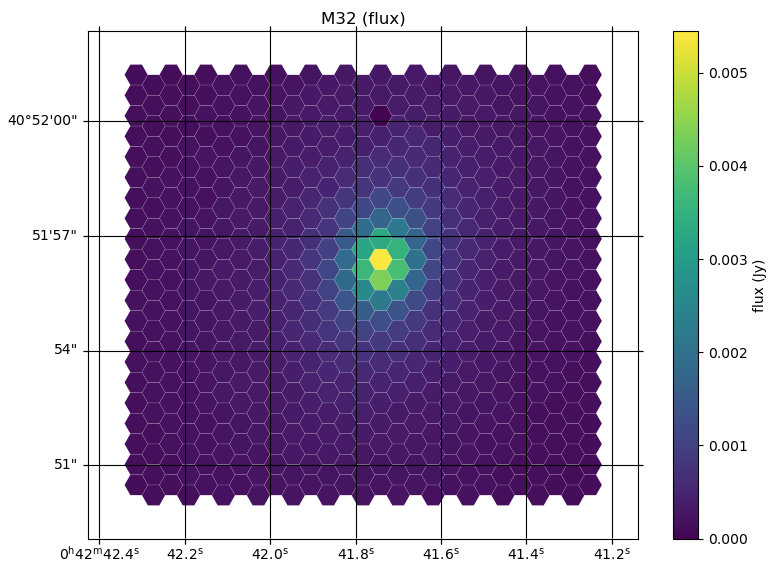

**Figure 17:** Example of reconstructed final_rss.fits (sky subtracted,
wavelength and flux calibrated) image of the center of Local Group
galaxy M32 in the MR-G setup. This image is generated using the
megaradrp.visualization code included in the MEGARA DRP distribution.

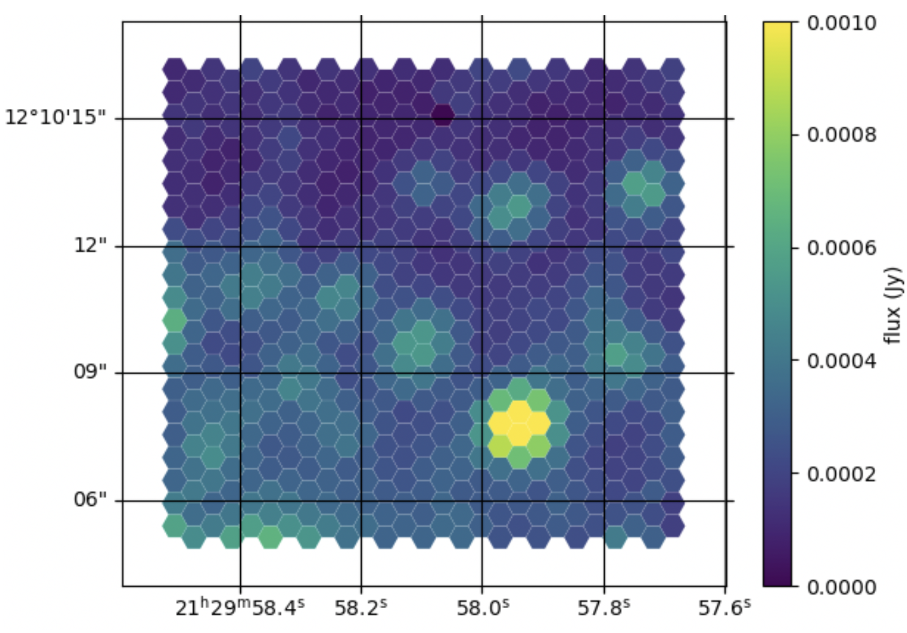

**Figure 18:** *Example of reconstructed final_rss.fits (sky subtracted,
wavelength and flux calibrated) image of the center of globular cluster
M15 in the HR-R setup. This image is generated using the
megaradrp-visualization code included in the MEGARA DRP distribution.*

**Figures 17** and **18** show two examples of the output generated by
this code for commissioning observations of Local Group galaxy M32 and
Galactic Globular Cluster M15, respectively.

As for the other commands, adding the -h flag would provide the help and
syntax for using this command. The result is the following:

.. code-block:: console

   usage: visualization.py [-h] [--wcs-grid] [--wcs-pa-from-header]
                           [--average-region AVERAGE_REGION AVERAGE_REGION]
                           [--extname EXTNAME] [--column COLUMN]
                           [--continuum-region CONTINUUM_REGION CONTINUUM_REGION]
                           [--coordinate-type {pixel,wcs}] [--colormap COLORMAP]
                           [--plot-sky] [--plot-nominal-config] [--hide-values]
                           [--title TITLE] [--label LABEL] [--hex-size HEX_SIZE]
                           [--hex-rel-size HEX_REL_SIZE] [--min-cut MIN_CUT]
                           [--max-cut MAX_CUT] [--percent PERCENT]
                           [--stretch {linear,sqrt,power,log,asinh}]
                           [--contour-pixel-size CONTOUR_PIXEL_SIZE]
                           [--contour-levels CONTOUR_LEVELS] [--contour]
                           [--contour-image CONTOUR_IMAGE]
                           [--contour-image-column CONTOUR_IMAGE_COLUMN]
                           [--contour-image-save CONTOUR_IMAGE_SAVE]
                           [--contour-image-region CONTOUR_IMAGE_REGION CONTOUR_IMAGE_REGION]
                           [--contour-is-density]
                           RSS [RSS ...]
   
   Display MEGARA RSS images
   
   positional arguments:
     RSS RSS images to process
   
   optional arguments:
     -h, --help show this help message and exit
     --wcs-grid Display WCS grid
     --wcs-pa-from-header Use PA angle from PC keys
     --average-region AVERAGE_REGION AVERAGE_REGION
                           Region of the RSS averaged on display
     --extname EXTNAME, -e EXTNAME
                           Name of the extension used
     --column COLUMN, -c COLUMN
                           Column of the RSS on display
     --continuum-region CONTINUUM_REGION CONTINUUM_REGION
                           Region of the RSS used for continuum subtraction
     --coordinate-type {pixel,wcs}
                           Types of coordinates used
     --colormap COLORMAP Name of a valid matplotlib colormap
     --plot-sky Plot SKY bundles
     --plot-nominal-config
                           Plot nominal configuration, do not use the header
     --hide-values Do not show values out of range
     --title TITLE Title of the plot
     --label LABEL Legend of the colorbar
     --hex-size HEX_SIZE Size of the hexagons (default is 0.443)
     --hex-rel-size HEX_REL_SIZE
                           Scale the size of hexagons by a factor
     --min-cut MIN_CUT Inferior cut level
     --max-cut MAX_CUT Superior cut level
     --percent PERCENT Compute cuts using percentiles
     --stretch {linear,sqrt,power,log,asinh}
                           Name of the strech method used for display
     contouring:
     --contour-pixel-size CONTOUR_PIXEL_SIZE
                           Pixel size in arc seconds for image reconstruction
     --contour-levels CONTOUR_LEVELS
                           Contour levels
     --contour Draw contours
     --contour-image CONTOUR_IMAGE
                           Image for computing contours
     --contour-image-column CONTOUR_IMAGE_COLUMN
                           Column of image used for contouring
     --contour-image-save CONTOUR_IMAGE_SAVE
                           Save image used for contouring
     --contour-image-region CONTOUR_IMAGE_REGION CONTOUR_IMAGE_REGION
                           Region of the image used for contouring
     --contour-is-density The data is a magnitude that does not require scaling

Note that this visualization tool can be also used to display output RSS
files from the ``analyze_rss.py`` tool described below. As an example, the
command to display the flux the first of the two gaussians fit to a
specific emission line analyzed with that code would be (see Section
6.8):

.. code-block:: console

   (megara) $ python -m megaradrp.visualization \
              test/analyze_rss_Halpha.fits -c 22 --min-cut 10. --max-cut 400.

Megaradrp-Cube
--------------

This tool allows to conver the output RSS file from the MegaraLcbImage
recipe (with or without the sky spectrum subtracted) into a FITS
datacube (x,y,z) where the z axis corresponds to every lambda in the
input RSS file and the (x,y) axes correspond to the two coordinates in
the sky (RA & Dec if instrument PA is 0º). Since this tool is now part
of the MEGARA DRP it should be run from within the DRP environment by
doing:

.. code-block:: console

   (megara) $ megaradrp-cube -h

The output of this command is:

.. code-block:: console

   usage: convert_rss_cube [-h] [-p PIXEL_SIZE] [-o OUTFILE] [-d]
                           [-m {nn,linear}] [--wcs-pa-from-header]
                           rss
   positional arguments:
     rss                   RSS file with fiber traces
   optional arguments:
   -h, --help              show this help message and exit
   -p PIXEL_SIZE, --pixel-size PIXEL_SIZE
                           Pixel size in arc seconds
   -o OUTFILE, --outfile OUTFILE
                           Name of the output cube file
   -d, --disable-scaling
                           Disable flux conservation
   -m {nn,linear}, --method {nn,linear}
                           Method of interpolation
   --wcs-pa-from-header    Use PA angle from header

We recommend to use output square-pixel sizes between 0.3-0.4 arcsec.
Default parameters for the ``--disable-scaling`` and ``--wcs-pa-from-header``
options should be fine for regular MEGARA data processed with the DRP.

An alternative software with similar scope has been developed by Javier
Zaragoza Cardiel (from INAOE) and can be obtained through GitHub at
https://github.com/javierzaragoza/megararss2cube.

Extract spectrum: megaratools-extract_spectrum
----------------------------------------------

This tool is the first being described in this cookbook that is part of
the *megaratools* package available through GitHub at
https://github.com/guaix-ucm/megara-tools. The objective of this tool is
to generate an extracted (1D) spectrum of a given fiber or set of
fibers. The main parameter determining the fiber(s) to be extracted is
the fiber number as measured in the pseudo-slit (from 1 to 623 in the
case of the LCB; 1 to 644 for the MOS). Since the RSS products of the
MegaraMosImage recipe already include an extension with the 7 fibers of
the each minibundle added together, this is particularly useful for
extracting spectra of different regions from processed LCB RSS frames.
The resulting extracted spectrum shares wavelength calibration solution
with the RSS. All tools included in the *megaratools* package can be
called as an argument for the Python main interpreter or as executables
on their own, although the latter option is recommended:

.. code-block:: console

   (megara) $ python <path_to_extract_spectrum>/extract_spectrum.py -h

   (megara) $ megaratools-extract_spectrum -h

The result of the task when called using the help (-h) argument is:

.. code-block:: console

   usage: extract_spectrum [-h] [-s RSS-SPECTRUM] [-t INPUT-TABLE] [-c COLUMN]
                           [-g GREP-STRING] [-o OUTPUT-SPECTRUM] [-p]

   Extract spectrum based on fiber IDs

   optional arguments:
     -h, --help show this help message and exit
     -s RSS-SPECTRUM, --spectrum RSS-SPECTRUM
                           RSS FITS spectrum
     -t INPUT-TABLE, --ids-table INPUT-TABLE
                           File with list of IDs
     -c COLUMN, --column COLUMN
                           Column to select from table
     -g GREP-STRING, --grep-string GREP-STRING
                           String to do grep in table
     -o OUTPUT-SPECTRUM, --output OUTPUT-SPECTRUM
                           Output 1D spectrum
     -p, --plot Plot spectrum instead?

The table with the fiber ids (-t) is a simple ascii file in which one of
the (space-separated) columns is the fiber id. The user can also choose
a set of rows that fulfils the condition of including a specific string
(using -g). An example of a file like this could be:

.. code-block:: console

   (megara) $ cat test/regions.fibers
   Region1 321
   Region1 319
   Region2 454
   Region2 460
   Region2 474

Should be the user be interested in extracting the fibers corresponding
to Region #2 (fibers 454, 460 & 474) from ``final_rss.fits`` file in the
``test/`` directory to a ``Region2.fits`` file, he/she can simply run:

.. code-block:: console

   (megara) $ megaratools-extract_spectrum -s test/final_rss.fits \
              -t test/regions.fibers -c 2 -g Region2 -o test/Region2.fits

The user can also decide to visualize the extracted spectrum without
saving it as a new FITS file. In that case he/she should make use of the
`-p` option:

.. code-block:: console

   (megara) $ megaratools-extract_spectrum -s test/final_rss.fits \
              -t test/regions.fibers -c 2 -g Region2 -p

One of the uses of this tool is to extract the spectrum of the
(flux-calibrated) ``final_rss.fits`` of a standard star processed with
MegaraLcbImage to verify that it matches the corresponding tabulated
spectrum. This extraction can be done using the ``fiber_ids.txt`` file
that it is stored in the ``*\*_results/*`` directory generated by the MEGARA
DRP when running this recipe. In the case the command would read (using
two single quotes for the ``-g`` option we ensure that the command selects
all rows extraction):

.. code-block:: console

   (megara) $ megaratools-extract_spectrum -s test/final_rss.fits \
              -t test/fiber_ids.txt -c 1 -g '' -p

Extract elliptical apertures: megaratools-extract_rings
-------------------------------------------------------

This tool (also part of *megaratools*) is similar to the previous one
but allows to automatically extract spectra of elliptical rings or
arbitrary size, orientation and ellipticity around a given position
(fiber). This is particularly useful of the analysis the radial
variation of properties derived from RSS data when the signal-to-noise
ratio does not allow to carry out a spaxel-by-spaxel analysis. The
options for this command are:

.. code-block:: console

   (megara) $ megaratools-extract_rings -h

   usage: extract_elliptical_rings_spectrum [-h] [-r RSS-SPECTRUM] [-a] [-b]
                                            [-c CENTRAL-FIBER] [-n NUMBER-RINGS]
                                            [-w RINGS WIDTH] [-s SAVED-RSS]
                                            [-e ELLIPTICITY] [-pa POSITION ANGLE]
                                            [-v]

   Extract spectra based on elliptical rings

   optional arguments:
     -h, --help            show this help message and exit
     -r RSS-SPECTRUM, --rss RSS-SPECTRUM
                           RSS FITS spectrum
     -a, --accumulate
     -b, --surface_brightness
     -c CENTRAL-FIBER, --central-fiber CENTRAL-FIBER
                           Central fiber
     -n NUMBER-RINGS, --number-rings NUMBER-RINGS
                           Number of rings
     -w RINGS WIDTH, --width RINGS WIDTH
                           Elliptical rings width (arcsec)
     -s SAVED-RSS, --saved-rss SAVED-RSS
                           Output RSS file
     -e ELLIPTICITY, --ellipticity ELLIPTICITY
                           Elliptical rings ellipticity
     -pa POSITION ANGLE, --position-angle POSITION ANGLE
                           Elliptical rings position angle (N->E)
     -v, --verbose

The command creates an RSS file with the same wavelength calibration
solution as the input RSS file but a number of columns equal to the
number of rings extracted (as set by the ``-n`` option). Besides, this
command when run with the verbose option (``-v``) on it also outputs the
main parameters of the rings extracted: average surface brightness at
the central wavelength (in Jy/spx or Jy/arcsec\ :sup:`2` is the ``-b``
option is set) and area. Below, we show an example of how this command
is run and of the output it creates in verbose mode.

.. code-block:: console

   (megara) $ megaratools-extract_rings -r test/final_rss.fits -c 311 \
              -b -w 0.6 -n 5 -s test/rings.fits -e 0.8 -pa 0. -v

   Ring #1: 0.010272977933 Jy/[asec/spx]^2 (@CWL) - area/rad: 1.1618385/0.3 [asec/spx]^2/asec)
   Ring #2: 0.006704834831 Jy/[asec/spx]^2 (@CWL) - area/rad: 3.3284848/0.9 [asec/spx]^2/asec)
   Ring #3: 0.002757987470 Jy/[asec/spx]^2 (@CWL) - area/rad: 4.1630143/1.5 [asec/spx]^2/asec)
   Ring #4: 0.001841463727 Jy/[asec/spx]^2 (@CWL) - area/rad: 6.5997403/2.1 [asec/spx]^2/asec)
   Ring #5: 0.001480577862 Jy/[asec/spx]^2 (@CWL) - area/rad: 9.4244147/2.7 [asec/spx]^2/asec)

Note that this tool can be also used to add the fluxes within (complete)
elliptical apertures, not only rings by using the ``-a`` option. The
resulting RSS can be used to extract the spectra of each ring/aperture
by combining its use with the ``megaratools-extract_spectrum`` tool
described in Section 6.3. Examples of that use are:

.. code-block:: console

   (megara) $ megaratools-extract_spectrum -s test/final_rss.fits \
              -t test/rings.dat -c 1 -g 1 -o test/ring1.fits
   (megara) $ megaratools-extract_spectrum -s test/final_rss.fits \
              -t test/rings.dat -c 1 -g 2 -o test/ring2.fits
   ...

where the ``test/rings.dat`` file is simply a list of integer numbers.

Plot spectrum: megaratools-plot_spectrum
----------------------------------------

This tool allows to plot a 1D MEGARA spectrum. It also allows to combine
the spectrum plotted with a tabulated spectrum (e.g. that from a
standard star) and a list of spectral lines. The options that can be
used for the ``megaratools-plot_spectrum`` tool are:

.. code-block:: console

   (megara) $ megaratools-plot_spectrum -h

   usage: plot_spectrum [-h] [-s SPECTRUM/FILE_LIST] [-l] [-t STD-TABLE]
                        [-c LINECAT-TABLE] [-z LINECAT-Z] [-o OUTPUT-PDF] [-e]
                        [-p] [-n] [-L1 INITIAL LAMBDA] [-L2 LAST LAMBDA]
                        [-T PLOT TITLE]

   Input spectrum and table

   optional arguments:
     -h, --help            show this help message and exit
     -s SPECTRUM/FILE_LIST, --spectrum SPECTRUM/FILE_LIST
                           FITS spectrum / list of FITS spectra
     -l, --is-a-list Use for -s being a list of FITS spectra
     -t STD-TABLE, --std-table STD-TABLE
                           Standard-star spectrum table
     -c LINECAT-TABLE, --catalog LINECAT-TABLE
                           Cataloged lines CSV table
     -z LINECAT-Z, --redshift LINECAT-Z
                           Redshift for catalog lines
     -o OUTPUT-PDF, --output OUTPUT-PDF
                           Output PDF
     -e, --efficiency Efficiency?
     -p, --plot Plot spectrum?
     -n, --no-legend Legend?
     -L1 INITIAL LAMBDA, --min-lambda INITIAL LAMBDA
                           Initial (rest-frame) lambda to plot
     -L2 LAST LAMBDA, --max-lambda LAST LAMBDA
                           Last (rest-frame) lambda to plot
     -F1 YMIN FLUX, --min-flambda YMIN FLUX
                           Minimum flux to plot
     -F2 YMAX FLUX, --max-flambda YMAX FLUX
                           Maximum flux to plot
     -T PLOT TITLE, --title PLOT TITLE
                           Title of the plot

Below we show an example of its use and the resulting plot (**Figure
19**).

.. code-block:: console

   (megara) $ megaratools-plot_spectrum -s test/spectrum.fits \
              -t test/mbd33d2642.dat -p -T 'BD+33 2642 spectrum' \
              -L1 6000 -L2 7500 -F1 2E-14 -F2 2E-13 -c test/bright_lines.dat

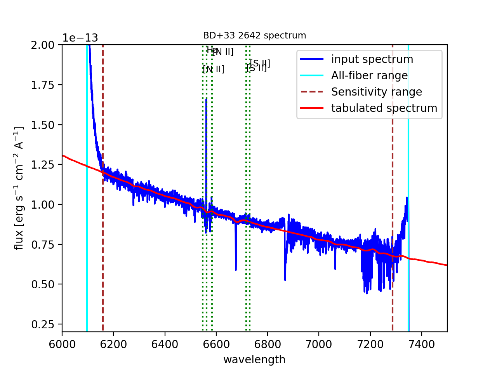

**Figure 19:** Result of the megaratools-plot_spectrum of standard star
BD+33 2642 along with the CALSPEC tabulated spectrum and a series of
spectral lines at the recession velocity of the source.

The tabulated spectrum is assumed to be in AB magnitudes and the file
with a catalogue of spectral lines must have the following format:

.. code-block:: console

   (megara) $ cat test/bright_lines.dat
   [N II],6548.1
   Ha,6562.8
   [N II],6583.4
   [S II],6716.3
   [S II],6730.7

Along with the input spectrum, ``megaratools-plot_spectrum`` also shows
(see **Figure 19**) the wavelength limits corresponding to the spectral
range that is common to all fibers (cyan lines) and that where the
computation (smoothing) of the sensitivity curve yields a reliable flux
calibration (dashed red lines). In that regard, it is also worth noting
that this tool can be also used to plot efficiency curves generated by
the LcbStdStar recipe (e.g. ``master_sensitivity.fits``), as shown in
**Figure 14**, both in their nominal units (electrons/Jy) or in relative
efficiency (when the option ``-e`` is used) assuming 80% pupil losses and
80% telescope efficiency relative to its effective area.

Diffuse light determination: megaratools-diffuse_light
------------------------------------------------------

In some MEGARA observations taken under bright moon conditions during
2018 and 2019 some reflected moonlight did manage to reach the
spectrograph camera and the detector. This diffuse light appeared as a
low-frequency pattern that could amount from just a few to tens of
counts (see top-left panel of **Figure 20**). This tool fits this
pattern using information from the region of the CCD that is not
illuminated by the fibers below and above the pseudo-slit and in between
the boxes that constitute it. **Figure 21** shows the result of the fit
of an average of 50 columns to a 4\ :sup:`th`-order
polynomial to the flux of regions illuminated by diffuse light alone.

|Diffuse light 1 of 4|\ |Diffuse light 2 of 4|

|Diffuse light 3 of 4|\ |Diffuse light 4 of 4|

**Figure 20:** Example of an image with diffuse light contamination
(top-left panel). The residuals after the best fit in 2D is performed is
shown in the top-right panel. Low-frequency background models obtained
by fitting only columns (left) and in 2D (columns first, then columns)
(right) are in the bottom panels.

Below we show how this tool is executed and some basic information on
its different options.

.. code-block:: console

   (megara) $ megaratools-diffuse_light -h

   usage: clean_diffuse_light [-h] [-i INPUT-IMAGE] [-o OUTPUT-IMAGE]
                              [-r RESIDUALS-IMAGE] [-t MASTER-TRACES]
                              [-s SHIFT-TRACES] [-w SEARCH-WINDOW]
                              [-d DEGREE-POLY-COLS] [-d2 DEGREE-POLY-ROWS]
                              [-p OUTPUT-PLOT] [-b SPECTRAL-BINNING]
                              [-e EXCLUDE-REGION [EXCLUDE-REGION ...]] [-2D]

   Cleaning of diffuse light from a reduced (non-RSS) MEGARA image

   optional arguments:
     -h, --help            show this help message and exit
     -i INPUT-IMAGE, --input INPUT-IMAGE
                           Reduced FITS image
     -o OUTPUT-IMAGE, --output OUTPUT-IMAGE
                           Output diffuse-light FITS image
     -r RESIDUALS-IMAGE, --residuals RESIDUALS-IMAGE
                           Output residual FITS image
     -t MASTER-TRACES, --traces MASTER-TRACES
                           Master traces JSON file
     -s SHIFT-TRACES, --shift SHIFT-TRACES
                           Traces shift
     -w SEARCH-WINDOW, --window SEARCH-WINDOW
                           Window around traces to search for non-illuminated
                           Fibers
     -d DEGREE-POLY-COLS, --degree DEGREE-POLY-COLS
                           Degree of polynomial fit for columns
     -d2 DEGREE-POLY-ROWS, --degree-rows DEGREE-POLY-ROWS
                           Degree of polynomial fit for rows
     -p OUTPUT-PLOT, --outplot OUTPUT-PLOT
                           Output plots
     -b SPECTRAL-BINNING, --binning SPECTRAL-BINNING
                           Binning in the spectral direction
     -e EXCLUDE-REGION [EXCLUDE-REGION ...], --exclude EXCLUDE-REGION [EXCLUDE-REGION ...]
                           Exclude region (c1 c2 r1 r2), e.g. 2407 2720 0 164
     -2D, --two-dimensional
                           Two-dimensional fitting?
   
Most of these options are related to the different fitting parameters
used. Note that the input image should be the ``reduced_image.fits`` image
generated by, among others, the **MegaraLcbImage** and **MegaraMosImage**
recipes, that is place in the corresponding ``*\*_work/*`` directory. This
cannot be run on raw images as those have different bias levels and
gains for its two amplifiers. A master-traces file and the offset
between them and the position of the fibers in the contaminated image
should be provided as well (options ``-t`` and ``-s``, respectively).

|Fit to the sum of 50 columns|\ |image13|

**Figure 21:** Fit to the sum of 50 columns (left) and 50 rows (right)
for a reduced_image.fits contaminated by diffuse light. The 2D fit
ensures that potential bright lines (peak in the right-panel profile) do
not significantly affect the modeling results. Black points correspond
to those pixels used to perform this fit. A fourth-order polynomial was
used in these fits.

Option ``-e`` (defined in pixels) allows to exclude a specific region from
the fit (white rectangle in top-right panel of **Figure 20**). This is
particularly useful from some very early observations in the red (LR-R,
MR-R, MR-RI) in which light from the pseudo-slit mechanism LED was
adding some diffuse light just below the position of the spectra on the
CCD but not the under the light from the fibers itself, making this
region not useful to fit any low-frequency pattern present throughout
the entire CCD. An example of the use of this tool follows:

.. code-block:: console

   (megara) $ megaratools-diffuse_light -i test/reduced_image.fits \
              -o test/background_2D.fits -r test/residuals_2D.fits \
              -t test/master_traces.json -s 1.2 -p test/plots_2D.pdf \
              -e 2407 2720 0 154 -2D

The result of this command is a low-frequency background image (the one
set by the ``-o`` option). See the bottom panels of **Figure 20** in this
regard, for the best fit along columns only (left panel) and fitting the
result also along rows (right panel). In order to remove this image
during the data processing with the DRP, both the MegaraLcbImage and
MegaraMosImage count with a ``requirement`` called ``diffuse_light_image``
that should be set to the image resulting from this tool. That image
should be placed under the ``data/*`` directory where the **megaradrp** is
being run. This requirement is added in the development versions of the
**megaradrp** or in Python package versions released after July
1\ :sup:`st` 2020 (**numina** and **megaradrp** versions 0.22+ and 0.10+,
respectively). The user can find more info on the set of requirements of
these tasks by doing:

.. code-block:: console

   (megara) $ numina show-recipes -m MegaraLcbImage

This tool also generates a clean image that, although of no use within
the **megaradrp**, can be used to verify the quality of the low-frequency
background modeling performed (see bottom panel of **Figure 20**).
Output background images generated by ``megaratools-diffuse_light`` have
keyword NUM-DFL added to their headers.

Analysis of a 1D emission-line spectrum: megaratools-analyze_spectrum
---------------------------------------------------------------------

There are multiple tools that perform the analysis of spectral of
astronomical sources, both the stellar continuum and emission lines
(pPXF, Steckmap, Fit3D, FADO, to name a few). However, most of these
software tools do not work right away on data from a new instrument,
although many started from the need of analyzing data from a specific
spectrograph and survey, such as SAURON (pPXF) or PPaK/CALIFA (Fit3D).
In the case of MEGARA three different tools are used, one that is based
on pPXF (see e.g. `Dullo et al.
2019 <https://ui.adsabs.harvard.edu/abs/2019ApJ...871....9D/abstract>`__;
not yet public) and two that are designed for the analysis of single
emission lines on extracted 1D (``megaratools-analyze_spectrum``, below)
and RSS 2D MEGARA spectra (``megaratools-analyze_rss``, Section 6.8).

The ``megaratools-analyze_spectrum`` tool allows to determine all
parameters of a specific emission lines by fitting different functions
(linear continuum plus a modelled single gaussian, double gaussian or
Gauss-Hermite polynomials to a single emission line) within a given
spectral range. As this tool is used on extracted 1D spectrum, the
output is given on the screen and no output file is created. This tool
is executed by doing:

.. code-block:: console

   (megara) $ megaratools-analyze_spectrum -h

   usage: analyze_spectrum [-h] [-s SPECTRUM/FILE_LIST] [-l]
                           [-f FITTING FUNCTION 0,1,2)]
                           [-w LINE CENTRAL WAVELENGTH] [-k]
                           [-LW1 LOWER WAVELENGTH - LINE]
                           [-LW2 UPPER WAVELENGTH - LINE]
                           [-CW1 LOWER WAVELENGTH - CONT]
                           [-CW2 UPPER WAVELENGTH - CONT]
                           [-ECW1 EXCLUDE FROM CONT. (LOWER WAVELENGTH)]
                           [-ECW2 EXCLUDE FROM CONT. (UPPER WAVELENGTH]
                           [-PW1 LOWER WAVELENGTH - PLOT]
                           [-PW2 UPPER WAVELENGTH - PLOT]
                           [-S2 SCALE FACTOR FOR AMP2] [-t SPEC-TABLE]
                           [-c LINECAT-TABLE] [-z REDSHIFT] [-o OUTPUT-PDF] [-p] [-n]
   ANALYZE SPECTRUM

   optional arguments:
     -h, --help            show this help message and exit
     -s SPECTRUM/FILE_LIST, --spectrum SPECTRUM/FILE_LIST
                           FITS spectrum / list of FITS spectra
     -l, --is-a-list Use for -s being a list of FITS spectra
     -f FITTING FUNCTION (0,1,2), --method FITTING FUNCTION (0,1,2)
                           Fitting function (0=gauss_hermite, 1=gauss,2=double_gauss)
     -w LINE CENTRAL WAVELENGTH, --ctwl LINE CENTRAL WAVELENGTH
                           Central rest-frame wavelength for line (AA)
     -k, --use-peak Use peak first guess on central wavelength
     -LW1 LOWER WAVELENGTH - LINE, --lcut1 LOWER WAVELENGTH - LINE
                           Lower rest-frame wavelength for line (AA)
     -LW2 UPPER WAVELENGTH - LINE, --lcut2 UPPER WAVELENGTH - LINE
                           Upper rest-frame wavelength for line (AA)
     -CW1 LOWER WAVELENGTH - CONT, --ccut1 LOWER WAVELENGTH - CONT
                           Lower rest-frame wavelength for cont. (AA)
     -CW2 UPPER WAVELENGTH - CONT, --ccut2 UPPER WAVELENGTH - CONT
                           Upper rest-frame wavelength for cont. (AA)
     -ECW1 EXCLUDE FROM CONT. (LOWER WAVELENGTH), --eccut1 EXCLUDE FROM CONT. (LOWER WAVELENGTH)
                           Lower rest-frame wavelength of range to exclude for cont. (AA)
     -ECW2 EXCLUDE FROM CONT. (UPPER WAVELENGTH), --eccut2 EXCLUDE FROM CONT. (UPPER WAVELENGTH)
                           Upper rest-frame wavelength of range to exclude for cont. (AA)
     -PW1 LOWER WAVELENGTH - PLOT, --pcut1 LOWER WAVELENGTH - PLOT
                           Lower rest-frame wavelength for plot (AA)
     -PW2 UPPER WAVELENGTH - PLOT, --pcut2 UPPER WAVELENGTH - PLOT
                           Upper rest-frame wavelength for plot (AA)
     -S2 SCALE FACTOR FOR AMP2, --scale-amp2 SCALE FACTOR FOR AMP2
                           Scale factor for amplitude 2
     -t SPEC-TABLE, --spec-table SPEC-TABLE
                           Additional spectrum table
     -c LINECAT-TABLE, --catalog LINECAT-TABLE
                           Cataloged lines CSV table
     -z REDSHIFT, --redshift REDSHIFT
                           Redshift for target and catalog lines
     -o OUTPUT-PDF, --output OUTPUT-PDF
                           Output PDF
     -p, --plot Plot spectrum?
     -n, --no-legend Legend?

Some of the options of this task are common to the ones in
``megaratools_plot_spectrum``, including the possibility of adding a tabulated
spectrum (``-t``) or catalog of spectral lines (``-c``), defining the redshift
of the source (``-z``), creating an output PDF (``-o``) with or without legend
(``-n``). Here we show an example of its usage:

.. code-block:: console

   (megara) $ megaratools-analyze_spectrum -s test/spectrum.fits \
              -f 2 -w 6563 -LW1 6552 -LW2 6570 -CW1 6400 -CW2 6710 \
              -ECW1 6545 -ECW2 6588 -PW1 6350 -PW2 6800 -f 2 \
              -c test/bright_lines.dat -p -k -z "-0.00025" -S2 " -0.2"

Note that setting values to ``-LW1``, ``-LW2``, ``-CW1``, ``-CW2``, ``-PW1``,
``-PW2`` is mandatory. The tool, based on some of the options introduced,
determines an initial set of fitting parameters. If the ``-k`` option is set,
the initial guess on the line peak is taken from the maximum value (after the
best-fitting continuum is removed) within the specified fitting range. For the
initial guesses on the 1\ :sup:`st` and 2\ :sup:`nd`-order moments we take the
position of that maximum and some factor (~1-1.2, depending on the model
function; see below) of the instrumental FWHM. The models considered to date
are:

– Gauss-Hermite polynomials (``-f 0``)

– Single gaussian (``-f 1``)

– Two gaussians (``-f 2``)

In the case of the model with two gaussians one can scale the initial
guess on the peak intensity of the second gaussian relative to the first
one. This is particularly useful when underlying absorption is present
in the spectral range of the fit (see **Figure 22**). After executing
this command, it prints in the screen both the input and output
(best-fitting) parameters. The content of this output also depends on
the type of model function chosen to fit the emission line. The output
of the example above would be the following:

.. code-block:: text

   FITTING CONTINUUM:
   Input(slope,yord): 0.000E+00 9.724E-14
   Output(slope,yord): -5.336E-17 4.468E-13
   Best-fitting chisqr continuum: 7.321E-27
   BASIC NUMBERS:
   (mean,rms,lpk,pk,S/N) 9.6828e-14 2.9143e-15 6561.03 1.6584e-13 56.9079
   FITTING METHOD: DOUBLE GAUSSIAN
   Input(i1,l1,sig1,i2,l2,sig2):  6.212E-14 6561.03 0.47 -1.380E-15 6561.03 0.93
   Flux1 from model: 8.224E-14+/- 9.845E-15
   Flux2 from model: -1.117E-13+/- 9.573E-15
   Output(i1,l1,sig1,i2,l2,sig2): 8.309E-14 6561.11 0.39 -1.263E-14 6561.31 3.63
   Flux & EW from data: -2.844E-14+/- 9.690E-15 -0.29+/- 0.10
   Flux & EW from model: -2.949E-14+/- 9.689E-15 -0.30+/- 0.10
   Best-fitting chisqr: 2.279E-28

Note that the term ``from data`` refers to the sum of the flux above the
continuum within the spectral range used to fit the line profile, while
the term ``from model`` refers to the analytic integral of the model.

Besides, ``megaratools-analyze_spectrum`` displays a plot (similar to the
ones shown in **Figure 22**) that includes:

– The input spectrum in the range set by options ``-PW``1 and ``-PW2`` (blue
line)

– Vertical lines of the different spectral ranges of interest, including the
range covered by all fibers (cyan line) and with precise flux calibration in
the original RSS frame (dashed red line), the range for fitting the continuum
(dashed grey lines) and that where the line fit is performed (solid gray line).

– Best-fitting continuum (solid red line).

– Best-fitting line plus continuum (solid orange line).

The user should check the ranges chosen and then kill the graphical
terminal for the code to start running.

|prezoom image14|\ |image14|

**Figure 22:** Two different views of the plot generated by
megaratools-analyze_spectrum for the example given in the text. In this
case the line fitted is Hα and the method used was a double gaussian,
where the intensity of the secondary gaussian was set to negative 20% of
the intensity of the primary one to model the underlying absorption in
this (Balmer) line.

Analysis of a 2D RSS emission-line spectrum: megaratools-analyze_rss
--------------------------------------------------------------------

Based on the fitting procedure of ``megaratools-analyze_spectrum`` tool we
also developed a tool that is able to do the same spectral analysis in
MEGARA RSS files. This is particularly useful for creating maps of
derived properties (fluxes, line-of-sight radial velocity and velocity
dispersion and higher-order momenta) from the analysis of LCB RSS final
data (``final_rss.fits`` or ``reduced_rss.fits`` files created by the
**MegaraLcbImage** recipe).

The tool is called ``megaratools-analyze_rss`` and it is executed by
doing:

.. code-block:: console

   (megara) $ megaratools-analyze_rss -h

   usage: analyze_rss [-h] [-s RSS FILE] [-f FITTING FUNCTION 0,1,2)]
                      [-S MINIMUM S/N] [-w LINE CENTRAL WAVELENGTH] [-k]
                      [-LW1 LOWER WAVELENGTH - LINE]
                      [-LW2 UPPER WAVELENGTH - LINE]
                      [-CW1 LOWER WAVELENGTH - CONT]
                      [-CW2 UPPER WAVELENGTH - CONT]
                      [-ECW1 EXCLUDE FROM CONT. (LOWER WAVELENGTH)]
                      [-ECW2 EXCLUDE FROM CONT. (UPPER WAVELENGTH]
                      [-PW1 LOWER WAVELENGTH - PLOT]
                      [-PW2 UPPER WAVELENGTH - PLOT] [-S2 SCALE FACTOR FOR AMP2]
                      [-z REDSHIFT] [-o OUTPUT-PDF] [-v] [-O OUTPUT RSS FILE]
                      [-of OUTPUT FIBERS LIST]

   __________________ ANALYZE_RSS PROGRAM __________________

   ____________ OUTPUT PARAMETER IN OUTPUT FITS ____________
   Property channel description

   ... FM # 0 Fitting method (0=gauss-hermite,1=1gauss,2=2gauss)
   ... CONTINUUM # 1 Continuum level in cgs
   ... NOISE # 2 rms in cgs
   ... SNR # 3 S/N at the peak of the line
   ... FLUXD # 4 Flux from window_data - window_continuum
   ... EWD # 5 Flux from window_data - window_continuum / mean_continuum
   ... FLUXF # 6 Flux from best-fitting function(s)
   ... EWF # 7 EW from best-fitting function(s)
   ... H0 # 8 amplitude for methods 0 & 1 & 2 (first gaussian)
   ... H1 # 9 central lambda for methods 0 & 1 & 2 (first gaussian)
   ... H2 # 10 sigma (in AA) for methods 0 & 1 & 2 (first gaussian)
   ... H3 # 11 h3 for method 0
   ... H4 # 12 h4 for method 0
   ... H0B # 13 amplitude for method 2 (second gaussian)
   ... H1B # 14 central lambda for method 2 (second gaussian)
   ... H2B # 15 sigma (in AA) for method 2 (second gaussian)
   ... H1KS # 16 velocity in km/s from H1 (1st g)
   ... H2KS # 17 sigma in km/s from H2 (1st g)
   ... H2KLC # 18 sigma in km/s from H2 corrected for instrumental sigma (1st g)
   ... H1KSB # 19 velocity in km/s from H1B (2nd g)
   ... H2KSB # 20 sigma in km/s from H2B (2nd g)
   ... H2KLCB # 21 sigma in km/s from H2 corrected for instrumental sigma (2nd g)
   ... FLUXF1 # 22 Flux from best-fitting 1st gaussian
   ... FLUXF2 # 23 Flux from best-fitting 2nd gaussian
   ... EFLUXD # 24 Error of 4 (Flux from window_data - window_continuum)
   ... EEWD # 25 Error of 5 (Flux from window_data - window_continuum / mean_continuum)
   ... EFLUXF # 26 Error of 6 (Flux from best-fitting function(s))
   ... EEWF # 27 Error of 7 (EW from best-fitting function(s))
   ... CHI2 # 28 best-fitting chi^2 (cgs)

   optional arguments:
     -h, --help            show this help message and exit
     -s RSS FILE, --spectrum RSS FILE
                           RSS input file
     -f FITTING FUNCTION (0,1,2), --method FITTING FUNCTION (0,1,2)
                           Fitting function (0=gauss_hermite, 1=gauss, 2=double_gauss)
     -S MINIMUM S/N, --limsnr MINIMUM S/N
                           Mininum Signal-to-noise ratio in each spaxel
     -w LINE CENTRAL WAVELENGTH, --ctwl LINE CENTRAL WAVELENGTH
                           Central rest-frame wavelength for line (AA)
     -k, --use-peak Use peak first guess on central wavelength
     -LW1 LOWER WAVELENGTH - LINE, --lcut1 LOWER WAVELENGTH - LINE
                           Lower rest-frame wavelength for line (AA)
     -LW2 UPPER WAVELENGTH - LINE, --lcut2 UPPER WAVELENGTH - LINE
                           Upper rest-frame wavelength for line (AA)
     -CW1 LOWER WAVELENGTH - CONT, --ccut1 LOWER WAVELENGTH - CONT
                           Lower rest-frame wavelength for cont. (AA)
     -CW2 UPPER WAVELENGTH - CONT, --ccut2 UPPER WAVELENGTH - CONT
                           Upper rest-frame wavelength for cont. (AA)
     -ECW1 EXCLUDE FROM CONT. (LOWER WAVELENGTH), --eccut1 EXCLUDE FROM CONT. (LOWER WAVELENGTH)
                           Lower rest-frame wavelength of range to exclude for cont. (AA)
     -ECW2 EXCLUDE FROM CONT. (UPPER WAVELENGTH), --eccut2 EXCLUDE FROM CONT. (UPPER WAVELENGTH)
                           Upper rest-frame wavelength of range to exclude for cont. (AA)
     -PW1 LOWER WAVELENGTH - PLOT, --pcut1 LOWER WAVELENGTH - PLOT
                           Lower (observed) wavelength for plot (AA)
     -PW2 UPPER WAVELENGTH - PLOT, --pcut2 UPPER WAVELENGTH - PLOT
                           Upper (observed) wavelength for plot (AA)
     -S2 SCALE FACTOR FOR AMP2, --scale-amp2 SCALE FACTOR FOR AMP2
                           Scale factor for amplitude 2
     -z REDSHIFT, --redshift REDSHIFT
                           Redshift for target and catalog lines
     -o OUTPUT-PDF, --output OUTPUT-PDF
                           Output PDF
     -v, --verbose Verbose mode for fitting results?
     -O OUTPUT RSS FILE, --output-rss OUTPUT RSS FILE
                           Output RSS file
     -of OUTPUT FIBERS LIST, --output-fibers OUTPUT FIBERS LIST
                           Output list of fibers above minimum Signal-to-noise ratio

Although the spectral ranges and model function set by the options of
the parameter are common to all fibers, option ``-S`` allows to set a
minimum signal-to-noise ratio for the peak intensity below which no fit
is attempted. The verbose mode allows to print to screen the same output
results as those shown by default by the ``megaratools-analyze_spectrum``
tool but for each individual fiber fulfilling the minimum S/N criteria
imposed.

The rest of the options are identical to the ones described for the
``megaratools-analysis_spectrum`` tool. The main difference comes from the
output products. While in the case of the ``megaratools-analysis_spectrum``
tool only printed output is produced, this tool generates an RSS FITS file of
products that has the same number of rows as the input RSS (623 or 644) but
only 29 columns, one per derived property, including the majority of the model
best-fitting parameters. The properties included in columns 0 to 28 of the
output RSS and their meaning are listed above as part of the online help
information provided by the tool (``-h`` option). The output also includes a
PDF file with the graphical result of all fibers that were fit (plots with the
original spectra of fibers with S/N below the number given in option ``-S`` are
also included) and an ascii file listing the ids of the fibers that matched our
minimum S/N requirement. This file is useful as it can be used (in combination
with ``megaratools-extract_spectrum``) to generate a high-S/N emission-line
spectrum of our target. **Figure 23** shows the plots generated for two
specific fibers and two different spectral lines using the instructions given
later in this section.

Below we provide two examples of the execution of the
``megaratools-analyzed_rss`` tool for two different spectral lines in the
same spectral setup: Hα and [NII]λ6584Å. Right after each of these
commands is executed, the program shows a plot of the integrated
spectrum (all fiber spectra added up) with all relevant spectral ranges
clearly identified with vertical lines. The RSS product files generated
by these two instructions will be later used to compute an RSS file that
can be used to create a line-ratio map.

.. code-block:: console

   (megara) $ megaratools-analyze_rss -s test/final_rss.fits -f 2
              -w 6563 -LW1 6552 -LW2 6570 -CW1 6400 -CW2 6710 \
              -ECW1 6545. -ECW2 6588 -PW1 6350 -PW2 6800 -f 2 -k
              -z "-0.00025" -S2 " -0.2" -S 5 \
              -o test/analyze_rss_Halpha.pdf \
              -O test/analyze_rss_Halpha.fits \
              -of test/analyze_rss_Halpha.fibers

   (megara) $ megaratools-analyze_rss -s test/final_rss.fits -f 2
              -w 6584 -LW1 6580 -LW2 6587 -CW1 6400 -CW2 6710 \
              -ECW1 6545. -ECW2 6588 -PW1 6350 -PW2 6800 -f 1 -k \
              -z "-0.00025" -S 5 \
              -o test/analyze_rss_N2.pdf \
              -O test/analyze_rss_N2.fits \
              -of test/analyze_rss_N2.fibers

|image15|\ |image16|

**Figure 23:** Results of the fitting of Hα (left panel) and
[NII]λ6584Å (right panel) spectral lines for fibers 291 and 321,
respectively. As for the graphical output of
megaratools-analyze_spectrum, the input spectrum is shown in blue, the
range used for the fitting the continuum is bracketed between dashed
grey lines, the range for fitting the line in between solid grey lines,
the best-fitting continuum is shown as a solid red line and the
best-fitting line plus continuum is in orange.

RSS arithmetics: megaratools-rss_arith
--------------------------------------

The tool ``megaratools-rss_arith`` described here allows to perform basic
computations (Python basic arithmetic and **numpy** numerical operations)
on RSS files. The online help output is shown below.

.. code-block:: console

   (megara) $ megaratools-rss_arith -h
   usage: combine_rss [-h] [-e Equation to evaluate] [-o OUTPUT RSS] rss

   Combining by averaging aligned RSS files

   positional arguments:
     rss Input table with list of RSS files

   optional arguments:
     -h, --help            show this help message and exit
     -e Equation to evaluate, --equation Equation to evaluate
                           Example: '(ima1[:,9] + ima2[:,10])/ ima3[:,3]'
     -o OUTPUT RSS, --output OUTPUT RSS
                           Output RSS

The input of this tool is a text file with the list of images involved
in the operation (all of the same size):

.. code-block:: console

   (megara) $ cat test/images.txt
   test/analyze_rss_N2.fits
   test/analyze_rss_Halpha.fits
   test/final_rss.fits

The output is always an RSS file with one single column and the same
number of rows as the input images. The philosophy behind of this tool
is rather similar to that of the **imexpr** command in IRAF.

The tool can be used for multiple purposes using any of the **numpy**
array operations. Below we show examples of some potential usages of
``megaratools-rss_arith``. For example:

.. code-block:: console

   (megara) $ megaratools-rss_arith test/images.txt \
              -e 'np.log10(ima1[:,6]/ima2[:,22])' \
              -o test/logN2_over_Ha_rss.fits

This instruction includes the options required to create a line-ratio
RSS (in log10 scale) from two RSS FITS files created by the
``megaratools-analyze_rss`` tool for the Hα and [NII]λ6584Å lines. Note
that, given that we are using only the flux of the emission component of
Hα, we use channel #22, which corresponds to the line flux of only the
primary gaussian (see description of tool ``megaratools-analyze_rss`` in
Section 6.8), for Hα and channel #6 for [NII]λ6584Å.

Other examples are:

.. code-block:: console

   (megara) $ megaratools-rss_arith test/images.txt \
              -e '(np.mean(ima3[:,1000:2000],axis=1))' \
              -o test/mean_1000_2000.fits

   (megara) $ megaratools-rss_arith test/images.txt \
              -e '(np.mean(ima3[:,2000:3000],axis=1))' \
              -o test/mean_2000_3000.fits

In these cases, we compute the mean of all the flux from spectral pixels
1000 to 2000 (top) and 2000 to 3000 (bottom) to create two new separated
RSS files. We can now create a spectral-index-like RSS image by running:

.. code-block:: console

   (megara) $ megaratools-rss_arith test/images2.txt \
              -e 'ima4[:,0]/ima5[:,0]' -o test/index.fits

The user should bear in mind that ``*test/images2.txt`` now includes two
additional rows with the names of the images created above:
``test/mean_1000_2000.fits`` and ``test/mean_2000_3000.fits``. Note that
although the images listed in the ``test/images2.txt`` file would have
different dimensions we would not get any error because (1) they have
the same number of rows (623 in this case) and (2) images of different
dimensions are not combined in the same execution of
``megaratoos-rss_arith``. We show in **Figure 24** the resulting
``test/index.fits`` RSS image using the ``megaradrp.visualization`` tool
described in Section 6.1. This figure was obtained using the command:

.. code-block:: console

   (megara) $ python -m megaradrp.visualization test/index.fits \
              -c 0 --min-cut 0.8 --max-cut 1.2

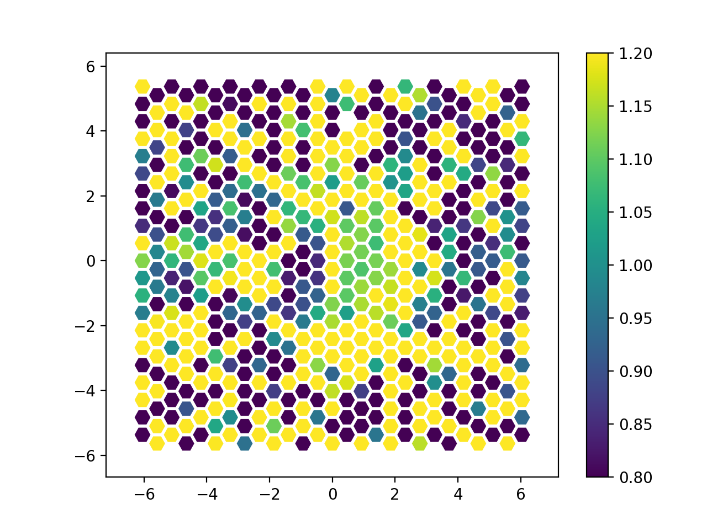

**Figure 24:** Ratio between the ``mean_1000_2000.fits`` and
``mean_2000_3000.fits`` images generated with ``megaratools-rss_arith``.

Note that the spectral range explored by this spectral-index image is
rather small, which leads to a very small dynamic range. Nevertheless,
most of the spaxels showing bright emission from the source reveal a
relatively blue color as expected for the spectral type of this
spectrophotometric standard star.

The user should be also aware when using this tool that any operation
involving a logarithmic or intensity ratios might lead to some warnings.
These tools should properly handle (and create when necessary) NaN
values but we cannot guarantee that any other software to be run on
these products will have no issues using these data.

We note that ``megaratools-rss_arith`` can be also used on extracted (1D)
spectra created with the ``megaratools-extract_spectrum`` tool described
in Section 6.3. The instruction to use it on extracted spectra would be
something like the following:

.. code-block:: console

   (megara) $ megaratools-rss_arith test/list_1D \
              -e '2.0*ima1+ima2' -o test/output_1D.fits

where ``list_1D`` should be a text ascii file with the (in this case, two)
extracted spectra on which the numerical operation is to be performed
(similar to the ``test/images.txt`` file quoted above for RSS files) and
``output_1D.fits`` would be the output 1D spectrum. This output file is
fully compatible with our ``megaratools-plot_spectrum`` or
``megaratools-analyze_spectrum`` tools.

Megaratools-hypercube
---------------------

Some observations with the MEGARA LCB might require of acquiring
multiple points to mosaic an extended astrophysical object. In order to
combine the information from all the different RSS files generated by
the DRP from each of the individual observations we have developed a
code based on the ``megaradrp-cube`` tool but that is able to handle a
series of RSS files placed at different adjacent positions in the sky
combined them all together to create a single large cube. This tool is
called ``megaratools-hypercube`` and its online help can be obtained by
doing:

.. code-block:: console

   (megara) $ megaratools-hypercube -h
   usage: convert_rss_cube [-h] [-l] [-c] [-p PIXEL_SIZE] [-o OUTFILE] [-d]
                           [-m {nn,linear}] [--wcs-pa-from-header] [-trim] [-hyp]
                           [-helio] [-trimn [TRIMMING_NUMBERS [TRIMMING_NUMBERS ...]]]
                           rss

   positional arguments:
     rss                   RSS file / List of RSS files
   optional arguments:
     -h, --help            show this help message and exit
     -l, --is-a-list       Use for -s being a list of FITS spectra
     -c, --is-a-cube       Use for -s being a list of cubes (not rss) spectra
     -p PIXEL_SIZE, --pixel-size PIXEL_SIZE
                           Pixel size in arc seconds (default = 0.4)
     -o OUTFILE, --outfile OUTFILE
                           Name of the output cube file (default = test
     -d, --disable-scaling
                           Disable flux conservation
     -m {nn,linear}, --method {nn,linear}
                           Method of interpolation
     --wcs-pa-from-header  Use PA angle from header
     -trim, --trimming     Use for trimming the cubes
     -hyp, --hyper         Use for creating the hypercube
     -helio, --helio       Use for applying heliocentric velocity correction
     -trimn [TRIMMING_NUMBERS [TRIMMING_NUMBERS ...]], --trimming-numbers [TRIMMING_NUMBERS [TRIMMING_NUMBERS ...]]
                           Use for declaring the number of rows and columns you
                           want to trim. [Bottom rows, top rows, left column, 
                           right column] (default= 1,2,1,1)

Although this tool determines the position on the sky based on the image
WCS solution, it also allows to apply additional RA & Dec offsets to
each of the individual generated cube sections (one from input RSS
frame). Besides, one can also shift and scale the flux levels of each of
the cube sections to take into account possible non-photometric
conditions during the observation. These corrections are introduced as
part of the input file where the list of RSS images to combine are
included. An example of such a file is given below:

.. code-block:: console

   (megara) $ cat test/list_hypercube
   test/reduced_rss_OB0001_B.fits 0.0 0.0 0.0 1.0
   test/reduced_rss_OB0002_B.fits 0.0 0.0 0.0 1.0
   test/reduced_rss_OB0003_B.fits 0.0 0.0 0.0 1.0
   test/reduced_rss_OB0004_B.fits 0.0 0.0 0.0 1.0

The first column is the RSS filename, columns 2 and 3 correspond to the
offsets (in arcsec) of the different pointings, column 4 allows to
introduce offsets to the flux levels measured in the corresponding
pointing and column 5 is the scaling factor to be applied to the flux of
each pointing. The example listed above would be the one to be used if
the astrometry and flux calibration of all RSS files is perfect.

An example of how the tool should be run would be the following:

.. code-block:: console

   (megara) $ megaratools-hypercube test/list_hypercube \
              -l -o test/cube.fits -p 0.4 -m linear --wcs-pa-from-header -trim -hyp -helio

In this case the pixel size of the ``cube.fits`` output file would be 0.4
arcsec/pixel, the cube would be generated using linear interpolation, 2
two rows and 1 bottom row, 1 left and right columns would be removed
from each cube before they are combined together. The best number of
rows and columns to be removed depends on the pixel size, so it can be
modified by using the -trimn option. Besides,
``megaradrp-tools_hypercube`` allows to put all (topocentric) wavelength
calibrations to a common barycenter wavelength calibration.

The use can also use this tool to simply generate a list of cubes from
individual RSS files by removing the ``-hyp`` option.

.. |image1| image:: _static/image2.png
   :width: 3.65278in
   :height: 2.34722in
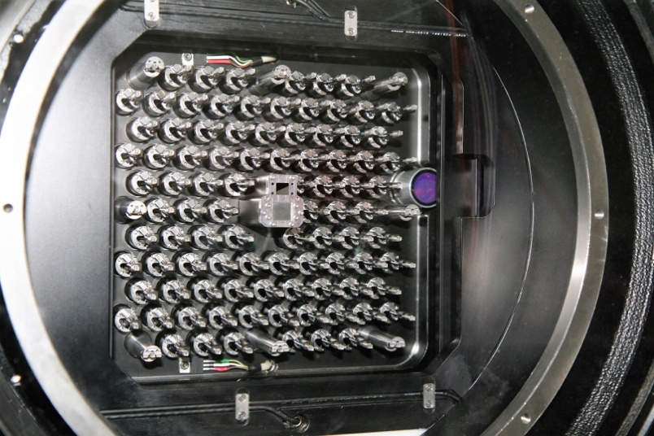
.. |image3| image:: _static/image4.png
   :width: 6.81319in
   :height: 3.43194in
.. |image4| image:: _static/image5.png
   :width: 6.81319in
   :height: 3.43194in
.. |image5| image:: _static/image6.png
   :width: 6.81319in
   :height: 3.43194in
.. |image6| image:: _static/image6.png
   :width: 6.81319in
   :height: 3.43194in
.. |image7| image:: _static/image10.png
   :width: 6.63681in
   :height: 3.09306in
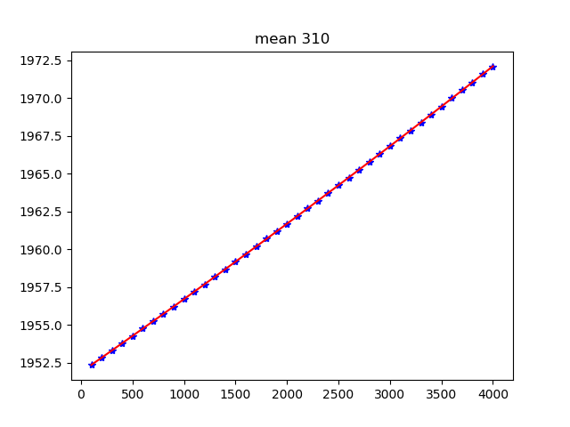
.. |image9| image:: _static/image13.png
   :width: 3.04167in
   :height: 2.28056in
.. |image10| image:: _static/image19.png
   :width: 6.69306in
   :height: 1.28472in
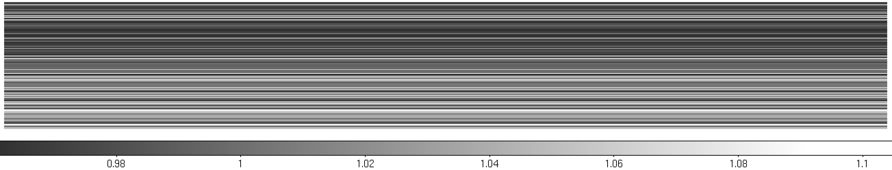
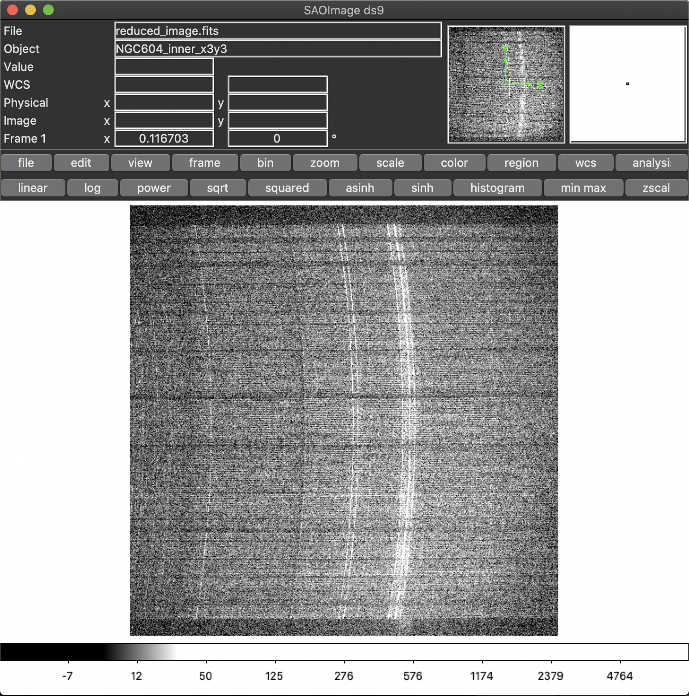
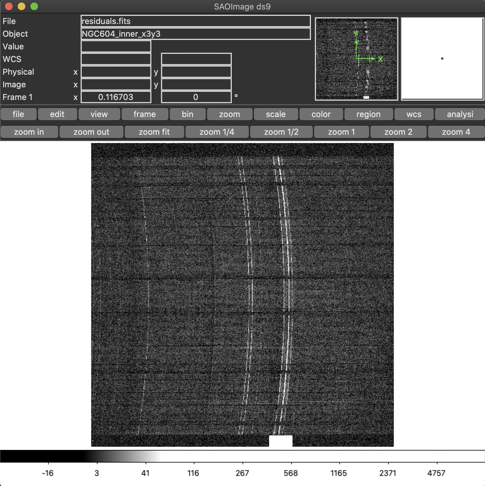

.. |Diffuse light 4 of 4| image:: _static/image31.png
   :width: 3.38422in
   :height: 3.40178in
.. |Fit to the sum of 50 columns| image:: _static/image32.png
   :width: 3.3in
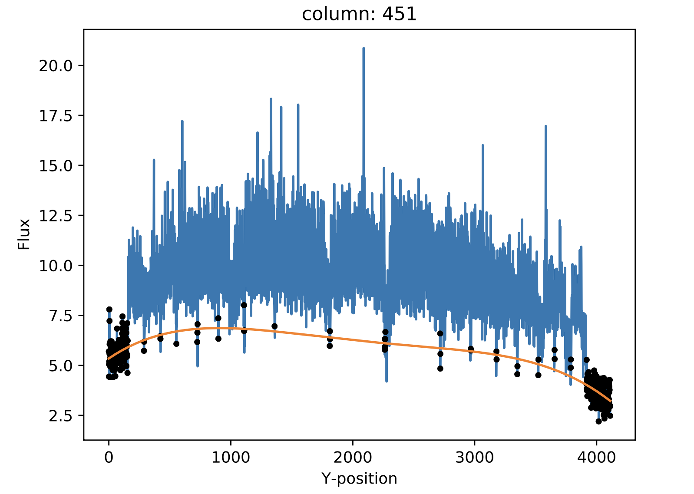
.. |prezoom image14| image:: _static/image34.png
   :width: 3.14708in
   :height: 2.41985in
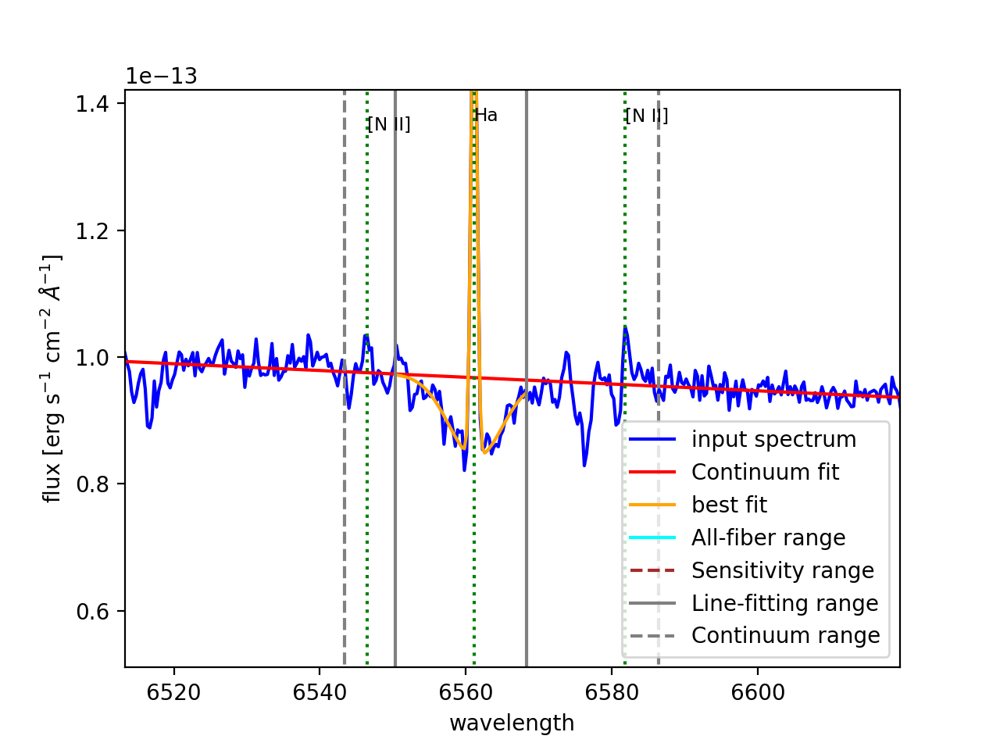
.. |image15| image:: _static/image36.png
   :width: 3.59647in
   :height: 2.66927in
.. |image16| image:: _static/image37.png
   :width: 3.5784in
   :height: 2.70836in
